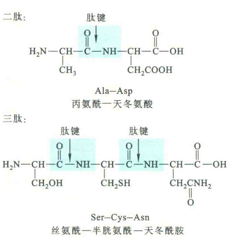

# 肽的分类和命名

肽的分类和命名的主要依据是氨基酸残基的数目、组成和排列顺序。

## 肽的分类

可根据氨基酸残基的数目而直呼其为几肽。例如，2个氨基酸构成的肽称为二肽，3个氨基酸构成的肽称为三肽，以此类推。

一般将2〜10个氨基酸残基组成的肽称为寡肽；由11〜50个氨基酸残基组成的肽称为多肽；由50个以上的氨基酸残基组成的肽称为蛋白质。

根据美国国家生物技术信息中心（NCBI）提供的数据，细菌、古菌和真核生物体内蛋白质的平均大小分别含有283、311和438个氨基酸残基。

目前已知最大的蛋白质是在肌细胞中发现的肌巨蛋白，也称肌联蛋白，约含27000个氨基酸残基。

胰岛素算得上是最小的蛋白质之一，因为它刚好有51个氨基酸残基。

除了少数环状肽链以外(如α-鹅膏蕈碱)，其他肽链都含有不对称的两端：其中含有游离的氨基的一端称为氨基端或N端;；含有游离羧基的一端称为羧基端或C端。

但有一些肽为了提高稳定性，N端氨基和/或C端的羧基会发生特定形式的化学修饰而被封闭。

例如，N端发生甲酰化或焦谷氨酰化(N端谷氨酸残基的γ-羧基与其α-氨基形成酰胺键)，C端发生酰胺化。

## 肽的写法

按照惯例，书写一条肽链的序列总是从N端到C端，即N端放在最左边，C端放在最右边。

有时为了强调，可在N端和C端分别添加H和OH，以此来表示两端游离的氨基和羧基。

各氨基酸残基可用三字母或单字母缩写表示，图中的三肽可写为Ser—Cys一Asn或H—Ser—Cys—Asn—OH或SCN。

## 肽的命名

寡肽通常根据氨基酸从N端到C端的排列顺序，依次称为某氨基酰某氨基酰……某氨基酸。

按照上述规则，图中的二肽和三肽应分别命名为丙氨酰天冬氨酸和丝氨酰半胱氨酰天冬酰胺。

多肽和蛋白质的命名一般是根据它们的来源或/和功能进行的，如胰高血糖素是一种来源于胰岛，功能是使血糖升高的多肽；血红蛋白是来源于红细胞与运输氧气有关的蛋白质。