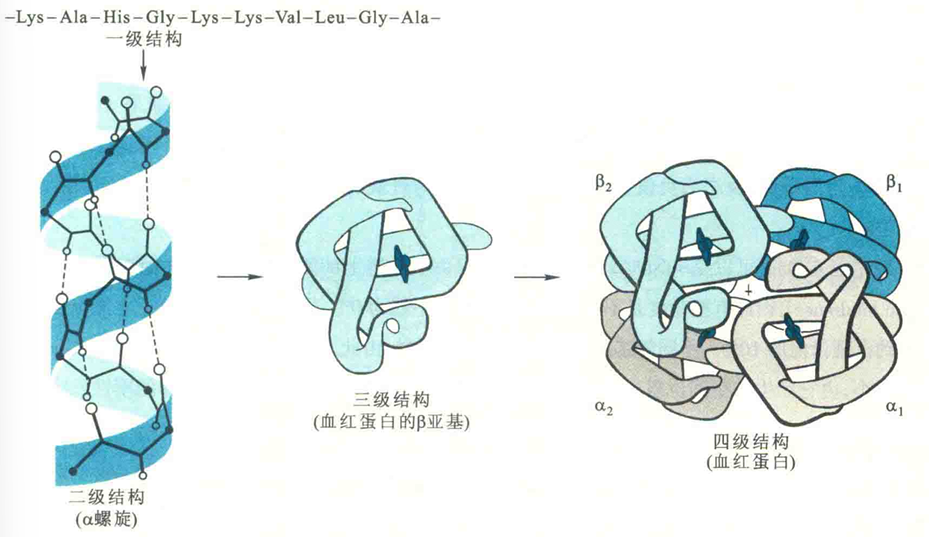
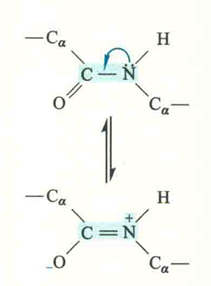
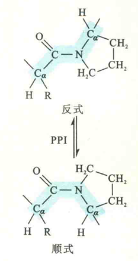
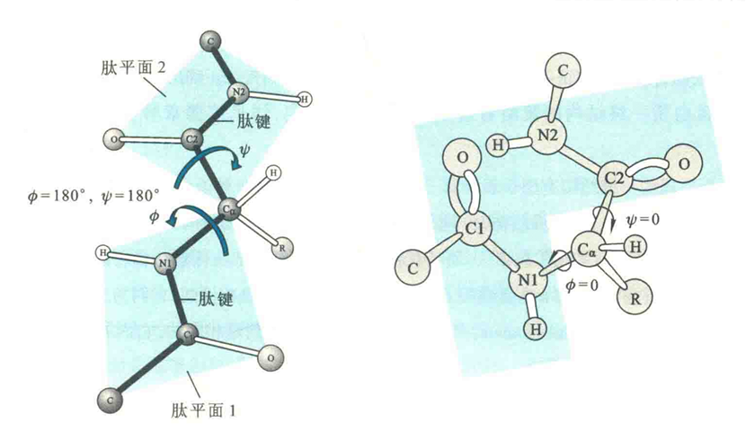
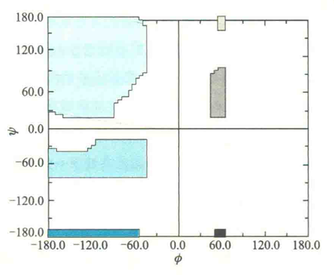
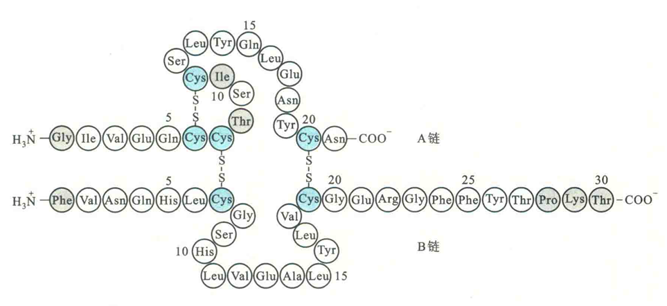
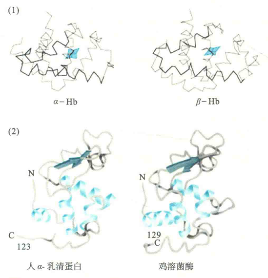

# 蛋白质的一级结构

蛋白质的结构一般具有4个层次，即一级结构、二级结构、三级结构和四级结构，但并不是所有的蛋白质都具有三级结构或四级结构。

蛋白质的一级结构也称蛋白质的共价结构，是指氨基酸在多肽链上的排列顺序。如果一种蛋白质含有二硫键，那么其一级结构还包括二硫键的数目和位置。

稳定蛋白质一级结构的化学键显然是共价键，主要是肽键。肽键实际上是一种酰胺键，一般用羰基C和酰胺N之间的单键表示。肽链中的每一个酰胺基称为肽基或肽单位，研究表明肽键具有以下性质：

## 具有部分双键的性质

其键长为0.133nm，短于一个典型的CN之间的单键，长于一个典型的CN双键。肽键所具有的双键性质是酰胺N上的孤对电子与相邻段基之间发生共振作用造成的。

## 多为反式，也有顺式

在反式构型中，邻近的非成键原子的空间位阻更小，因而比顺式稳定（相差100倍）。

如果肽键是由一种氨基酸的羧基与Pro的亚氨基形成的（X-Pro），那么仍然是反式的稳定。但Pro残基的四氢吡咯环造成的空间位阻，会部分抵消反式构型原有在空间位阻上的优势，这使得顺式与反式在稳定性上的差距有所降低（仅相差4倍），因此此时的肽键有可能以顺式形式存在。

然而，多肽或者蛋白质在核糖体上合成时，最初形成的肽键都是反式的，只是后来某些部位与Pro的亚氨基有关的肽键在肽基脯氨酰顺反异构酶（PPl）的催化下变成了顺式。

## 肽平面

与肽键相关的6个原子共处于一个平面，此平面结构称为肽平面或酰胺平面，肽平面结构的形成是因为肽键具有双键的性质。

### 二面角

在一个肽平面上，肽键由于具有双键的性质不能自由的旋转，但在肽链的主链上，与每一个Cα有关的两个共价键都是单键，因此这两个单键是可以自由旋转的。正因为如此，每一个肽平面有两个可以旋转的角度：由Cα-N单键旋转的角度称为Φ，Cα-C单键旋转的角度称为ψ，与同一个Cα有关的一对Φ和ψ称为蛋白质的二面角。显然，当一条肽链上所有的二面角被确定以后，该肽链的三维结构也就基本确定下来了。

根据惯例，如果肽链处于完全伸展状态，即所有的肽键位于同一个平面上，Φ和ψ定为土180°；如果Φ的旋转单键Cα-N1两侧的N1-C1和Cα-C2呈顺式时，则规定Φ=0°；如果ψ的旋转键Cα-C2两侧的Ca-Nl和C2—Ν2呈顺式时，则规定ψ=0°

从Cα向N1观察，顺时针旋转Cα-N1键得到的Φ角为正值，反之为负值；从Cα向C2观察，顺时针旋转Cα-C2键得到的ψ角为正值，反之为负值。

### 二面角度限制

理论上Φ和ψ可以是的任意值，但由于主链上的原子和R基团之间存在空间位阻，因而有些角度是不允许的，如Φ和ψ不能为0°。据估计，蛋白质分子中能出现的二面角约占理论值的10%。不同氨基酸残基的R基团不一样，由此产生的空间位阻也不一样。

Gly的R基团最小，由它产生的空间位阻也最小，与它相关的二面角变化的范围最大；而Pro的刚性吡咯环则使其受到的限制最为严重，其Φ值被限制在-85°~-35°。

### Ramachandran作图法

为了能够更好地显示一种蛋白质分子所能采取的二面角值，印度生化学家G.N.Ramaehandran通过计算蛋白质中非键合原子间的最小接触距离，预测了哪些成对二面角（Φ,ψ）所规定的两个相邻肽平面的构象是允许的，哪些是不允许的。并提出以Φ为横坐标、ψ为纵坐标，在坐标图上标出每一对（Φ,ψ），以此来表示一种蛋白质的构象。这种作图方法后来被称为Ramachandran作图法。

Ramachandran预测到的结果中，有色区域表示所有允许的二面角，白色区域表示不允许的二面角。上述结果与后来实验测定的结果基本一致。

## 带电性

酰胺N带部分正电荷，羰基O带部分负电荷，这是酰胺N上的孤对电子与相邻羰基之间发生共振作用而造成的。

## 一级结构的发展史

1954年，Sanger成功地测定出牛胰岛素一级结构，胰岛素成为世界上第一例一级结构被测定的蛋白质，Sanger也因此荣获1958年的诺贝尔化学奖。

1965年，我国科学家根据胰岛素的一级结构人工合成了具有正常生理活性的牛胰岛素，这是世界上第一种人工合成的蛋白质，从某种意义上讲，成功的合成也直接证明了Sanger测定出的胰岛素一级结构是正确的。

确定蛋白质的一级结构有助于理解其三维结构和功能，因为一种蛋白质的一级结构包含了决定其三维结构的所有信息，而三维结构又与蛋白质的功能直接相关。来源于不同种类生物的同源蛋白具有相似的氨基酸序列(如细胞色素c)，而具有相似序列的不同肽链往往意味着它们具有相似的三维结构。例如，构成血红蛋白的α珠蛋白和β珠蛋白有46%的序列是相同的，它们的三维结构也非常相似。再如，人α-乳清蛋白和鸡溶菌酶有39%的序列是相同的，它们的三维结构也十分相似。

## 一级结构与遗传疾病

许多遗传性疾病实际上是机体内某种蛋白质一级结构发生差错而引起的“分子病”。例如，镰状细胞贫血就是血红蛋白的β亚基在6号位的Glu被Val取代造成的，这是一种最常见的血红蛋白分子病。

测定蛋白质的一级结构，还可以帮助科学家在分子水平上研究生物的进化。例如，将不同生物来源的细胞色素c的一级结构进行比对，可有助于了解物种间的进化关系，因为物种间的亲缘关系越接近，细胞色素c的一级结构就越相似。