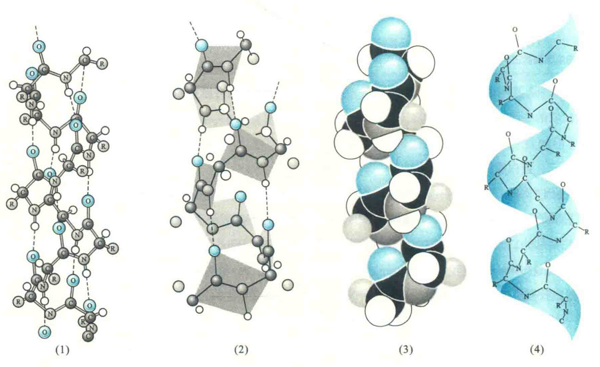
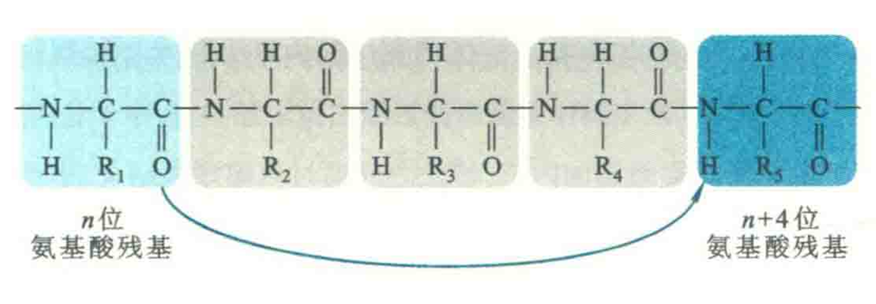
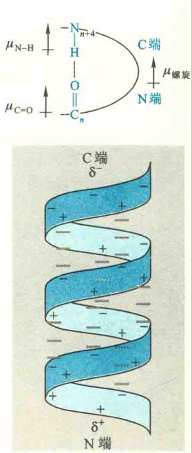
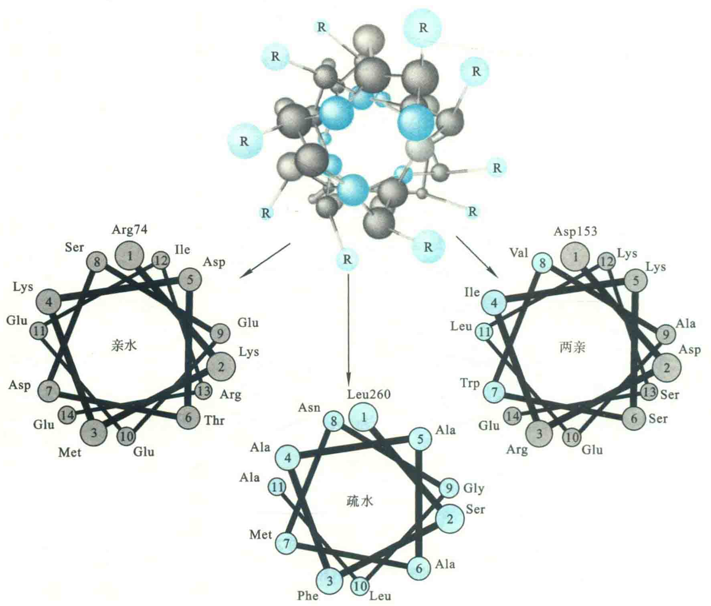
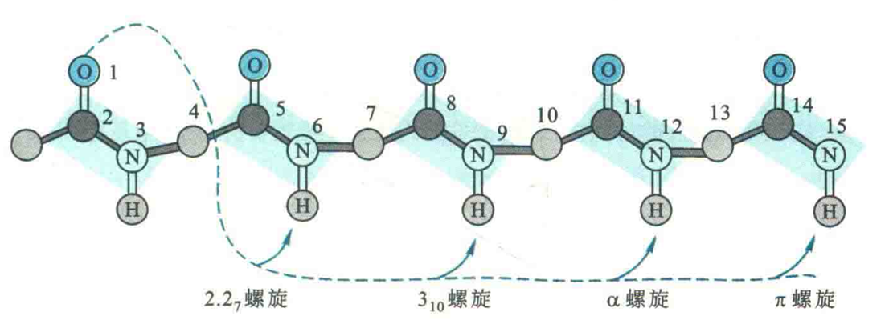

# α螺旋

α螺旋是一种最常见的二级结构，其主要内容包括：

1. 肽链主链围绕一个虚拟的轴以螺旋的方式盘绕。

2. 螺旋的形成是自发的，而稳定它的氢键非常有规律。氢键受体总是几位氨基酸残基的残基O，供体则是n+4位残基氨基上的H，被氢键封闭的环共含有13个原子，因此α螺旋也称为3.6/13螺旋。螺旋的前后4个氨基酸残基通常不能形成全套螺旋内氢键，这些残基需要与水分子或蛋白质内部的其他基团形成氢键后才能稳定下来。

3. 每隔3.6个残基，螺旋上升一圈。每个氨基酸残基环绕螺旋轴100°，螺距0.54 nm，即每个氨基酸残基沿轴上升0.15 nm；螺旋的半径为0.23 nm，二面角(Φ,ψ)约为(-57°,-47°)。

4. 螺旋的方向一般是右手，左手螺旋很少见。这是因为蛋白质分子中的氨基酸只有L型，若形成左手螺旋，L型氨基酸的β碳和谈基氧在空间上会发生冲突，从而使稳定性降低.

5. 氨基酸残基的R基团伸展在螺旋的表面，虽不参与螺旋的形成，但其大小、形状和带电状态却能影响到螺旋的形成和稳定性。

## 二级结构的稳定性

使用由同一种氨基酸残基构成的多聚氨基酸，来研究氨基酸的R基团对α螺旋的形成及其稳定性的影响。

### 电荷因素

多聚亮氨酸和多聚丙氨酸很容易形成α螺旋，多聚甘氨酸只会形成无规卷曲，多聚脯氨酸不形成α螺旋，但会形成它所特有的右手螺旋（肽键顺式）或左手螺旋（肽键都为反式)。

::: tip

多聚甘氨酸太软，多聚脯氨酸太硬

:::

多聚天冬氨酸和多聚谷氨酸在pH≥7时，只会形成无规卷曲，在ρΗ<2.5时，则自发地形成α螺旋。因为若pH>7，Asp和Glu的R基团均带负电荷，静电的排斥导致无法形成稳定的α螺旋，但在ρΗ<2.5时，R基团质子化，不再带电荷，因此可以形成α螺旋。

多聚赖氨酸在pH<11时，只形成无规卷曲，是因为R基团带正电荷，阻碍了α螺旋的形成，而如果pH≥12，其R基团不再带有电荷，就很容易形成α螺旋。

一般而言，判断一个氨基酸残基是否有利于形成α螺旋，要看它的侧链能否保护螺旋在主链上的氢键。在20种常见的蛋白质氨基酸中，经常在α螺旋中出现的有Ala、Cys、Leu、Met、Glu、Gln、His和Lys，特别是其中的Ala、Leu、Met、Glu和Lys。

最常见的两种不利于形成α螺旋的氨基酸是Gly和Pro。

GIy不利于形成α螺旋的原因是它的侧链太小，自由度太大，与它有关的二面角变化太大，无法满足α螺旋形成所必需的条件：具有相对固定的二面角。

而Pro不利于形成α螺旋与两个因素有关：一是它的本质是亚氨基酸，当它的亚氨基与其他氨基酸的竣基形成肽键以后，不能充当氢键供体，于是主链上氢键的数目减少而使螺旋的稳定性降低；二是它的侧链为刚性的环，这使α螺旋形成所需要的值难以达到。但这并不意味着Pro绝对不能出现在α螺旋中，在少数α螺旋中也会发现Pro的踪影，如视紫红质七次跨膜的α螺旋中就有，但它一般只会出现在α螺旋的前4个氨基酸残基中，并且它的出现会导致螺旋发生小小的弯曲;

具有较大R基团或者β碳原子上有分支的氨基酸，如Ile、Val、Thr、The和Trp，因为容易产生空间位阻，不利于α螺旋的形成；

Ser、Asp和Asn在侧链上靠近主链的位置含有氢键供体或受体，容易与主链上的氨基H或羰基O竞争形成氢键，故也不利于形成α螺旋；

侧链带有电荷的氨基酸，如Glu，Asp、Lys和Arg，如果带同种电荷的连续排列，也不利于α螺旋的形成。

### R基团大小

除了R基团的大小、形状和带电状态外，螺旋具有的偶极距也能影响到螺旋的稳定性。

由于稳定α螺旋的氢键几乎都平行于螺旋轴，使得每一个肽键的固有偶极“连为一体”，螺旋的总偶极矩成为一个净偶极矩，其正极在N端，负极在C端。虽然偶极距的存在不利于螺旋的稳定，但蛋白质可以借助螺旋本身N端的酸性氨基酸(R基团带负电荷)和C端的碱性氨基酸(R基团带正电荷)，来中和偶极矩的存在，使螺旋两端带有相反的电荷，从而消除其对螺旋稳定性的不利影响。

还可以通过相邻螺旋之间的相互作用(两个螺旋反平行排列，相互中和各自在两端的电荷)来降低偶极距对螺旋的去稳定作用。

有些蛋白质通过α螺旋在N端带有的正电荷与带负电荷的配体分子（如磷酸基团）结合，或者通过在C端带有的负电荷与带正电荷的配体（如金属离子）结合，来消除偶极距对螺旋的稳定性产生的不利影响。

对于一个稳定的α螺旋而言，主链上的原子埋在螺旋的内部，彼此之间通过范德华力结合，里面几乎已没有任何空隙，而所有的R基团都呈辐射状离开螺旋的核心，充分展示在螺旋的表面。螺旋的这种性质方便了它们与其他部位的氨基酸残基的侧链或者与其他生物分子（如DNA）之间的相互作用。

## 螺旋轮作图

螺旋的上述性质可用螺旋轮作图表示。一个螺旋轮是螺旋沿着螺旋轴的二维投射图，具体作图步骤是

首先想象有一条与螺旋轴平行、垂直于纸平面的直线0°，其顶端（正对读者）表示螺旋的第1个氨基酸的侧链，用画圈的数字1表示它的位置；

然后，按顺时针方向转100°画第2条直线，使其一端在螺旋轴，另一端用画圈的数字2表示第2个氨基酸；

再从第2条直线向顺时针旋转100°画第3条直线，依次类推，直到将螺旋上的所有氨基酸都画上。注意，离我们越近的数字圆圈轮要画得越大；

### 判断亲水性

按照这种作图方法，第5圈以后，图的样式将会重复，即第19号位的氨基酸残基将位于1号位残基的上面。

使用螺旋轮作图能显示出各氨基酸残基侧链在螺旋边缘的分布情况，有利于判断一个α螺旋是亲水的，还是疏水的，或是两亲的。

如果螺旋上的亲水氨基酸较多，则螺旋可视为亲水的；如果全部是疏水氨基酸，螺旋则是疏水的。

疏水α螺旋经常出现在膜内在蛋白的跨膜区，这是因为膜内部的环境是疏水的。例如，在很多真核细胞的质膜上，有一类称为G蛋白偶联的受体，这类受体属于跨膜蛋白，共跨膜七次，每一个跨膜的肽段形成的都是疏水α螺旋；

如果亲水残基和疏水残基含量差不多，并且亲水的分布在螺旋一侧，形成亲水的一面，疏水的集中在另一侧，形成疏水的一面，那么这样的螺旋称为两亲螺旋。两亲螺旋的疏水面通常与蛋白质内部的疏水区结合，而亲水面与水相互作用。此外，两亲螺旋还发现在许多载脂蛋白分子中，这些载脂蛋白通过两亲螺旋的疏水面与脂质结合，亲水面则暴露在水溶液中。

## 其他螺旋

除了α螺旋以外，Pauling还提出了3/10螺旋、2.2/7螺旋和π螺旋结构。

其中3/10螺旋是α螺旋的过渡形式，其瘦而长，3表示每圈只有3个氨基酸残基，10表示氢键环含有10个原子，每一个氢键的受体和供体分别是主链R位氨基酸残基的羰基O和n+3位残基的氨基Η；

2.2/7螺旋比较紧，2.2表示每圈只有2.2个氨基酸残基，7表示氢键环含有7个原子，每一个氢键的受体和供体分别是主链η位氨基酸残基的羰基O和n+2位残基的氨基H；

π螺旋也称为4.4/6螺旋，4.4表示每圈有4.4个残基，16表示氢键环含有16个原子，每一个氢键的受体和供体分别是主链n位氨基酸残基的羰基O和n+5位残基的氨基H。

以上几种螺旋都可以在体外通过模型建立得到，但存在于蛋白质的螺旋主要还是α螺旋。有人在蛋白质数据库中搜寻过3万个左右的螺旋片段以后，发现几乎都是α螺旋(有一例左手)，只有一例π螺旋和一例自由的3/10螺旋，但在一些长的α螺旋的两端发现有很短的3/10螺旋，还没有发现2.2/7螺旋。