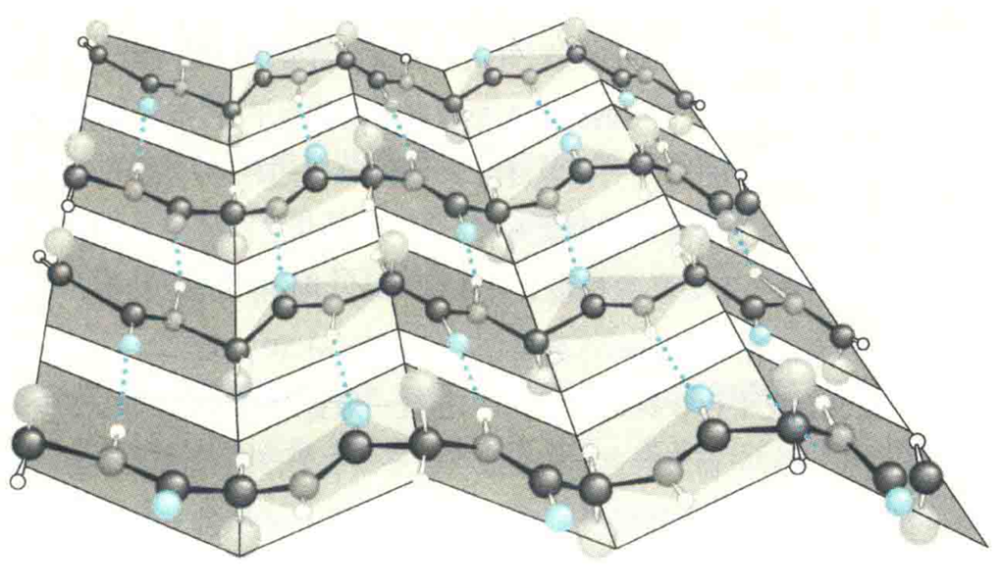
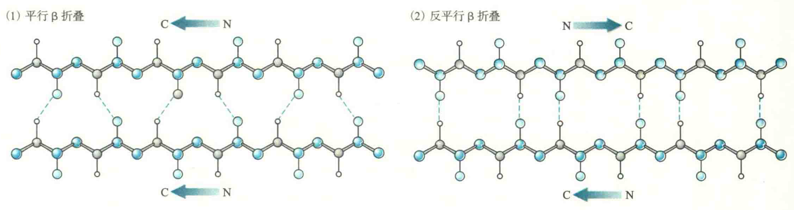
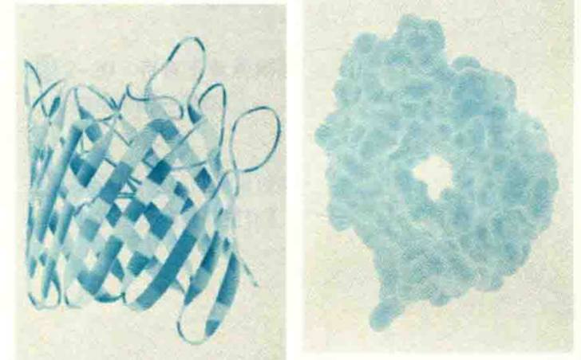

# β折叠

β折叠又称为β折叠片层，与α螺旋相比，β折叠是肽链的一种更加伸展的结构，主链呈扇面状展开。

## 主要特征

1. 至少由两条肽段组成，每一条肽段几乎完全伸展，肽平面之间呈锯齿状。
2. 每一条肽段称为β股，相邻β股呈现平行排列，主链之间通过氢键相连。
3. R基团垂直于相邻两个肽平面的交线，并交替分布在折叠片层的两侧。
4. 肽段的走向有正平行和反平行两种。正平行经常简称为平行，指相邻β股的N端位于同侧，反平行正好相反。在反平行折叠中，同一个氢键的3个原子（N-H-O）几乎位于同一直线上，因此反平行折叠更加稳定，其存在的概率就更大。
5. 反平行β折叠的每一个氨基酸残基上升0.347 nm，二面角（Φ，ψ）约为（-135°，140°），平行β折叠的每一个氨基酸残基上升0.325 nm，二面角角为（-120°，105°）。
6. 

因为平行β折叠没有反平行β折叠稳定，所以前者一般含有较多的β股，很少低于5个，并且β股总是被包埋在蛋白质的内部，而后者含有的β股可以低到2个，其一面经常暴露在水相中。

不管是哪一类β折叠，在两边的β股上总会有一些羰基O和氨基H没有参与形成β折叠内部的氢键，因此要通过其他方式来满足它们形成氢键的“欲望”，这些方式包括：

①如果β股正好暴露在水相中，就与水分子形成氢键；

②如果β股在蛋白质的内部，可以与其他二级结构（如α螺旋）上的亲水氨基酸残基的侧链形成氢键；

③如果β股在蛋白质的表面，就与其他有相同问题的蛋白质分子的表面β股形成β折叠；

④构成β折叠的所有β股在空间上发生一定的扭曲，以便让第一股和最后一股靠近，即首尾相连而形成氢键，以致这些β股聚集在一起，形成一种伸展的右手扭曲结构。这样的结构实际上是一种结构模体(见后)，存在于多种蛋白质分子的核心。

如果β股交替出现疏水残基和亲水残基，那么可以形成两亲β折叠。这样的结构常见于孔蛋白。孔蛋白是一种膜蛋白，由两亲β折叠构成β桶结构。在β桶结构中，非极性残基的侧链伸向膜脂的疏水区，极性残基在内部形成亲水通道，允许极性分子通过膜。

有时，两个蛋白质分子在特定的条件下，可以各提供一个β股形成β折叠，从而导致两者瞬间结合，形成临时的复合物(如真核细胞内的Raf蛋白和Rap蛋白)，这种情况经常出现在细胞的信号转导过程中。

相比于α螺旋，参与形成β折叠的β股在空间上处于更加伸展的状态，因而那些在α螺旋中容易产生空间位阻的氨基酸残基能在β折叠中找到合适的位置，即**侧链基团庞大的氨基酸残基更倾向于形成β折叠**。

那些在β碳上无分支的氨基酸残基也适合存在于β股上，但大的疏水侧链更容易紧密地结合在一起，故它们出现在β折叠中的频率更高。这些氨基酸残基有Val、Ile、Phe、Tyr、Trp、Thr。Pro的刚性环结构限制了它的小值（-85°~-35°），而β折叠的φ值在-119°左右，所以Pro从来不会出现在β折叠中。