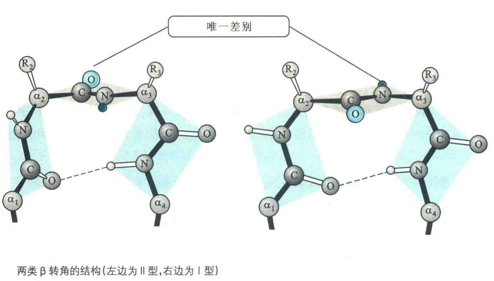

# β转角

为了在一条肽链上形成β折叠，或将一条多肽链上的α螺旋与β折叠组合在一起，多肽链通常需要其主链弯曲或回折，而β转角结构就可以达到这样的目的。

β转角也称β弯曲、β回折或紧密转角，这种结构是指伸展的肽链在局部形成了180°的U形回折。

## 主要特征

①主链发生了180°的改变。

②由肽链上4个连续的氨基酸残基组成，Gly和Pro经常出现在中间的两个位置。

::: tip

这是因为Gly的R基团最小，很容易调整其在β转角中的位置，降低与其他残基(尤其是R基团大的残基)之间可能形成的空间位阻，而Pro则具有相对刚性的环状结构和固定的山，在某种程度上能迫使转角的形成。

:::

③在构成β转角的4个氨基酸残基中，只有1号位氨基酸残基的羰基O与4号位残基的氨基H形成氢键，其余位置的氢键供体和受体之间并没有形成氢键。为了让它们也能参与形成氢键，需要将它们放在蛋白质的表面，以方便与水分子形成氢键。

正因为如此，β转角通常出现在球状蛋白质的表面。已发现蛋白质的抗体识别、磷酸化、糖基化和羟基化位点经常出现在β转角和紧靠β转角。此外，在水溶液中的小肽分子上也发现了类似β转角的结构。

④有利于反平行β折叠的形成。这是因为β转角改变了肽链的走向，促进相邻的肽段各自作为β股，形成β折叠。

β转角有3种类型，前2种类型（I型和Π型）的差别仅仅在于第2个残基和第3个残基形成的肽平面的朝向（相差180°），第3种类型（Ⅲ型）则有重复的二面角（-60°，-30°），与3/10螺旋接近。

I型转角更为常见，它的3号位最适合Pro，而Ⅱ型的2号位最适合Pro，3号位适合Gly和其他小的亲水氨基酸。无论是哪一种类型，4号位最适合Gly，而1号位经常是Asn、Asp、Ser和Cys。

由于β转角能够改变肽链的走向，因此它对球状蛋白质的形成十分重要，但对于**纤维状蛋白**质来说，它的肽链在空间上只有一个取向，故一般**没有β转角**。