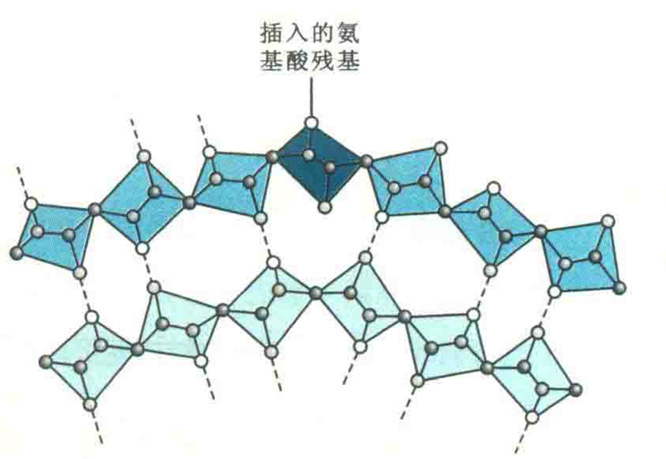

# β凸起

若构成β折叠的两个β股有一股多出一个氨基酸残基，而这个残基刚好不利于形成β折叠，则原来连续的氢键结构即被打破，这个多出的残基由于没有能与之形成氢键的供体或受体，只能突出在外，从而使肽链发生轻微的弯曲，形成了β凸起。

β凸起主要存在于反平行β折叠中，只有约5%的β凸起出现在平行的β折叠结构中。

β凸起也能改变多肽链的走向，但没有β转角那样明显。

## β凸起的功能

可减少生物进化过程中发生在β折叠中的插入突变对原来蛋白质分子中保守性结构的影响，因为形成β凸起可基本维持原来的β折叠结构。

