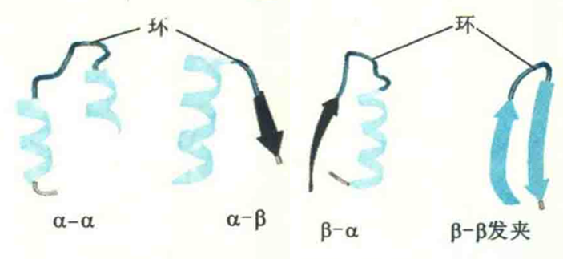

# 无规则卷曲

在蛋白质分子中，除了上述几种有规则的二级结构以外，还有一些极不规则的二级结构，它们柔性强，涉及的二面角变化大，但也不是任意变动的，这些结构统称为无规卷曲。

环曾长期被归为一种无规卷曲结构，但随着对其结构和功能认识的深入，人们越来越倾向于将其视为一种独立的二级结构。

环作为蛋白质三维结构中最重要的动态结构元件，一般位于球状蛋白质的表面，在很多地方充当将有规则的二级结构联系在一起的纽，其侧链和主链部分通常含有各种结合位点和功能位点，并以运动的方式作为控制与蛋白质相互作用的配体进入的“门户”。

## 生物功能

已发现的与环有关的生物功能有：分子识别、与其他蛋白质相互作用、与配体结合、参与或控制酶的催化等。

从进化的角度来看，相同的蛋白质家族的不同成员在功能上的差异通常是由蛋白质表面的结构变化引起的，而这些变化经常发生在环上。因此，环结构的突变是蛋白质进化产生新活性和新功能的常见手段。