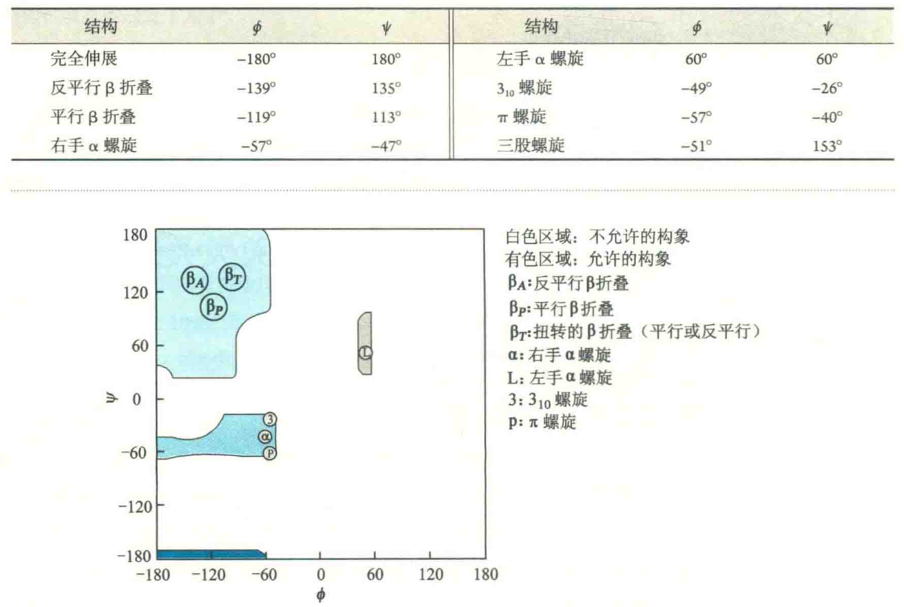

# 蛋白质的二级结构

蛋白质二级结构是指多肽链的主链部分(不包括R基团)在局部形成的一种有规律的折叠和盘绕,其稳定性主要由主链上的氢键决定。

常见的二级结构有α螺旋、三股螺旋、β折叠、B转角、β凸起、无规卷曲和环。其中前5种比较有规律，所涉及的肽段上的每一对二面角都差不多，在Ramachandran图上，会集中在某一区域，而无规卷曲和环的二面角则落在其他的允许区。

从结构的稳定性上看，右手α螺旋>β折叠>β转角>无规卷曲和环；但从功能上看正好相反，酶与蛋白质的活性中心通常由无规卷曲和环充当，α螺旋和β折叠一般只起支持作用。

