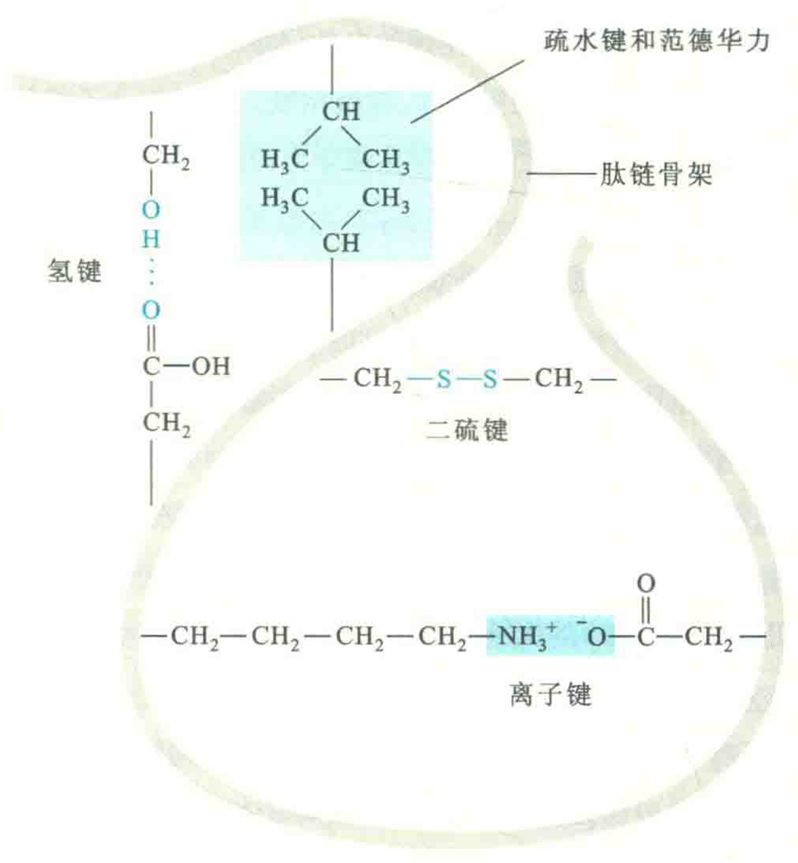
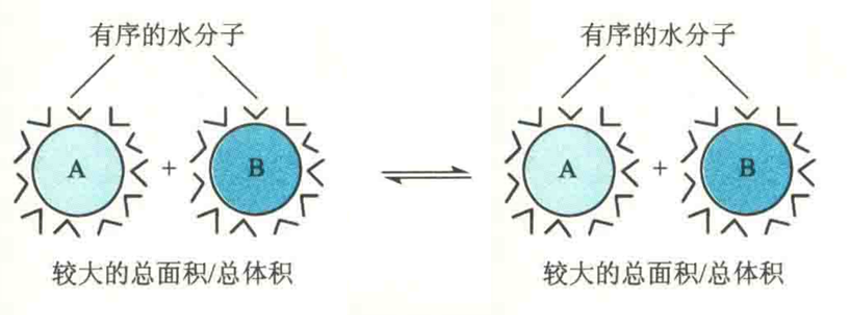

# 稳定三级结构的化学键

稳定三级结构的化学键主要是次级键，包括氢键、疏水键、离子键、范德华力。有的金属蛋白还借助于金属配位键来稳定其三级结构。此外，属于共价键的二硫键也参与稳定许多蛋白质的三维结构。

## 氢键

凡是与电负性很强的原子（如0、N、F）相连的氢原子，由于带部分正电荷，可以作为氢键供体，与另一电负性较强的带部分负电荷的原子（O和N）作为氢键受体，通过静电吸引相连，以这种方式形成的化学键称为氢键。

氢键除了用来稳定蛋白质二级结构以外，在维持三级结构方面也起着重要作用。不过，稳定二级结构的氢键供体和受体来自主链，而稳定三级结构的氢键供体和受体一般则来自亲水氨基酸的R基团。例如：羟基氨基酸的羟基和酸性氨基酸的羧基。

氢键的键能为12~30 KJ/mol，比共价键弱得多。但由于蛋白质分子中存在许多氢键，其在维持蛋白质三级结构的稳定性中仍有很大贡献。

## 离子键

离子键是带相反电荷基团之间的静电引力，其键能为100~500 kJ/mol，在蛋白质中常称为盐键或盐桥。

在生理pH下，肽链上的碱性和酸性氨基酸残基的侧链分别带正、负电荷，此外游离的N端氨基和C端羧基也分别带正、负电荷，所有这些带电荷的基团都可以形成盐键。

## 疏水键

疏水基团或疏水分子在水溶液里为了避开水相而互相聚集在一起形成的作用力称为疏水键，也称疏水作用力，其键能＜40 KJ/mol。

蛋白质分子中的疏水基团主要由疏水氨基酸残基提供，它们聚集在一起时会在蛋白质分子内部形成一个疏水核心。这种疏水相互作在在维持蛋白质的三级结构中起着举足轻重的作用，可以说是稳定蛋白质三级结构最重要的化学键。

如果一个多肽的所有氨基酸残基都是亲水的，那么用来驱动三级结构形成的力将十分有限；而如果一个多肽既含有亲水氨基酸又含有疏水氨基酸，则有利于蛋白质在溶液中快速地折叠，并到达最终的构象状态。

需要特别注意的是，疏水键并不是发生在疏水基团之间的一种主动吸引力，而是一种受热力学第二定律驱动的作用力。将疏水基团集中在蛋白质内部的疏水核心在能量上是有利的，因为它降低了疏水基团与水分子之间不利的作用，反而使疏水基团之间的范德华力大大增加。

两个疏水基团A和B若单独存在的话，其表面会附着更多有序的水分子，所以熵比较小；这两个疏水基团若聚合在一起（A-B）的话，由于球面积是半径的平方，而体积是半径的立方，那么将有一部分水分子从疏水基团的表面释放出来，进入无序状态，这会导致系统的熵增加。另外，在两个疏水基团因为疏水作用而靠近时，这也为它们之间建立范德华力创造了条件。正因为如此，疏水键和范德华力往往相伴相随，一起对稳定蛋白质的三维结构、核酸的双螺旋结构以及生物膜的脂双层结构起决定性作用。

## 范德华力

范德华力是在两个相邻的不带电荷的非成键原子之间的作用力，这种作用力可能是吸引力也可能是排斥力。

### 范德华引力的三种形式

**诱导力**：源于相邻的不带电荷的非成键原子，因为电荷密度的波动引发的诱导偶极间的相互吸引；

**色散力**：源于分子或基团瞬时偶极间的作用力，即由于电子的运动，某一瞬间电子的位置对原子核是不对称的，正、负电荷重心发生瞬时的不重合，从而产生瞬时偶极；

**取向力**：发生在极性分子或基团之间。由于极性分子或基团的电性分布不均匀，一端带正电，一端带负电，形成偶极。因此，当两者相互接近时，偶极的同极相斥，异极相吸。

在极性分子或基团之间，三种形式的力都存在；而在极性与非极性分子或基团之间，则存在诱导力和色散力；在非极性分子或基团之间，则只存在色散力。

范德华斥力产生的原因则是相邻的不带电荷的非成键原子靠得太近，但并没有诱导偶极，反而因电子云的重叠引发电子-电子间的排斥。

尽管范德华力非常弱，键能只有0.4~4 KJ/mol，但在蛋白质分子中，这样的作用力大量存在，因此其对蛋白质三级结构的形成和稳定所起的作用不容小觑。

## 配位键

配位键是一种特殊形式的共价键，它对某些金属蛋白的三级结构具有一定的稳定作用。以羧肽酶A为例，这种由307个氨基酸残基组成的蛋白质大致折叠成球形，这和1个Zn2+与其His 69、Glu 72、His 196的侧链以及1个水分子配位结合形成四面体结构有一定关系。

## 二硫键

二硫键也称为二硫桥，它是在两个半胱氨酸残基的S原子之间形成的共价交联。

对于细菌和真核生物来说，含有二硫键的蛋白质一般是分泌蛋白或细胞膜蛋白（如抗体、胰岛素、胰岛素的受体、动物消化道内的各种蛋白酶），而胞内蛋白很少有二硫键。其原因一是胞外的环境多变，有时甚至比较恶劣（如胃液的pH在2以下），二是蛋白质比较小，故疏水作用力相对要弱，这两种因素使这些蛋白质更需要借助共价的二硫键来加固它们的三级结构。胞外环境的氧化性较强，而胞内环境一方面还原性强，不利于二硫键的形成；另一方面，胞内环境相对稳定和温和，也不需要用二硫键来稳定蛋白质的三维结构。

然而，对于古菌而言，其胞内许多蛋白质也有二硫键，这显然有助于它们抵抗古菌生存的极端环境。