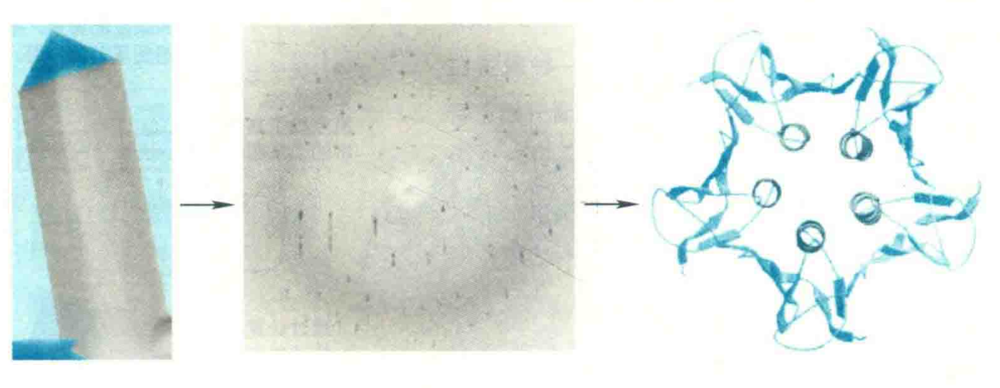

# 蛋白质三级结构的研究方法

## X射线晶体衍射

首先需要制备待测蛋白质的晶体，然后才可以对蛋白质进行X射线衍射分析。但是，想得到一种蛋白质的晶体并非易事，特别是膜蛋白，何况某些蛋白质的晶体也许永远都得不到。此外，X射线衍射分析得到的并不是原子的直接图谱，而是电子密度图谱。因此需要利用专业的傅里叶逆变换去分析电子密度，再还原成三维结构。

由此得到的三维结构显然是蛋白质分子在晶体状态下的，这种结构与蛋白质分子在细胞内的天然结构相比可能有较大的差别，原因是晶体中的蛋白质分子相互间紧密而有规律地排列在一起，运动性较差，而细胞中的蛋白质分子大多数处于溶液状态，周围是水分子和其他生物分子，运动性较强。

然而，根据蛋白质数据库（PDB）截至2018年8月1日发布的数据，由X射线衍射获得三维结构的蛋白质、核酸以及蛋白质核酸复合物分别有119369J945和6122种，占绝对优势。

PDB是一个生物大分子三维结构数据库，它由美国布鲁克海文国家实验室建立，为人们提供蛋白质以及其他大分子三维结构信息服务。

## 核磁共振波谱法

此方法是根据原子核在磁场下的振动情况来分析蛋白质结构。它的基本原理是在强磁场中，原子核发生自旋能级分裂，在吸收外来电磁辐射后，会发生核自旋能级的跃迁，产生核磁共振现象。核自旋能级的共振频率与电子类型有关，且受到所处化学结构微环境的影响。由此可提供分子结构包括蛋白质三维结构的信息。

NMR既可以研究膜蛋白，又可以直接对溶液中的蛋白质结构进行研究，因此得到的三维结构也更接近蛋白质在生理条件下的真实构象；而且通过改变溶液的性质，可以模拟出细胞内的各种生理条件，以观察周围环境的变化对蛋白质分子构象的影响。此外，它还能研究蛋白质与蛋白质以及与其他分子（如小分子配体和核酸）之间的相互作用。

然而，随着蛋白质相对分子质量的增大，谱峰数量随之急剧增大，谱峰增宽，重叠严重，信号减弱，灵敏度下降，还受到自旋扩散和分子局域运动的影响，因此此方法开始仅用于研究＜120个氨基酸残基的蛋白质，这就大大地限制了它的使用，而X射线晶体衍射的方法对蛋白质分子的大小没有限制。

不过，随着三维、四维核磁的使用以及蛋白质同位素标记技术的应用，NMR能够测定的蛋白质的大小上限不断被打破。同样根据PDB到2018年8月1日的数据，由NMR测出三维结构的蛋白质、核酸以及蛋白质-核酸复合物分别有10781J252和250种，其中有些蛋白质也利用X射线晶体衍射测定过。

比较两种方法得到的结果，可以看出大体上是相同的，但局部的表面区域由于它们所处的环境不一样而呈现出明显的差异。另外，许多蛋白质在晶体状态下仍然具有在细胞生理状态下的生物活性，如与配体结合和催化反应等。由此可见，两种方法得到的结果都是可靠的。

## 冷冻电镜

这种方法始于20世纪70年代，近几年得以飞速发展，可以说已成为当今结构生物学研究普遍使用的革命性技术。其基本原理或步骤可简单概括为：先将待测蛋白质溶液迅速冷冻，一般在-180℃；再获取其二维投影图像；最后通过分析、计算，得到蛋白质三维密度图，进而确定其三维结构。

## 同源建模

这种方法是借助计算机模拟来预测和构建蛋白质的三维结构。在众多的计算机建模方法中，同源建模算最成熟，准确度最高，结果也最可靠。

同源建模的基本原理是：如果结构未知的蛋白质A与已知结构的蛋白质B之间的序列一致性或同一性超过30%，则蛋白质A可以蛋白质B为模板来构建其全原子三维结构。显然，一致性越高，预测成功的可能性就越大。

事实上，早在20多年前，著名的计算生物学家Chris Sander就提出了蛋白质同源性可用来做结构预测的想法：同源蛋白有共同的祖先，它们有相似的氨基酸序列，在细胞内行使相似的功能，三维结构一般也是相似的。如果有一种远古蛋白质，在一开始有两个氨基酸残基的侧链基团是紧靠着的，那么在进化的过程中，它们也一定会保持这种接触。若是在进化中，其中有一个发生了突变，使其侧链变大，则另外一个也必须发生突变使其侧链变小。因此，计算机的运算法则可以利用对同源蛋白的序列比对以及统计学的规律，鉴定出相关联的氨基酸。由于这些相关的氨基酸在空间上是靠着的，其关联的信息就可以用来预测蛋白质的三维结构。

### 构建同源模型的流程

①使用BLAST或FASTA等序列相似性搜索工具，为查询序列搜索序列相似度较高的已知结构的蛋白质作为候选模板；

②将查询序列与候选模板进行比对，以序列相似度为指标，从中挑选一个或多个模板组合作为最终模板；

③进入实际的建模阶段，在比对对齐后，对于与模板序列完全相同的残基，所有原子坐标直接从模板拷贝，对于与模板相似的残基，仅有主链原子取自模板，侧链坐标需另行构建，对于缺失序列，则需通过查找一个循环数据库来进行补缺；

④将虚拟的预测模型在特定的势场参数下进行能量优化，得到最终模型。