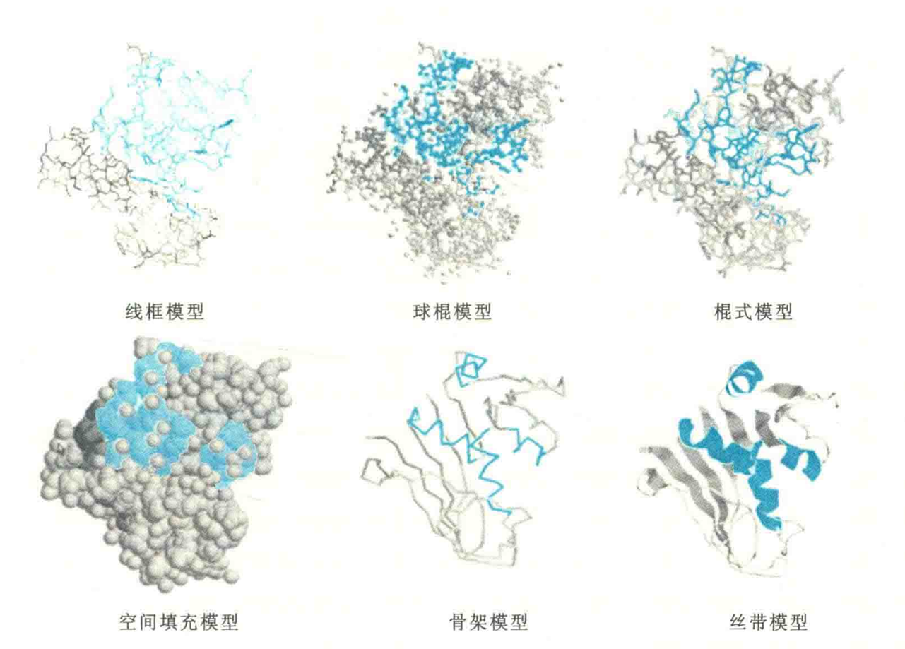

# 三级结构的表示方法

在得到一种蛋白质的三维结构以后，可以用不同的模型将其展示出来。几种常见的模型有6种

**线框模型**用线框表示蛋白质主链及其侧链，以显示蛋白质分子在三维空间上的轮廓。

**球棍模型**用“球”代表成键原子，“棍”代表原子之间的共价键，以此显示蛋白质分子的三维结构。

**棍式模型**用“细棍”代表原子之间的共价键，但原子本身并没有显示出来。

**空间填充模型**用重叠的“球”来表示成键原子，“球”的直径由范德华半径决定，此模型能更真实地显示出蛋白质分子的外形，但很难从模型中看见它的键角，很多重要的结构信息也没有表现出来。

**骨架模型**用粗的线条显示蛋白质主链在空间上的走向。

**丝带模型**用不同形状的丝带显示构成蛋白质分子各种二级结构在三维空间内的排布，此模型虽不能显示构成蛋白质分子的各个原子在空间上的具体排布，但能显示与蛋白质三维结构相关的重要二级结构信息

