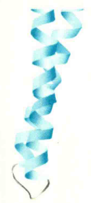
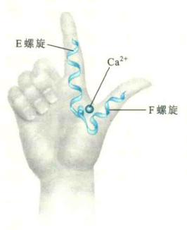
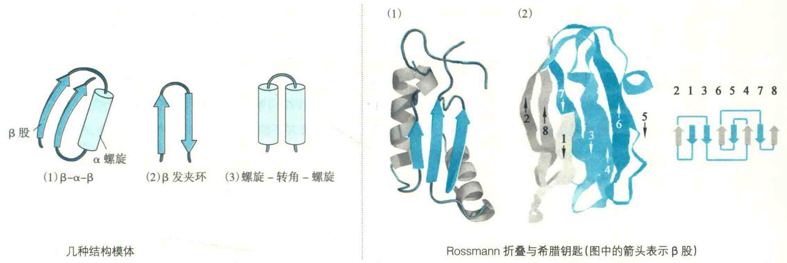
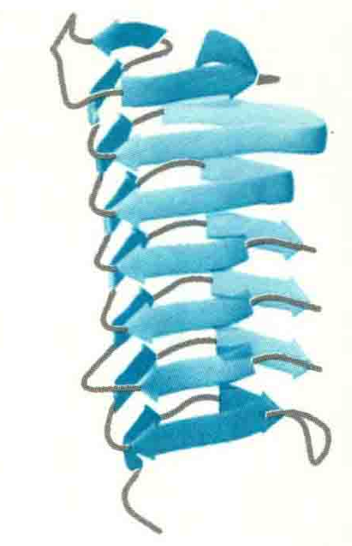

# 模体

在结构生物学上，模体这个概念有两种不同的用法。

1. 第一种用在一级结构上，特指具有特殊功能的特定氨基酸序列或DNα分子上的碱基序列，被称为序列模体。

例如，很多序列特异性DNα结合蛋白的一级结构含有一段CX2-4CX1-2HX3H序列（X代表任何一种氨基酸残基），它是形成锌指结构的特征序列，而被这些DNA结合蛋白识别的碱基序列可视为DNA分子上的序列模体。

再如，能够与整联蛋白结合的细胞外基质蛋白一般含有RGD序列模体。还有在细胞质基质核糖体上合成、最后定位并留在内质网腔的蛋白质都含有KDEL序列模体.

2. 模体的第二种用法表示的是结构模体，相当于**超二级结构**。如果一种结构模体对应于一种特定的生物功能，那么这种结构模体可称为功能模体。

结构模体作为结构域的组分，介于蛋白质二级结构和三级结构之间，由相邻的二级结构单元彼此相互作用，组合在一起，形成一种在空间结构上易于辨认的有规律的二级结构组合体，并充当三级结构的部件。在多数情况下，只有疏水残基的侧链参与这些相互作用，而亲水侧链多在分子的外表面，常见的结构模体包括：

## 卷曲螺旋

这是一种常见的α螺旋聚合体，一般是由两股或三股甚至多股α螺旋组装而成的一种超螺旋结构。螺旋间的方向有的是平行，有的是反平行。每一股螺旋一般含有BXXBCXC七肽重复序列，这里的B表示疏水氨基酸残基(经常是Leu)，C表示带电荷的氨基酸残基，X表示其他类型的氨基酸残基。这种有规律的七肽重复序列使螺旋之间能够通过螺旋表面的疏水补丁聚合在一起，亲水的R基团则暴露在表面，形成二聚体或多聚体，超螺旋的方向一般是左手。

卷曲螺旋不仅作为三级结构的模体参与蛋白质的折叠，而且还参与蛋白质与蛋白质之间的相互作用，因为蛋白质之间可以通过它形成二聚体或多聚体复合物，例如α角蛋白之间就可以通过这种方式形成二聚体。

再如，在真核细胞内经常发生各种小泡膜与目的地细胞器膜的融合，这种融合显然不是随意的，它依赖于来自小泡膜上的v-SNARE蛋白的一段螺旋，与目的地细胞器膜上的t-SNARE蛋白的三段螺旋之间的相互作用，如果能形成稳定的四螺旋束结构，说明双方的膜是匹配的，就可以融合，否则就融合不了。

## 螺旋-环-螺旋（HLH）

**HLH又称为EF手相**，是一种典型的功能模体。它是由E螺旋、F螺旋和螺旋之间的一个环组成，已被发现存在于多种与Cα2+结合的Cα2+传感器蛋白上，Cα2+在环上与蛋白质结合。

螺旋-环-螺旋中有一类称为碱性螺旋-环-螺旋(bHLH)，其中的一股螺旋含有碱性氨基酸残基。许多参与基因转录的转录因子(如c-Myc和MyOD)含有这种模体结构。这些转录因子通过碱性螺旋上的亲水氨基酸残基，识别DNA双螺旋大沟内特定的碱基序列，并形成氢键，从而与DNA分子上的特定序列位点结合。

## β-α-β

由2个β股和夹在中间的1个α螺旋组装而成，其中2个β股形成平行的β折叠。

## β发夹环

此模体因形似发夹而得名，它是蛋白质所有模体中最简单的一种，有时还会出现在一些小肽分子上，由两段反平行的β股和一段连接小环组成。β股之间形成氢键，小环含有2~5个氨基酸残基。

## 螺旋-转角-螺旋（HTH）

该模体是另外一种重要的功能模体，也存在于许多与DNA特异性结合的蛋白质分子上，如Cro、CAP和λ阻遏蛋白，其中与DNA结合的也是两股α螺旋中的一股。这股螺旋主要也是通过表面亲水氨基酸残基的侧链，与DNA分子上的特殊碱基序列形成氢键而结合。

## Rossmann折叠

该模体由两个相连的βαβ单位组成，每一个βαβ单位由两段平行的β股和一段作为连接链的α螺旋组成，进而形成βαβαβ结构，同时在紧密结合的折叠和螺旋之间经常有一个疏水核心。

::: tip

这种模体能结合辅酶I或辅酶Ⅱ，故存在于许多需要辅酶I或辅酶Ⅱ的脱氢酶中，如乙醇脱氢酶。

:::

## 希腊钥匙模体

这是一种全β折叠聚合体，存在于许多不同类型的蛋白质中，因在拓扑学上像古代花瓶上的希腊钥匙而得名。

::: tip

例如，清蛋白原和质体蓝素就含有这种模体。

:::

## β螺旋

这是由多个β股以螺旋的方式组织在一起，并主要通过股与股之间的氢键而得以稳定的模体。螺旋可以有2~3个侧面，其方向有右手的（如果胶酸裂合酶中的β螺旋），也有左手的（如古菌碳酸酐酶中的β螺旋）。

首例β螺旋被发现在果胶酸裂合酶分子中，此酶共含有7圈螺旋，长达3.4 nm，就像属于二级结构的α螺旋一样，2个β螺旋之间也可以很好地结合在一起，结合的方式可以靠它们各自的侧面接触，也可以靠两端通过氢键结合。若结合在一起的β螺旋分别来自两个不同的蛋白质，就可以促使蛋白质之间的相互作用。

