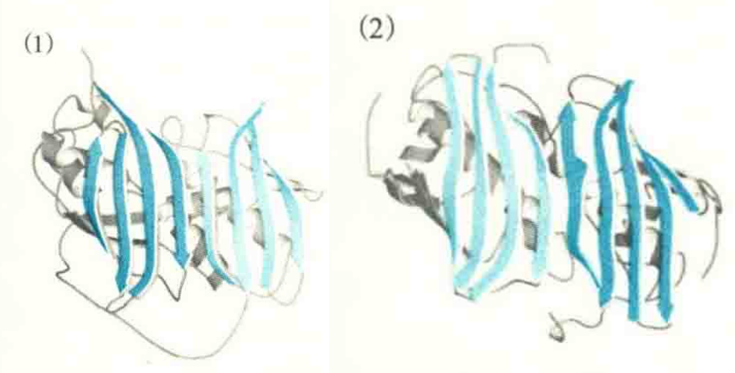
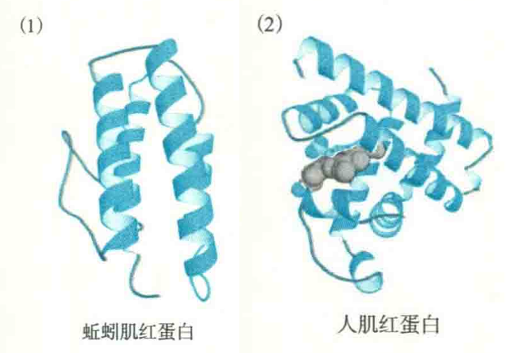
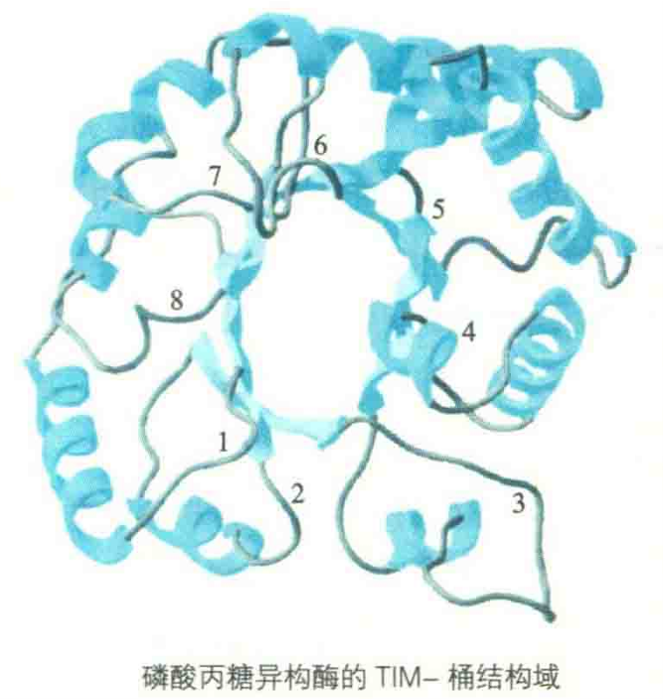

# 结构域

纤维状蛋白(如胶原蛋白)呈纤维状，其肽链向同一个方向伸展，但球状蛋白会卷曲成致密的球状结构。相对分子质量低于2×10^4的蛋白质通常呈一个简单的球形(平均直径为2~3 nm)，而较大的蛋白质一般会折叠成两个或多个相对独立的球状区域。这些相对独立的球状结构和/或功能模块称为结构域，每一个结构域通常是独自折叠形成的，内部都有一个疏水核心，并含有一个或几个模体结构。疏水核心是结构域稳定存在所必需的。

## 结构域的大小

结构域有大有小，但通常不会超过由250个氨基酸残基组成的单结构域蛋白，其中大多数在200个氨基酸残基以下，由51~150个氨基酸残基构成的结构域约占49%。迄今发现的最大的结构域含有907个氨基酸残基。

大的结构域疏水核心较大，所以稳定性更好。小的结构域疏水核心较小，因而稳定性较差，经常要借助于金属离子的结合或二硫键来加固。

不同的蛋白质含有的结构域数目也可能不一样，以2~3个较为普遍，其中有一种蛋白质被发现多达13个结构域。

## 结构域与生物进化

某些结构域在同一个蛋白质分子上有多个拷贝，即一个蛋白质分子含有多个相同或相似的结构域。有时，两个相邻的结构域之间除了一些起连接作用的外部环和小的肽段以外，可以发生几乎完美的重叠。一般认为，这样的蛋白质是通过基因重复的方式进化而来的，即一个结构域是另外一个结构域的复制品。

对于某些蛋白质，复制的结构域与母体结构域在序列上具有某种一致性，而对于其他一些蛋白质，经过多年的进化，序列跟母体相比已变得面目全非。复制的结构域是否与原来的结构域具有一致性，则取决于复制事件已经历了多长时间，以及指导它趋异的功能对原序列的影响。显然，基因复制的越古老，积累的突变就越多，从而使序列之间的亲缘关系变得模糊。

以大肠杆菌的硫酯酶为例，它有两个结构域在大小和形状几乎完全相同，但氨基酸序列差之甚远，这显然是几百万年的随机突变造成的。

## 结构域的相对独立性

结构域在结构上是相对独立的，在功能上也是如此。许多蛋白质的结构域在特殊的条件下被人为地分开以后，每一个结构域仍然保留各自原有的功能。

::: tip

例如，大肠杆菌DNA聚合酶Ⅰ含有3个结构域，分别有DNA聚合酶、3'-外切核酸酶、5'-外切核酸酶的活性。使用胰蛋白酶可以将其中的一个结构域和另外两个结构域分开。利用这种方法游离出来的小结构域具有5'-'外切核酸酶活性，另外两个结构域保留DNA聚合酶和3'-外切核酸酶活性。

:::

在许多参与激活基因转录的激活蛋白分子上，结构域所具有的相对独立性更是表现得淋漓尽致。这些激活蛋白一般有两个结构域，一个负责与DNA特异性结合，另一个负责激活基因的表达。当将DNA结合结构域与一种本来并不能结合DNA的蛋白质A融合，再将激活基因表达的结构域与另外一种并不能激活基因表达的蛋白质B融合以后，如果AB之间能够发生特异性相互作用，那么AB在相互结合以后能够作为一个整体，去激活报告基因（如绿色荧光蛋白）的表达。有人正是根据这一点，发明了一种研究蛋白质与蛋白质相互作用的酵母双杂交技术。

并不是所有的蛋白质在结构域被人为分开以后都可以保证功能不受到影响，如果一种蛋白质的某项功能由它的两个结构域共同承当，其结构域的分离必然会影响到它的功能。

还有一种情形，一个结构域的功能是调节另外一个结构域的活性，例如某些酶的催化中心在一个结构域上，调节酶活性的别构中心在另外一个结构域上，如果将这两个结构域分开的话，这些酶的活性将不再受原来的别构中心调节。

## 结构域的分类

根据占优势的二级结构元件的类型，结构域通常分为四大类：

- α结构域——完全由ά螺旋组成
- β结构域——只含有β折叠、β转角和不规则环结构
- α/β结构域——由β股和起连接作用的α螺旋片段组成，其组成单元是βαβ模体
- α+β结构域——由独立的α螺旋区和β折叠区组成。

构成这四类结构域的二级结构元件可能有不同的组织方式，而每一种组织就是一种结构模体。此外，还有一些结构域缺乏特定的二级结构元件，需要借助二硫键或金属离子来稳定。

### α结构域

α结构域经常含有四螺旋束模体，并行使多种生物功能，包括氧气运输、核酸结合和电子传递等。这种模体由4个反平行的α螺旋聚合而成，每一个α螺旋与下一个相交，夹角约为-20°，于是整个模体向左手弯曲。例如，蚯蚓肌红蛋白和人生长激素就含有这种模体。

另外一种常见的组成α结构域的模体是珠蛋白折叠，它一般由8个左右的α螺旋组成，这种模体使结构域内部形成一个疏水的口袋，以容纳大的疏水性的血红素辅基。该折叠因在肌红蛋白中首先发现而得名。

肌红蛋白只有一个结构域，功能是贮存氧气，构成模体的8个α螺旋环绕其血红素辅基。类似的模体还发现在另一类含有血红素辅基但参与电子传递的细胞色素分子上。

### β结构域

由β结构域组成的蛋白质包括免疫球蛋白、几种酶（如超氧化物歧化酶）和细胞表面的一些糖蛋白。因为在相邻的β股之间没有起连接作用的螺旋，所以全β结构域实际上只有反平行的β折叠，在β股之间起连接作用的是β转角和较大的环。

β结构域内的反平行折叠倾向于将它们的亲水一面面向蛋白质的表面，与水环境接触，而将疏水的一面面向疏水的核心，相互间还可以包装在一起，形成β桶结构。例如，清蛋白原使用希腊钥匙模体。

在含有β桶的蛋白质中有一亚类，其β桶是封闭的。在这种封闭的β桶中，可以检测到一圈氢键，即每一个β股与左右两个相邻的β股都形成氢键，这意味着第一个与最后一个β股也形成氢键。在已确定的β桶结构之中，β股的数目从4到20不等，β折叠多为反平行或混合型。例如，胰凝乳蛋白酶有两个结构域，每一个结构域都具有反平行的6股β折叠。

### α/β结构域

α/β结构域的一个常见例子是磷酸丙糖异构酶桶（TIM）或TIM-桶折叠结构域，它由8个重复的βα单元组成桶状结构，每一个α螺旋位于一个β股之后（之间是连接环），桶内侧的8个平行β股被外侧的8个α螺旋覆盖。

TIM桶折叠是PDB中最常见的一种结构域，它被发现存在于许多不同的前家族中从进化的角度来看，结构域这个层次也是独立进化的，而且蛋白质在分子进化中，结构域作为其基本部件，可以以不同的方式进行重组，就像洗牌一样，从而产生出具有不同功能的新的蛋白质。

