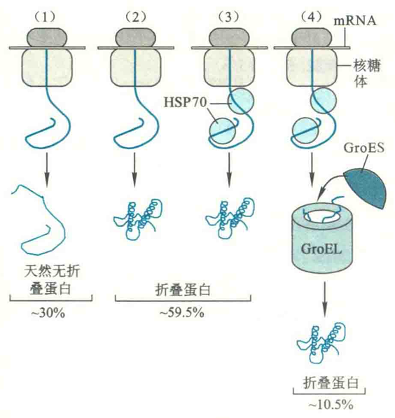
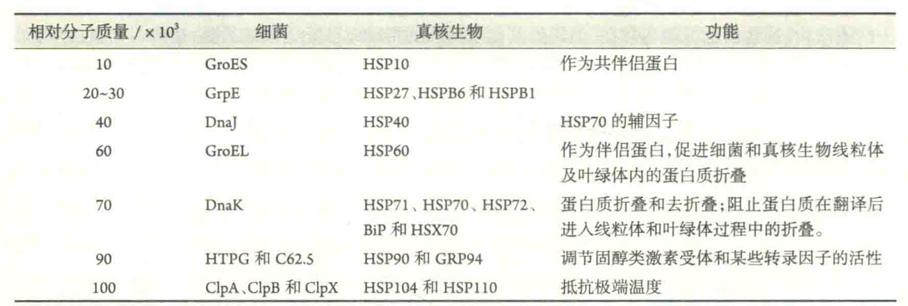
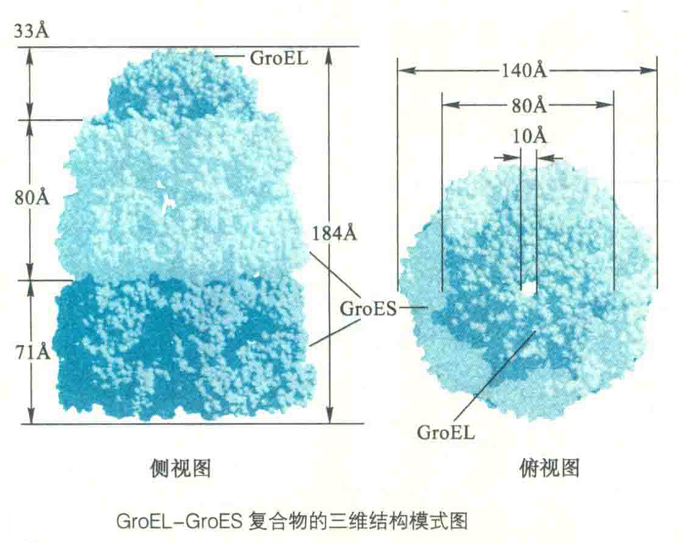
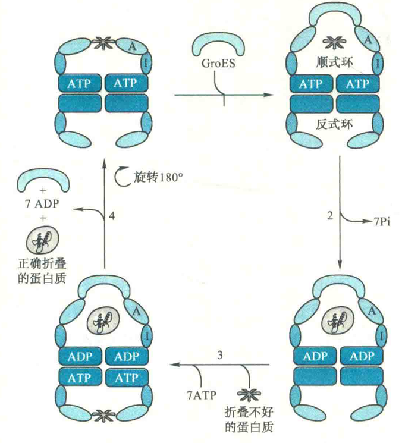
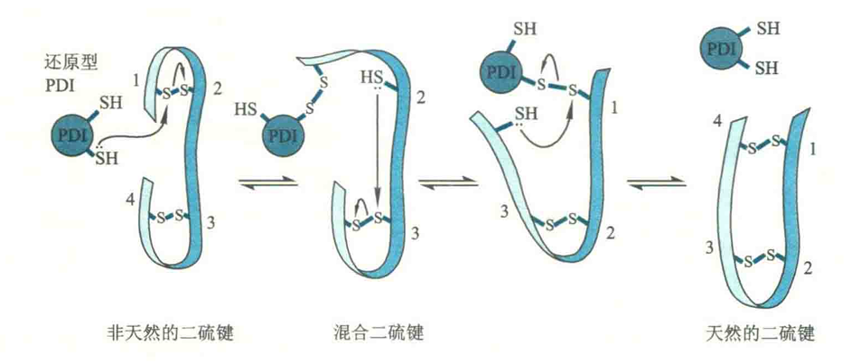
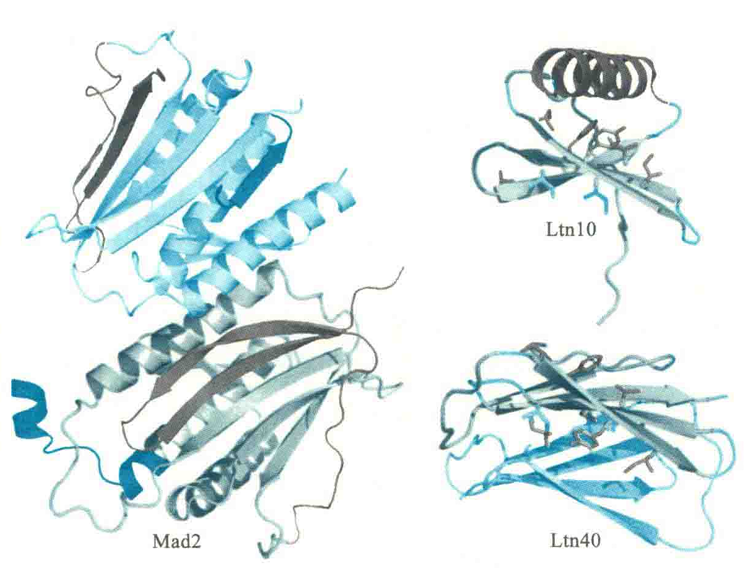

# 蛋白质折叠的基本规律

到目前为止，已经被确认的蛋白质折叠的基本规律包括：

## 法则一
一级结构决定三维结构，即一种蛋白质的一级结构包含了它折叠成最终构象所需要的全部信息。这就是美国科学家Christian B. Anfinsen在1954年提出的蛋白质折叠的热力学学说，也被称为Anfinsen法则。

现在有时将包含在一级结构中驱动蛋白质折叠的信息称为“第二套遗传密码”。

1. 就某些蛋白质而言，这些折叠信息是自我识别的，因而它们不需要其他蛋白质的帮助就可以正确地折叠；
2. 而对于另外一些蛋白质，这些信息可能也存在，但需要其他蛋白质的帮助以防止错误的折叠；
3. 还有一些蛋白质，如枯草杆菌素，以前体的形式被合成，在后加工的过程中被切除的肽段充当肽链剩余部分折叠的模板。前枯草杆菌素原是枯草杆菌素的前体，它在N端含有两段前肽序列，一段为信号序列，指导其分泌到胞外，另一段作为折叠的模板。在后加工的时候，先切除信号序列产生枯草杆菌素原，然后再切除第二个肽段，产生有活性的枯草杆菌素。

枯草杆菌素原的变性是可逆的，但枯草杆菌素则不然，这是由于枯草杆菌素已丧失了自我折叠的模板。

## 法则二
蛋白质的折叠伴随着自由能的降低，这属于热力学有利的反应。但是两种状态在自由能上的差距并不很大。小的自由能差异是必要的，因为如果差别太大，就意味着折叠后的蛋白质在结构上过于稳定，即刚性太强，柔性不足，这反而不利于蛋白质的功能发挥。

## 法则三

蛋白质的折叠是协同和有序的过程，而驱动蛋白质折叠的主要动力是疏水键，其他次级键也有作用。就氢键而言，要尽可能让主链肽基之间形成最大数目的分子内氢键，如α螺旋和β折叠，同时保持大多数能形成氢键的R基团位于蛋白质分子表面，与水相互作用。

## 法则四

在细胞内，不同的蛋白质折叠的路径不尽相同。

有些蛋白质在合成好以后，并不折叠或仅39仅部分折叠，它们缺乏特定的二级结构和三级结构，会暂时或永远处于完全或部分无折叠状态；有些蛋白质能够完全独立地进行折叠；但大多数蛋白质的折叠需要其他蛋白质的帮助。蛋白质在寻找其天然的低能状态的时候，会不断地经历折叠和重折叠反应，途中需要经过多个高能的构象状态。此阶段构成蛋白质折叠的**动力学障碍**，是折叠的限速步骤。

## 分子伴侣

事实证明，细胞内有一类专门的统称为分子伴侣的蛋白质可以克服这些动力学障碍，以加快折叠的速率，而克服动力学障碍的动力是ATP的水解。

分子伴侣所起的作用主要是在正确的时间和地点促进新生肽链的正确折叠，同时防止它们彼此聚集在一起形成沉淀，有时还能“拨乱反正”，帮助错误折叠的蛋白质有机会重新折叠成正确的构象。

此外，还有一种称为HSC70的分子伴侣参与细胞自噬，帮助真核细胞清除一些无用或损坏的蛋白质，将它们送往溶酶体或液泡（真菌和植物细胞）降解以循环利用。

显然，分子伴侣并非“终身伴侣”，一旦蛋白质折叠好，它就被释放，然后再参与另一个新生肽链的折叠。

绝大多数分子伴侣属于热休克蛋白（HSP）。HSP是一类细胞在受热和其他胁迫条件（如UV辐射和伤口愈合等）才表达或者大量表达的蛋白质。它们中的大多数作为分子伴侣促进新合成的蛋白质正确折叠，或者让在胁迫条件下变性的蛋白质重新折叠。

一般可以根据相对分子质量的大小，将HSP分成HSP10、HSP20、HSP40、HSP60、HSP70、HSP90和HSP100等亚类。其中，充当分子伴侣的有HSP10、HSP40、HSP60和HSP70。

HSP70作为分子伴侣，其作用是在细胞内与新生肽链上的疏水区临时结合，一方面能阻止多肽链提前折叠，另一方面可在多肽链没有折叠之前，防止暴露在外的疏水区之间通过疏水作用“非法聚集”在一起，而导致多肽链之间的聚合，甚至出现沉淀而伤害细胞。

HSP60和HSP10则在细菌以及真核生物的线粒体和叶绿体基质内，分别作为伴侣蛋白和共伴侣蛋白促进蛋白质的折叠。与HSP70不同，伴侣蛋白形成笼状结构，可将待折叠的蛋白质彼此隔离开来，各自折叠，而不会聚合在一起。在折叠反应中，伴侣蛋白会随着ATP的水解以及底物蛋白、共伴侣蛋白与其结合，不断地经历较大的构象变化口这些构象变化让伴侣蛋白可以结合没有折叠或错误折叠的蛋白质结合，将它们“揽入怀中”，让它们在由两个环构成的洞穴内“尽情”地折叠，一旦折叠好，即被释放出来。

### 大肠杆菌的分子伴侣

大肠杆菌的伴侣蛋白是GroES-GroEL复合物.在结构上，GroEL由两个垛叠在一起的7元环组成，其中的每一个亚基即为1分子HSP60。

两个7元环形成高15nm、宽14nm的圆柱体。它的上下各有1个中央空洞，是依赖于ATP的蛋白质折叠场所，可容纳相对分子质量为（1.5~6.0）×10^4的蛋白质折叠。

GGroES为单个的7元环，其中的每一个亚基即为1分子HSP10。GroES与GroEL结合的时候，就像一层屋顶。一个没有折叠或部分折叠的蛋白质分子从GroEL入口处的疏水区进入中央空洞结合以后，即进行依赖于ATP的折叠。

蛋白质分子在中央空洞内，经过多轮与空洞表面的结合、ATP水解、蛋白质释放、再结合的循环，直至折叠成功。但折叠仅发生在蛋白质与空洞表面脱离接触的短暂间隙。折叠是高度耗能的，以一个硫氟酸酶分子的折叠为例，它在中央空洞内达到完全折叠状态需要消耗100多个ATP。

GroEL具有顺式的环和反式的环，各与一个中央空洞相连。顺式环能结合7个分子的ATP并将其水解。而一旦ATP水解，顺式环的构象发生变化而导致环内中央空洞的扩大。

### 蛋白折叠转正步骤

在中央空洞内，一个没有折叠、部分折叠或甚至折叠不好的蛋白质可转变成正确折叠的蛋白质。以折叠不好的蛋白质为例，其“转正”的具体步骤如下：

1. 一个折叠不好的蛋白质分子在中央空洞通过疏水作用与GroEL结合，与此同时，ATP分子也与GroEL结合。
2. GroES与GroEL结合导致GroEL顺式环构象发生变化，改变了折叠不好的蛋白质与空洞之间的相互作用。
3. 与GroEL结合的7个ATP分子被水解，中央空洞内折叠不好的蛋白质“转正”。
4. 7个ATP和另一个折叠不好的蛋白质在另一端与反式环结合，与此同时，ADP、GroES和已正确折叠的蛋白质从顺式环释放。
5. 顺式环变成反式环，进入下一轮循环。

### 古菌和真核生物的分子伴侣

古菌和真核生物的细胞质基质含有另外一类伴侣蛋白，它们并不是热休克蛋白，而是属于含有TCP1复合物的伴侣蛋白（CCT）OCCT也称为TCP1环复合物（TRiC），在真核生物的细胞质基质可促进微管蛋白和肌动蛋白等蛋白质的折叠。这一类伴侣蛋白没有GroES的等价物，其顶盖是内置的，由顶部亚基突出的结构域组装而成。

TRiC是由8元环或9元环组成的双环结构，每一个亚基的相对分子质量为5.5×10^4

## 法则五

某些蛋白质的折叠还需要蛋白质二硫化物异构酶（PDI）和肽酰脯氨酰顺反异构酶（PPI）的帮助。

PDI的功能是促进含有二硫键的蛋白质形成正确的二硫键。其作用机制是通过重排二硫键，使蛋白质能快速找到热力学最稳定的二硫键配对方式。

PDI一般含有两段CGHC序列，处于这种序列中的Cys的疏基具有较低的PKa（7.3），低于其他蛋白质分子中疏基的pKa（8.5），故它的反应性较强，在生理pH下，就能够充当良好的亲核试剂，从而启动二硫键的重排反应。

### PDI的作用机制

1. 首先，它的一个反应性强的疏基进攻暴露在外的错误的二硫键，形成混合二硫键。
2. 随后发生二硫键的重组，直至形成正确的二硫键。
3. 由于正确的二硫键处于正确的三维结构之中，PDI很难再对其进攻，所以被保留下来。

真核细胞的PDl位于内质网，那些分泌到胞外或者最后定位到质膜的蛋白质在途中，经过内质网，因此能够形成正确的二硫键。而那些在细胞质游离的核糖体或者在细胞器（叶绿体和线粒体）核糖体上完成翻译的蛋白质一般是不会有二硫键的。

细菌的PDI又称为二硫桥形成蛋白（DSb），它位于细胞外的周质，因此只有分泌到周质中的蛋白质才有可能形成二硫键。

### PPI的功能

PPI的功能是促进X-Pro之间的肽键采取正确的形式。蛋白质分子中在X-Pro之间的肽键大概有6%以顺式构型存在。X-Pro之间肽键的顺反异构构成许多蛋白质折叠的限速步骤；PPI通过扭曲这个位置的肽键来促进它的顺反异构，从而加速蛋白质的折叠。

Pin1蛋白就是人体内一种重要的PPI，它在细胞内能够特异性地识别磷酸化的S/T-P序列，催化其中的肽键发生顺反异构，从而调节细胞内一系列蛋白质的活性，特别是一些与细胞周期调控有关的蛋白质，如周期蛋白D1。已发现，乳癌细胞内的Pinl呈过量表达。

## 法则六

最终得到的蛋白质构象不是僵硬的，而是具有一定的柔性。

通过实验测出来的蛋白质构象图是僵硬和静止的，但实际上蛋白质是高度柔性的分子，也许用“刚柔相济”这个成语描述蛋白质的结构特征更形象。

## 例外

与AnfinSen法则不符的除了天然无折叠蛋白以外，还有另外一类称为变形蛋白的蛋白质，能够以两种不同的构象存在，而这两种构象能量状态差不多，处于动态平衡之中。当它们与不同的配体分子结合的时候，可形成功能不一样的复合物。

### 淋巴细胞趋化蛋白

淋巴细胞趋化蛋白（Ltn）的细胞因子与其他细胞因子一样，可以与免疫细胞表面的受体结合，引发免疫反应。但Ltn能够以两种构象存在：

一种是典型的细胞因子的构象——由一个3股β折叠和一个C端α螺旋组成，这种构象形式为Lm10，可结合并激活它的受体；

另一种构象是全部由β折叠构成的二聚体，这种构象形式为Ltn40，可结合糖胺聚糖。

两种构象在相互转变的时候，需要几乎所有氢键或其他次级键的破坏和重建。

它们的生物活性是不相容的：细胞因子的构象结合不了糖胺聚糖，全β折叠激活不了受体。但两种不同的活性是它行使全部生物学功能所必需的。有人设计了一种突变，使其只能折叠成一种构象，结果就限制了它在机体内功能的发挥。

### Mad2

在真核细胞内，有一种参与纺锤体组装检查的蛋白质Mad2，在没有配体结合的时候，也有两种处于动态平衡的构象：一种是开放的构象，在这种构象状态下，它在C端的一段长达50个氨基酸残基的片段会紧紧地贴在蛋白质的右侧；另一种是封闭的构象，在这种构象状态下，它可以结合配体分子，如Mad1或Cdc20。而一旦结合了配体，其C端的肽段会发生移位，然后像安全带一样牢牢地扣住结合的配体。

显然，变形蛋白的存在可扩大一种生物的基因组的编码能力，因为一个基因编码的蛋白质可以折叠成两种不同的构象，而每一种构象又可行使不同的功能。
