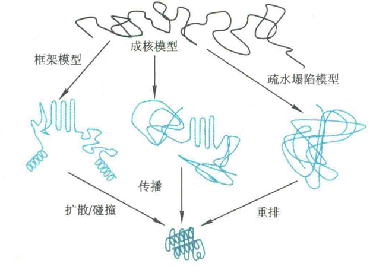
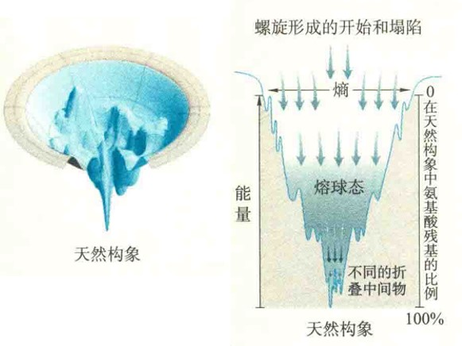

# 蛋白质的折叠历程

在Anfinsen提出蛋白质折叠的热力学学说以后，人们对于蛋白质在折叠过程中最后如何达到在热力学上最稳定的构象状态有很大的争议。

## Levinthal氏悖论

1969年，Cyrus Levinthal对此提出了一种观念：假定一种蛋白质由100个氨基酸残基组成，而每个残基有2个构象，那么这种蛋白质的总构象数目是2^100=1.27×10^30。再假定此蛋白质为了寻找总能量最低的构象状态，每尝试一次构象耗时10^-13 s，那么将所有可能的构象都尝试完需要的时间是4×10^9 yr。

事实上，许多小的蛋白质完成折叠的时间在毫秒甚至在微秒这样的数量级。Levinthal这种与事实不符的观念被称为Levinthal氏悖论。

Levinthal氏悖论表明，蛋白质折叠不可能是通过随机尝试来找到最后自由能最低的构象状态的，而是只尝试有限数目的构象，或者按照特异性途径进行折叠。于是，研究的重心转移到揭示特异性的折叠途径上。

## 三种模型

科学家根据体外实验的结果和计算机模拟等方法得到的数据，提出了3种模型用来解释蛋白质的折叠过程：

### 框架模型

该模型认为，局部的二级结构首先形成，它们独立于三级结构的建立。当折叠好的各种二级结构单元扩散并发生碰撞的时候，便发生了聚合，从而成功形成最终的三级结构。

### 疏水塌陷模型

该模型认为，蛋白质分子上的疏水侧链快速地发生包埋，即发生疏水塌陷，亲水侧链则暴露在外，形成熔球体。在熔球体内，远距离基团之间的相互作用得以建立，从而先形成三级结构，最后才形成二级结构。

### 成核模型

该模型认为，在一级结构上相邻的一些序列自发折叠成天然的二级结构。然后这些二级结构充当折叠核，其他结构以此为核心，向周围扩展，逐步形成最终的三级结构。

## 结合

有人将这3种模型结合起来，认为蛋白质折叠经过3步反应：

①启动，快速地形成局部二级结构，即折叠核，此过程是可逆的；

②折叠核协同聚合成结构域；

③结构域经熔球体，最终形成具有完整三维结构的蛋白质。

熔球体被认为是疏水塌陷的结果，这种中间体含有某些二级结构，但还没有形成正确的三级结构。

## 蛋白质折叠的全景图

蛋白质折叠的全景图好像一个漏斗，漏斗表面的每一个点代表的是多肽链的一个构象，蛋白质分子可被视为一组在向下滑行的滑雪者，下坡滑雪指导多肽链进入它的天然状态，有些蛋白质折叠过程比较“坎坷”，有些蛋白质则折叠得比较顺利。蛋白质的天然状态是最深的“山谷”，其他山谷代表的是部分折叠的构象状态。

## 蛋白质在溶液中折叠的驱动力

①肽链内氢键供体和受体之间形成氢键，而将原来有序结合的水分子释放，从而增加水的嫡；

②疏水侧链倾向聚合以尽可能减少与水接触的疏水面积；

③亲水残基面向表面与水接触，增加溶解性；

④带相反电荷的基团靠近，形成盐桥；

⑤在疏水作用力的基础上，疏水基团靠近而产生范德华引力。

## 不利于蛋白质三维结构稳定的因素

这些作用力也是稳定蛋白质三维结构的因素，而不利于蛋白质三维结构稳定的因素则包括：

①肽链形成有规律的二级结构，使嫡减少；

②将一个极性的基团从水相中移走，却没有让它形成新的氢键；

③将一个带电基团从水相中移走，却没有带相反电荷的基团和它形成盐键，或者将两个带同种电荷的基团强行放在了一起；

④将一个疏水基团放在水相中；

⑤将两个原子放在同一位置，产生空间位阻。

也许，蛋白质折叠就是这两种相反的势力相互较劲最后妥协的结果，仿佛是一个竞赛剧烈又相互谦让的游戏。