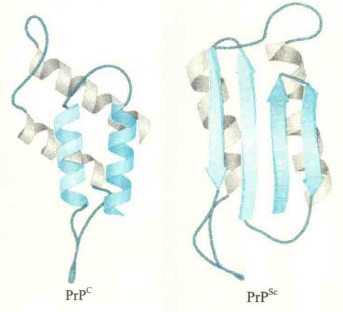
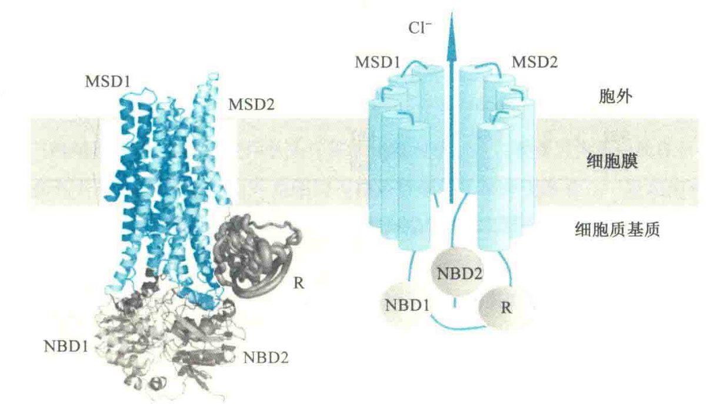

# 与蛋白质错误折叠相关的疾病

据估计，正常的细胞约有1/3的蛋白质可能会错误折叠，但细胞内有专门的质量控制系统，能及时发现并处理它们。

例如，分子伴侣能够与错误折叠的中间物结合并重启折叠过程。另外，在真核细胞内有一种称为泛素的蛋白质，能够将这些错误折叠的蛋白质打上“死亡”标签，并把它们引入到细胞内的“垃圾处理站"——种称为**蛋白酶体**的圆筒状细胞器，被“无情”地水解，以防止它们在细胞内的堆积。因此在一般情况下，细胞内出现少量折叠异常的蛋白质并不会影响到细胞的正常功能。

然而，如果一个细胞内大量出现某种错误折叠的蛋白质，以至于超出了质量控制系统的处理能力时，就可能导致机体的病变。错误折叠的蛋白质对机体造成的最大麻烦就是它们可能会聚集在一起，最终形成不溶性的淀粉样纤维损害细胞，严重的可导致细胞死亡。

近些年来，越来越多的疾病被发现与蛋白质的异常折叠有关，例如囊性纤维变性和一些神经退化性疾病，其中囊性纤维变性是由于基因突变导致编码的蛋白质不能正确折叠，而神经退化性疾病主要是因为后天因素导致神经细胞内出现一些细小的原纤维。原纤维由4~30个错误折叠的蛋白质形成，它们可进一步聚合成不溶性的纤维，而不论是原纤维还是纤维，都会危害细胞。

## 海绵状脑病

SE是一种致命性神经退化性疾病，因受感染的动物在脑部病变的部位出现海绵状的空洞而得名，它是由错误折叠蛋白引发的一代表性疾病。

SE可以感染多种动物，例如人的克雅病、GSS病、库鲁病、致死性家族性失眠症、幼儿海绵状脑病、山羊和绵羊的羊瘙痒病、鹿和麋的慢性消耗病、牛的海绵状脑病，即疯牛病。

### 致病因子

SE的主要症状包括渐进性痴呆和运动机能失调，致病因子是一种折叠异常的朊蛋白(PrP)，正常动物也有这种蛋白质，一般简写成PrPc。尽管PrPc与PrPsc的一级结构完全一样，但构象不同。

PrPc与PrPsc的主要差别是：PrPc富含α螺旋，可溶于水，对蛋白酶敏感，呈单体状态；PrPsc则富含β折叠，其核心部分能抵抗蛋白酶的水解，分子间很容易聚合形成多亚基聚合体，最后形成淀粉样纤维杆状结构。

PrPc主要分布在脑细胞上，少量发现在淋巴细胞和其他细胞中。PrPc的确切功能尚不清楚，有研究表明它与动物的长期记忆有一定的关系。PrPc在进化上十分保守，成熟的PrPc由209个氨基酸残基组成，含有一个链内二硫键，通过糖基磷脂酰肌醇（GPD）锚定在细胞膜的外侧。人的PrPc由位于20号染色体短臂上的PRNP基因编码。

### 感染途径

动物可以通过受外来的阮病毒感染、家族性遗传和PrPc偶然的折叠错误患病，无论是哪一种方式，都是先出现少量“坏的”蛋白质——PrPsc，而PrPsc旦出现，自身可以作为坏的模板，催化脑细胞膜上原来“好的”蛋白质——PrPc向“坏的"PrPSc转变。当一个脑细胞膜上出现许多PrPsc时候，它们就在膜上聚集并诱发质膜出现凹陷，形成内体。内体与溶酶体融合后，PrPsc因为结构特殊，无法被溶酶体中的蛋白酶分解，反而在溶酶体中大量累积，最终涨破溶酶体，使其中的蛋白酶和其他水解酶流出而对细胞造成破坏，使神经元大量死亡而产生海绵状空洞，由此导致神经退化和病变。烹调和煮沸都不能破坏玩病毒，因此，感染朊病毒的动物是绝对不能加工食用的.必须将其彻底销毁。

## 囊性纤维变性

囊性纤维变性是一种遗传性疾病，它与一种编码囊性纤维变性跨膜传导调节蛋白(CFTR)的基因缺陷有关，其中最常见的一种突变是缺失了508号位的Phe。该基因的缺陷导致患者体内缺乏正常有功能的CFTR，因此这种疾病是一种隐性遗传性疾病，即编码CFTR的两个等位基因必须同时有缺陷才能致病。

正常的CFTR是一种ABC转运蛋白，全长1480氨基酸残基，存在于多种上皮细胞的质膜上，作为一种受ATP调控的Cl-通道，负责将Cl-运输出细胞。

它共有5个结构域，其中2个为跨膜结构域（MSD或TMD），每1个MSD有6个跨膜的α螺旋，这些螺旋都与细胞质基质中的2个核甘酸结合结构域(NBD)相连。第一NBD通过一个调节结构域(R)与第二个跨膜结构域相连。这个R结构域是CFTR特有的，因为其他ABC转运蛋白并没有。

研究发现，R结构域只有受蛋白激酶A(PKA)催化发生磷酸化以及NBD结合了ATP以后，CFTR才有活性。有缺陷的CFTR不能正常地折叠，其折叠中间物不能与分子伴侣解离，从而导致它不能整合到细胞膜上，结果在胞内很容易被降解掉。于是，缺乏CFTR的上皮细胞开始积累由于渗透压的缘故，细胞会不断地吸收周围黏液中的水分，导致黏液变稠，特别在患者的呼吸道内会产生稠厚的黏痰，而阻碍呼吸，引起阵阵剧烈咳嗽，使得呼吸道反复受感染。患者平均期望寿命仅为37岁。

## 其他疾病

除了海绵状脑病和囊性纤维变性以外，阿尔茨海默病（AD）和帕金森病（PD）也是两种因蛋白质错误折叠引起的疾病。