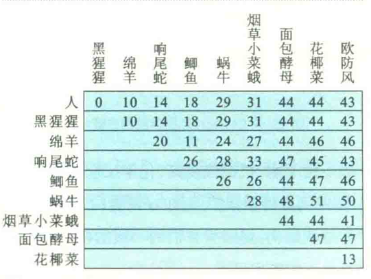
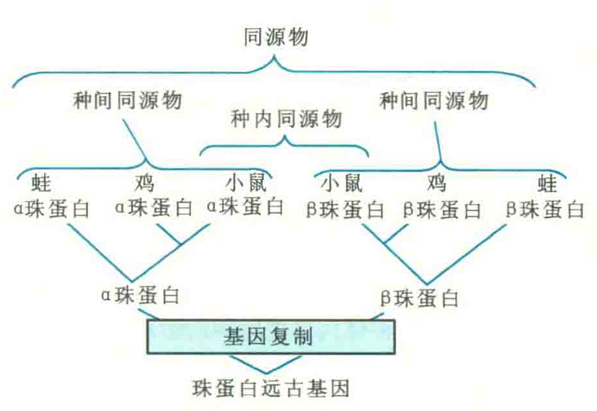

# 蛋白质结构与功能之间的关系

蛋白质的结构与功能之间的关系，一直是生化学家和分子生物学家最关注的问题之一。在经过对多种蛋白质的结构与功能关系的研究，科学家已总结出了其中的一些基本规则。

1. 蛋白质的一级结构决定其三维结构，而三维结构直接决定蛋白质的功能。

2. 大多数蛋白质一旦合成后，就会折叠成特定的三维结构，并开始行使特定的生物学功能。一旦三维结构被破坏，蛋白质的功能随之丧失。少数蛋白质在体内可暂时处于天然无折叠状态，但在需要的时候可迅速折叠并行使它们的功能。

3. 蛋白质在行使功能的时候一般需要三维结构或构象的变化，这种构象的变化可能是剧烈的也可能是细微的。

## 结构与功能的关系

4. 结构相似的蛋白质一般具有相似的功能。反过来，功能相似的蛋白质通常具有相似的结构，特别是三维结构。

这项规则，有时对于预测一个序列已知的蛋白质的功能往往很有用。例如，假定有一天你在某一种生物体内发现一种新的蛋白质，并获得了它的一级结构，这时你可以在蛋白质序列数据库里进行查询和比对，看数据库里面有无功能已知的蛋白质跟你研究的这种蛋白质序列相似。如果有，那么你正在研究的这种蛋白质的功能很可能与数据库中这种已知功能的蛋白质相似，甚至相同。序列相似度越高，可能性越大。

使用序列比对软件绘制生物进化树，你研究的蛋白质与进化树中靠得最近的蛋白质在功能上应该最有可能相似或相同。当然，通过这种方法预测出来的蛋白质功能最终还需要通过设计的实验来进行验证。

## 功能与亲缘关系

5. 在不同物种体内功能相同的蛋白质具有相同或基本相同的三维结构，但一级结构是否有差异以及差异的程度往往取决于物种之间在进化上的亲缘关系。

以组成有氧生物呼吸链的关键成分细胞色素c为例，这种蛋白质存在于所有的有氧生物体内，与原核生物的质膜和真核生物的线粒体内膜相联系，其功能是作为一种流动的电子传递体，往返于呼吸链的复合体Ⅲ和Ⅳ，进行电子的传递，但真正传递电子的是与细胞色素e共价结合的血红素辅基上的铁离子。

在对多种不同来源的细胞色素c的晶体结构进行研究后发现，它们在三维结构上都惊人地相似。而在对40种不同的真核生物的细胞色素c的一级结构进行比较分析后还发现，在构成细胞色素c的110个左右的氨基酸残基中，28个残基始终不变，这意味着这28个氨基酸残基是细胞色素c形成稳定的三维结构，或者行使正确的功能所必需的。

进一步的研究结果还表明，在这28个高度保守的氨基酸中，有3个Gly，2个Cys，1个His和1个Lys。

- 其中的3个Gly在所有的细胞色素c分子中都是绝对保守的；
- 而2个Cys和1个His关系到血红素辅基与细胞色素c的共价及配位结合，因此也是不可变更的；
- 至于这个Lys残基，有关细胞色素c与膜的结合，因而也是高度保守的。

从二级结构的层次来看，保守的氨基酸多分布在无规卷曲中，还有5段β突起高度保守。这与无规卷曲通常与蛋白质的功能关系密切，以及β突起通过细调肽链的走向而影响细胞色素c最终三维结构的形成是一致的。

根据两种有氧生物在细胞色素c一级结构上的差异程度，可以判断它们之间的亲缘关系。

例如，人与黑猩猩没有差别，而人与绵羊相差10个，与鲫鱼相差18个，与酵母相差44个。这清楚地表明，亲缘关系越近，氨基酸的差异就越少。根据不同种属之间氨基酸残基差异的多少和替换速率，可基本了解生物的进化过程，并描绘出系统分子进化树。

## 结构与起源

6. 一级结构相似的蛋白质往往具有共同的起源，但不是一定具有共同的起源。

   很多人喜欢根据蛋白质一级结构的相似性来研究生物进化。一般说来，两种生物的亲缘关系越近，它们的基因和蛋白质的一级结构就越相似。

在蛋白质的进化过程中，一般有两种情形可产生结构相似、功能相似的蛋白质。一是类似物，另一是同源物。

### 类似物

类似物专指具有相同的功能，但起源于不同的祖先基因的蛋白质，它们是基因趋同进化的产物。

例如，鼠疫杆菌和牛都合成一种酪氨酸磷酸酶，这两种生物产生的同一种酶在活性中心的三维结构十分相似，活性也相似，但一级结构差别很大，显然它们是从完全不一样的祖先基因进化而来的。

再如，枯草杆菌合成的枯草杆菌蛋白酶与哺乳动物消化道分泌的胰蛋白酶、胰凝乳蛋白酶和弹性蛋白酶都属于丝氨酸蛋白酶，虽然它们的活性中心都含有由Ser、His和Asp组成的催化三元体，但是在一级结构和三维结构上差别很大，因此它们也来自不同的祖先基因。

### 同源物

同源物专指存在于不同生物或者同种生物，来源于某一共同祖先基因的蛋白质，可进一步分为种间同源物和种内同源物。

种间同源物也称为直向同源物或直系同源物，专指来自于不同物种的由垂直家系（物种形成）进化而来的蛋白质，它们通常保留与原始蛋白相同的功能，但也不尽然。例如，小鼠、蛙和鸡各自的α珠蛋白或β珠蛋白。

种内同源物也称为旁系同源物，专指同一物种内由于基因复制、分离产生的同源物。例如，小鼠α珠蛋白和β珠蛋白，蛙的α珠蛋白和β珠蛋白。通过进化，这一类种内的同源物可能会获得新的功能，但这种新功能多多少少会与原来的功能有一定的关系

7. 许多疾病都是体内重要的蛋白质结构异常引起的。

