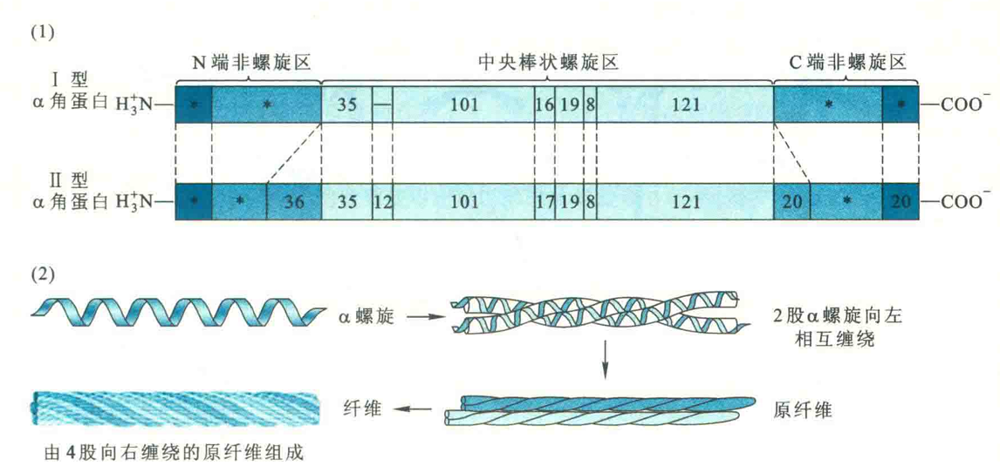

# α角蛋白

α角蛋白因二级结构主要是α螺旋而得名。它广泛存在于动物的毛发、角、鸟喙和爪子中，可分为不同的亚型，如I型和Π型。

其一级结构由311~314个氨基酸残基组成。每一个α角蛋白分子在肽链的中央形成典型的α螺旋，而两端为非螺旋区。

螺旋区由七肽重复序列（-a-b-c-d-e-f-g-）组成，a位和d位刚好为疏水氨基酸。

这样的分布让两个α角蛋白分子可通过a位和d位的疏水R基团结合，并相互缠绕形成一种双股的左手超螺旋，即**卷曲螺旋**。

卷曲螺旋大大地提高了α螺旋的稳定性。此外，在链间还有二硫键，这种共价交联可进一步提高α角蛋白的强度。

指甲的强度比毛发高是因为含有更多的Cys残基，能形成更多的二硫键。

α角蛋白分子还可以在双股的卷曲螺旋的基础上，先形成原纤维，然后再由原纤维组装成纤维。

::: tip

在美发过程中，无论是卷发还是直发，原理都一样：先用硫基类化合物（如巯基乙酸铵或半胱氨酸）破坏二硫键（大约45%的二硫键被切断），使之被还原成游离的巯基，易于变形；再用发夹和发卷将头发塑成一定的形状（卷发让头发成为波状，直发则将头发拉直）；最后用氧化剂重建二硫键，使发型固定下来。

:::

在机体内，除了α角蛋白分子之间可以形成卷曲螺旋这样稳定的超螺旋结构以外，还有其他的一些蛋白质，它们都属于卷曲螺旋蛋白超家族的一员。

例如，人体属于这一超家族的蛋白质约有60种，它们包括构成细胞骨架的中间纤维以及肌球蛋白（myosin）和原肌球蛋白等。

