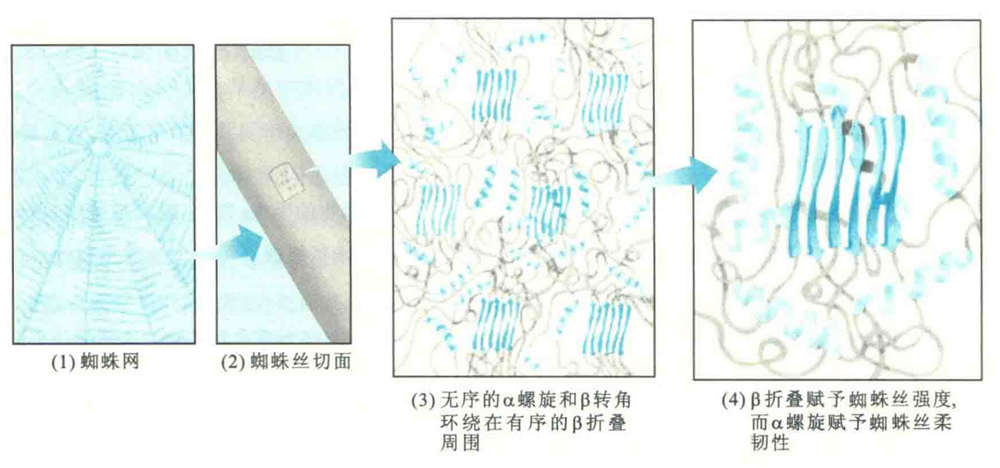
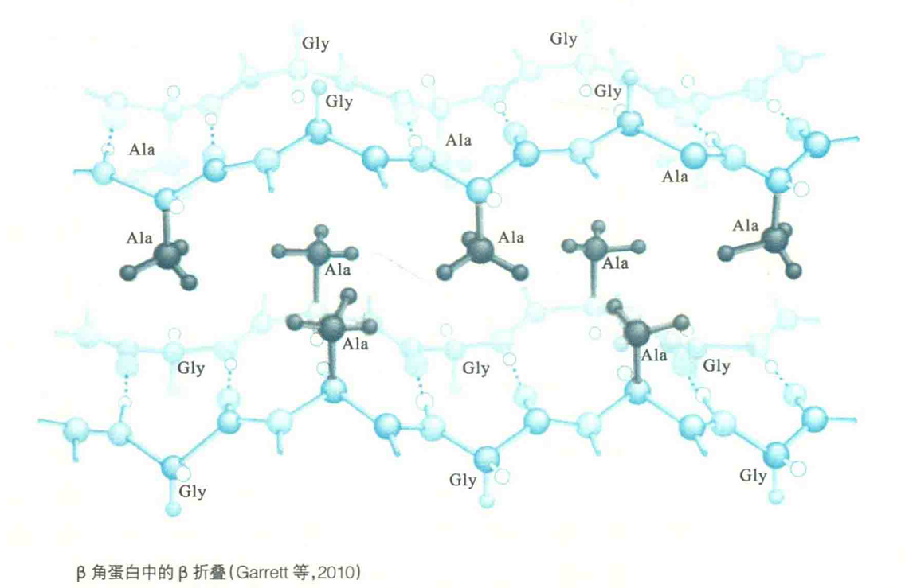

# β角蛋白

β角蛋白则因二级结构主要是β折叠而得名，大量存在于蚕丝和蜘蛛丝之中。其一级结构富含Ala和Gly，具有重复序列GIy-Ala/Ser-Gly-Ala/Ser；它的二级结构主要是有序的反平行β折叠，还有一些环绕在β折叠周围的无规卷曲和α螺旋。

有序的反平行β折叠构成丝的微晶区，由于Gly和Ala/Ser分别分布于折叠片层的两侧，相邻的β股能更加紧密地堆积形成网状结构，从而赋予丝较高的抗张性。而无序的α螺旋和无规卷曲构成无定形区，又使丝具有一定的弹性。

