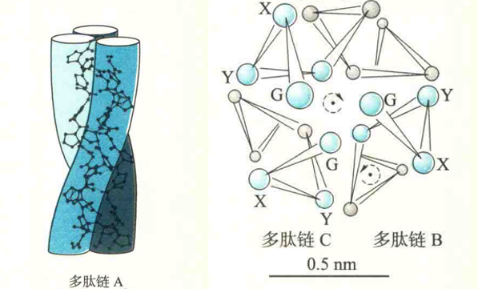
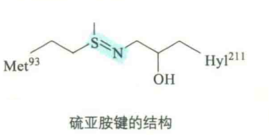

# 胶原蛋白

胶原蛋白作为动物细胞胞外基质内的一种主要结构蛋白，广泛存在于动物的结缔组织和其他纤维样组织中，如肌腱、韧带、骨骼、基底膜和血管壁等，是哺乳动物体内含量最丰富的蛋白质。在食品工业上经常使用的明胶就是动物胶原蛋白经酸或碱部分水解的产物.

胶原蛋白的基本组成单位是由3条α链组成的原胶原。其中有两条相同的叫α1链，第三条链为α2，两者在组成上有所差别。不同类型的原胶原由于α链的氨基酸组成及含糖量不同因而性能也不同。

在人体内已发现的近29种不同类型的胶原蛋白中，I型胶原最多，占90%以上。

## 原胶原的一级结构

原胶原的一级结构的主要特征是：

①约1/3是Gly（约33%），Pro含量也很高（约12%），但Tyr含量少，Trp和Cys缺乏；

②具有3种修饰的氨基酸，即4-羟脯氨酸（Hyp）、3-羟脯氨酸（约9%）和5-羟赖氨酸（Hy1）；

③每一条肽链都具有重复的Gly-X-Y三联体序列，重复次数约200。X和Y通常是Pro，也可能是Lys，Y位置上的Pro经常被羟基化为4-羟脯氨酸，Lys也常被羟基化成5-羟赖氨酸。

## 胶原蛋白的二级结构

胶原蛋白富含Gly和Pro的性质使得它难以形成α螺旋和β折叠，但有规律的三联体重复序列却有利于3条α链相互“抱成一团”，形成另外一种螺旋，即三股螺旋。

三股螺旋为原胶原特有的二级结构，其二面角为（-51°,153°），由三股以左手螺旋存在的α链组成，这三股α链以氢键相连，并相互缠绕形成右手超螺旋。

在螺旋中，体积最小的Gly正好位于螺旋的内部，构成紧密的疏水核心，而Pro和Hyp的侧链位于三股螺旋的表面，面向外，以尽量减少空间位阻。

每一个Gly残基的氨基H与X残基的羧基形成氢键，一个三联体序列大约形成一个氢键。

三股螺旋比α螺旋更为伸展，每一个氨基酸残基上升0.29nm，一圈有3.3个氨基酸残基。

## 胶原蛋白的稳定因素

Pro残基缺乏氢键供体，因此单凭三条肽链主链之间形成的氢键，还不足以稳定三股螺旋结构。这时就需要通过特殊的化学修饰在肽链上引入额外的氢键供体。这种化学修饰就是发生在Pro残基上的羟基化反应。

其中催化羟化反应的羟化酶需要Ο2、Fe2+，酮戊二酸和维生素C。

Fe2+包埋在羟化酶的活性中心，所起的作用是活化充当底物的O2，但它很容易被氧化成无活性的Fe3+；

维生素C所起的作用是作为抗氧化剂，可防止Fe2+的氧化。

故维生素C的缺乏会导致胶原的羟化反应不能充分进行，也就影响到正常胶原纤维的形成。那些非羟化的前仪链在细胞内很容易降解，从而导致牙龈出血、创伤不易愈合等病变，严重可导致**坏血病**。

## 胶原蛋白的合成

胶原蛋白主要由成纤维细胞合成。刚刚翻译出的多肽链被称为前α链，其两端各有一段不含Gly-X-Y重复序列的前肽，但却含有Cys。

3条前α链的C端前肽借助Cys残基之间的二硫键形成链间交联，使得三条前α链“对齐”排列，然后从C端向N端形成三股螺旋。

前肽部分呈非螺旋卷曲，形成球状结构域。带有前肽的三股螺旋胶原分子被称为前胶原。前α链在细胞内合成后还要进行糖基化修饰，才能自组装成三股螺旋。

前胶原分泌到胞外以后，在前胶原肽酶的催化下，两端的前肽序列被水解后成为原胶原。胶原变性后不能自然复性重新形成三股螺旋结构，是因为成熟胶原分子的肽链不含前肽，故不能再进行“对齐”排列。

在胞外基质内，4个原胶原分子以平行交错的方式聚合成胶原原纤维，再进一步包装成胶原纤维。原胶原分子内部和原胶原单位之间会逐步形成特殊的共价交联，进一步稳定和加强胶原结构。

其中最常见的一种共价交联的形成需要胞外基质中的赖氨酰氧化酶。在此酶的催化下，原胶原上的Lys残基被氧化成醛赖氨酸。而醛赖氨酸上的醛基可以与邻近肽链上的Lys氨基或Hyl的羟基缩合，由此形成共价交联。共价交联的形成是一个缓慢的过程，可持续一生，故交联的程度随着年龄的增加而加深。引入共价交联能提高组织强度，但同时也降低了组织的弹性和柔韧性。

## 硫亚胺键

胶原肽链之间除了有上述这种常见的共价交联以外，科学家已在IV型胶原分子之间发现了一种新的共价交联——硫亚胺键，它是在一个Met残基和一个Hyl残基的侧链之间形成的。

该结构就像"挂人/钩”一样，可将IV型胶原分子连接在一起，为细胞提供了很好的支架。

2012年，G.BhaVe等发现几乎所有动物都存在的一种过氧蛋白催化了硫亚胺键的形成。

2014年，Bhave G.等又发现溴元素以HOBr的形式作为过氧蛋白的辅因子，参与了硫亚胺键的形成。这项成果直接让溴成为一种新的生命元素。

## 胶原相关疾病

营养不良或者基因缺陷可导致许多与胶原相关的疾病，如成骨不全。

成骨不全又称脆骨病，其典型症状为骨骼脆性增加。在患者体内，编码组成I型胶原α链的基因有缺陷，而导致肽链上的某些Gly被侧链较大的氨基酸残基取代。

较大的侧链基团容易产生空间位阻，这使得三股螺旋出现突起，破坏了螺旋的稳定性，导致胶原蛋白不能正常地行使功能。

另外，N型胶原之间的硫亚胺键异常，可引发一种罕见的自身免疫疾病肺出血肾炎综合征。例如，机体内过氧蛋白酶过度活化，有可能导致了IV型胶原过度沉积，引起基底膜增厚，进而损害肾功能

