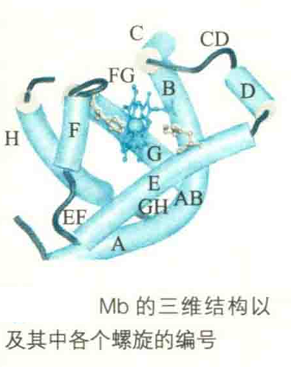
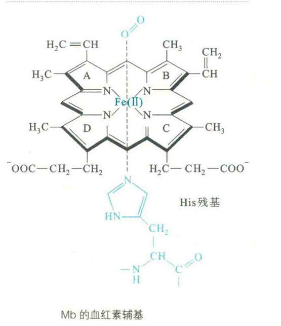
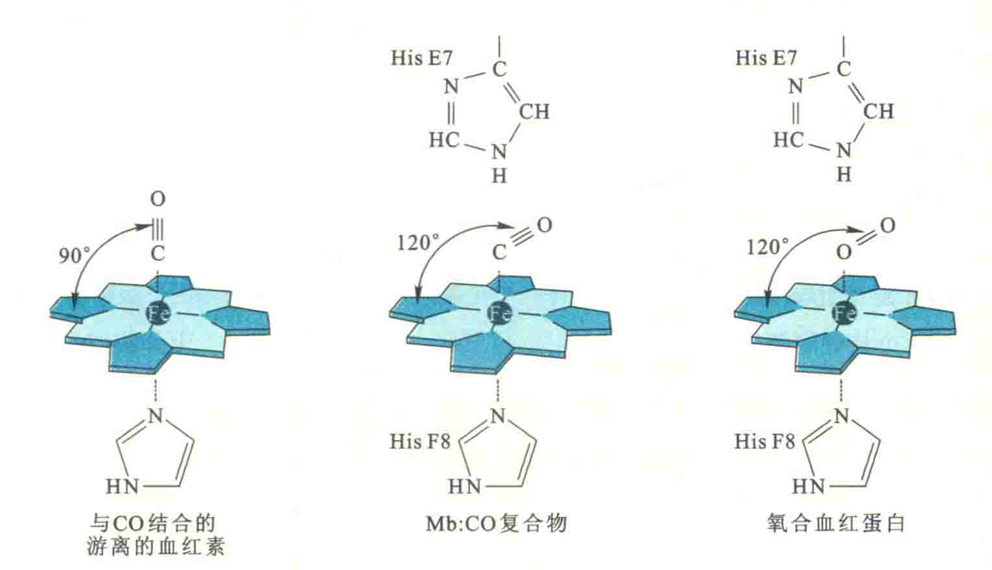
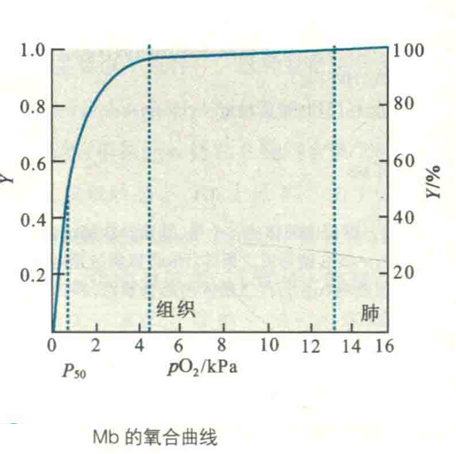
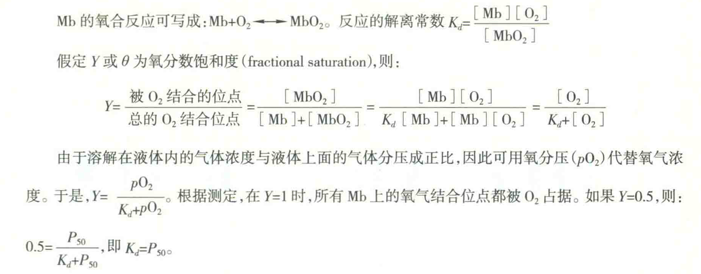

# 肌红蛋白

Mb只存在于肌细胞中，心肌含量特别丰富。

其功能是作为氧气的贮存者，专门为动物的肌肉组织贮备氧气，因为肌肉组织对氧气的需求比较大，特别是在做激烈运动的时候。水生哺乳动物（如鲸鱼）体内的Mb含量尤其丰富，因此它们可以在水下长时间憋气。

## Hb的一级结构

Mh的一级结构特征包括：由一条肽链组成，含有153个氨基酸残基；紧密结合1个血红素辅基。血红素由原卟啉和Fe2+组成。

## Mb的二级结构

Mb的二级结构特征包括：共有8段α螺旋，它们约占全部序列的75%，按照N端到C端的次序，被依次编号为A、B、C、D、E、F、G、Η。螺旋之间是短的β转角或小环（CD表示C、D螺旋之间转角或环，以此类推）。有4个螺旋终止于Pro残基。

Mb是第一个获得完整三维结构的蛋白质。1959年，John Kendrew和Max Perutz使用X射线晶体衍射的方法，成功获得抹香鲸肌红蛋白的三维结构。1962年，Kendrew和Perutz因此而荣获诺贝尔化学奖。

Mb整条肽链与血红蛋白的每一条肽链一样，折叠成紧密的球状结构，疏水侧链大都在分子内部，极性、带电荷的侧链则暴露在分子表面，因此水溶性好。

其分子表面有一个深的疏水口袋，口袋的侧面由E螺旋和F螺旋组成，底部由G螺旋和H螺旋组成。血红素“藏”在袋中，与周围氨基酸残基形成次级键，而Fe"与F螺旋8号位的HiS残基（HisF8）形成配位键。

该口袋既可让O2进入与Fe2+结合，又可防止Fe2+被氧化成Fe3+，但阻止H2O的进入。

Fe2+一共可以形成6个配位键，在结合氧气之前，它已形成了5个配位键——4个与原卟啉吡咯环上的N原子，1个与HisF8的咪唑基。HisF8被称为近端组氨酸。

显然第6个配位键是专门为O2预备的，O2可以通过这个配位键可逆地与Fe2+结合。

## CO中毒

但如果Fe2+被氧化成Fe"，水分子就会立刻占据第6个配位键，而导致氧气无法结合。

CO与O2差不多大，因此也能与血红素结合。CO的毒性主要是因为它与血红素的亲和力更强，从而阻止了与血红素的结合。

## 高铁血红蛋白症

游离的血红素也能够与氧气结合，但它们在溶液中很容易相互靠近，在有氧的情况下，所有的铁都会被氧化成高价态。而“高铁”是不能结合氧气的，因此生物没有选择用游离的血红素分子来运输或者贮存氧气。

如果血红素结合在Mb或者Hb的疏水口袋之中，血红素分子之间等于被安全隔离起来，其中的铁也就难以氧化了。因此，Mb的作用实际上是用疏水口袋保护血红素的二价铁，防止它被氧化。

然而，尽管Mb和Hb本身已为上面的Fe2+提供了很好的保护，但是细胞内的各种氧化剂仍有可能对其进行氧化，从而导致体内出现少量无功能的高铁血红蛋白和高铁肌红蛋白。

### 防御机制

幸好正常人的体内还有一种保护机制，这种机制主要依赖细胞色素b5还原酶。该酶也被称为NADH-高铁血红蛋白还原酶，能够利用细胞内的还原性辅酶I（NADH/H）将被氧化的铁还原成低价态。此外，有一种次要的NADPH-高铁血红蛋白还原酶也具有类似的功能。

### 发病机制

如果一个人缺乏有功能的细胞色素b5还原酶，那体内的met-Hb水平就可能异常的高，从而得高铁血红蛋白症。

高铁血红蛋白症患者由于大量met-Hb的存在，而降低了红细胞的携氧能力，令他们的血液颜色比正常人更深，皮肤的颜色也因此可能呈现为罕见的蓝色。

## 远端组氨酸

将血红素放到Mh和Hb上还有一个好处，就是降低血红素与CO的亲和力。根据测定，游离血红素与CO的亲和力是与O2亲和力的25000倍！而Mb和Hb分子上的血红素辅基与CO的亲和力仅是与O2亲和力的200倍。

Mb和Hb分子上的血红素辅基对CO亲和力的急剧下降与E螺旋7号位His残基（HisE7）有关。HisE7位于血红素平面的另一侧，与近端组氨酸（HisF8）隔环相望，因此也称为远端组氨酸。

远端组氨酸和近端组氨酸一样，对珠蛋白家族的所有成员来说都是不可缺少的。

远端组氨酸有两个重要的功能：

一是保护血红素的二价铁，阻止细胞内任何可能的氧化剂对铁的氧化；

二是为CO与血红素的结合制造障碍。因为对于CO而言，它与血红素铁结合的“舒适”角度是垂直于血红素平面，即90°，而HisE7的出现使得CO只能与120°的角度结合，因此CO与血红素结合的亲和力就下降了。而对于O2来说，它与血红素铁结合的“舒适”角度就是120。，故有无HisE7对血红素结合O2没有影响。

## Mb氧合曲线

Mb结合O2的特征可以用氧合曲线来描述，为双曲线的一支。

从图中可以看出，Mb倾向于结合氧气而不愿意放出氧气，因此它的功能是贮存氧气，只有在pO2极低的时候，如肌肉因剧烈运动而缺氧，它才释放出氧气。

Mb在肌肉组织中的重要生理功能似乎表明它是动物不可缺少的蛋白质。然而，有人使用基因敲除技术，培育出了缺失Mb的小鼠，结果发现，这些小鼠不仅能生存，还能正常地运动和生育，对缺氧也有正常的通气反应。

尽管这些小鼠的心肌和比目鱼肌没有正常肌肉的颜色，但功能仍显示正常。

缺失Mb的小鼠能够正常地生存，可能是因为机体为此做出各种代偿性反应，如Hb浓度、血流量和毛细血管密度都有所提高。
