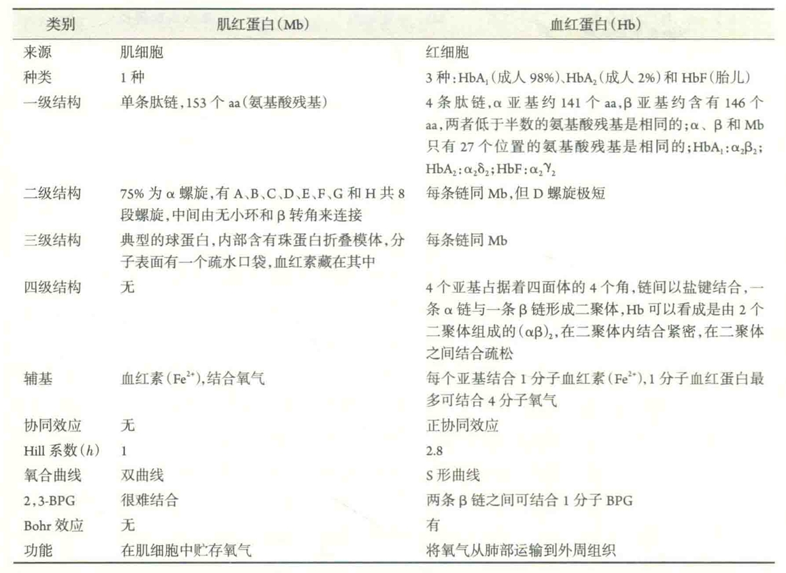
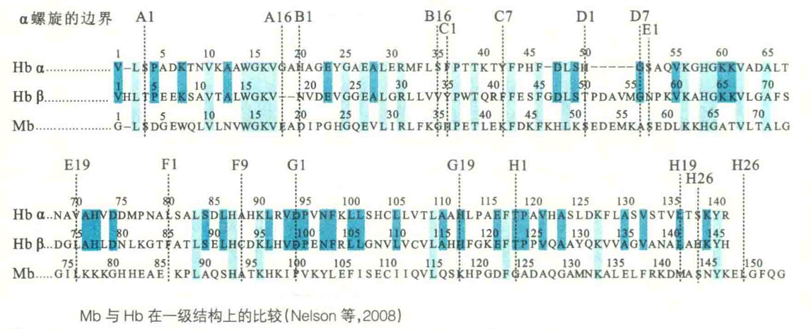
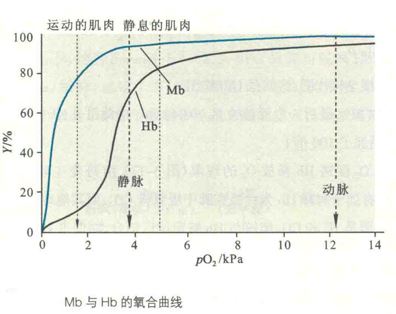
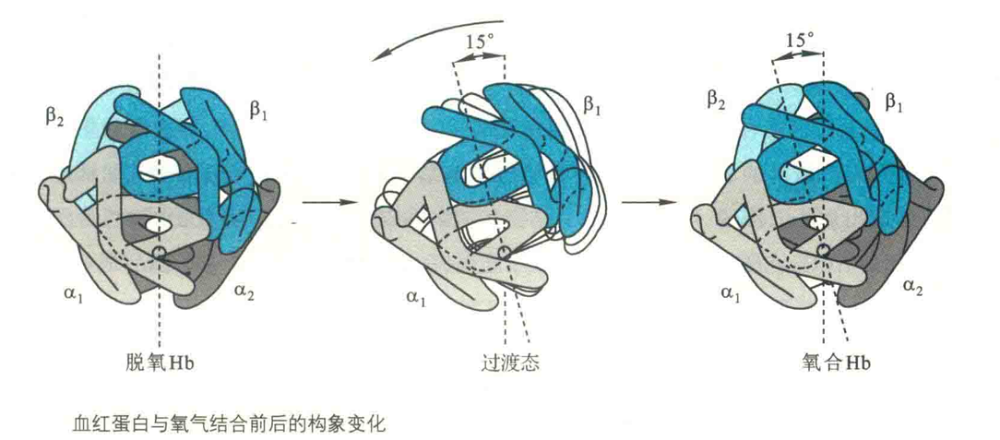
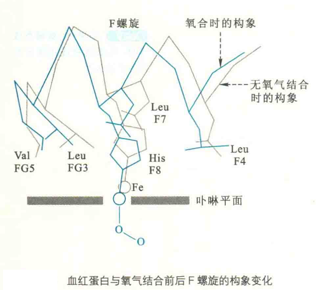
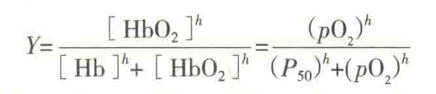
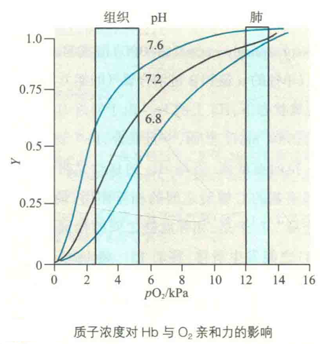
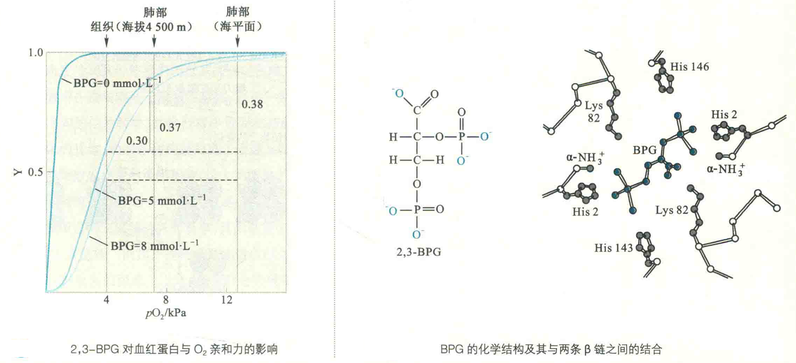

# 血红蛋白

Hb主要存在于红细胞，其主要功能是作为氧气的运输者，为整个机体运输氧气。

除了红细胞以外，机体内还有一些细胞可以表达少量的Hb，例如黑质内的A9多巴胺能神经元、巨噬细胞、肺泡细胞和肾的血管系膜细胞等。这些组织表达HB的功能显然与运输氧气无关，而是作为一种抗氧化剂以及调节细胞内铁的代谢。

Hb由4个亚基组成，因而有四级结构。每一个亚基称为珠蛋白，单个亚基的一级结构与Mb差别较大，只有27个位置的氨基酸残基与Mb相同，但二级和三级结构却与Mb十分相似。

与Mb相比，Hb之所以更适合充当氧气的运输者，主要的原因是因为它具有四级结构。而具有四级结构的特征使得它在结合氧气的时候，具有3个重要的效应：正协同效应、波尔效应和别构效应。这3个效应都有利于Hb更适合充当氧气运输者的角色。

## 正协同效应

Hb氧合曲线为S形曲线。这意味着，只有在pO2很高的情况下（在肺部或鳃），Hb才能更好地结合氧气，而pO2一旦降低（在外周血管中），它就开始释放O2，而此时的Mb却没有反应。就结合O2的亲和力而言，4价的Hb还不如1价的Mb。

Hb的氧合曲线之所以呈现为S，是因为Hb与O2的结合具有正协同效应。

Hb的正协同效应是指Hb分子有一个亚基结合O2后，其构象会发生变化，使得其他亚基对O2的亲和力突然增强。

### 理论解释

协同效应可使用齐变或序变模型来解释。两种模型都假定血红蛋白存在两种构象，即紧张态（T态）和松弛态（R态）。

在没有结合氧气时，Hb的4条链之间结合紧密，此时Hb主要以T态存在。这种紧密结合是由盐键以及结合在2条β链之间缝隙中的2，3-二磷酸甘油酸（2,3-BPG）造成的，它们屏蔽了分子表面疏水的空穴，使得Hb结合O2的能力降低（单独的α链和β链结合氧气的能力与Mb相同）。

在脱氧状态下，Hb上的Fe2+由于邻近His残基和毗咯环N原子之间的空间位阻，而略偏离血红素平面（0.04 nm）。然而，一旦氧合，Fe2+就移向卟啉环，致使O2能更好地结合。

Fe2+的移位将近端HiS拉向血红素，近端His的移动又带动F螺旋也随之移动，而F螺旋的移动势必影响到它与相邻亚基的C螺旋之间的相互作用，最终导致相邻亚基的构象发生改变。

于是，相邻肽链之间的盐键遭到破坏，Hb的四级结构也随之改变。这时2个二聚体（αβ）之间发生滑移，移动15°，将BPG挤出。

随后，四级结构发生进一步的变化，每条肽链表面疏水的空穴都暴露在外，这时的Hb主要以R态存在，于是它结合O2的能力变强了。

### 量化评估

为了对Hb的正协同效应进行量化评估，需要在Hb的O2分数饱和度方程中引入所谓的Hill系数。于是：

如果h=1，上面的方程实际上就是Mb的氧合方程，因此无协同效应；如果h>1，就有正协同效应；如果h<1，就有负协同效应。上面方程转化为：Y/(1-Y)=(pO2/P50)^4

经过线性处理后变成：lg Y/(1-Y) = hlg pO2 -hlg P30

以lg [Y/(1-Y)]为纵坐标，lg pO2为横坐标作图，即为Hill作图。

根据测定，第一个亚基与O2结合的P50=4 kPa，最后一个亚基的P50=0.04 kPa。由此可见，正协同效应导致Hb最后一个亚基对O2的亲和力增加了100倍。

## 波尔效应

波尔效应是指H+和CO2促进Hb释放O2的现象。波尔效应也有助于解释Hb为什么在肺中吸氧排CO2而其他地方（肌肉组织）吸CO2 排氧。

产生波尔效应的原因是H+和CO2能够与Hb特定位点结合，而促进Hb从R态转变为T态。

与H+引发的波尔效应相关的基团有：α 亚基的N端氨基、α亚基的HiS122咪唑基、β亚基的Hisl46咪唑基。这3个基团在Hb处于T态的时候都是高度质子化的，而当O2与Hb结合以后，质子即发生解离。

如果溶液中的pH降低，将有利于这3个基团处于质子化状态，从而稳定T 态，抑制氧气的结合。

用反应式来表示，即为：Hb+4O2→HB(O2)4 + nH+。显然PH下降，即H+浓度 升高,会使反应平衡向左移动，这时有利于Hb释放结合的Ο2。

### 产生途径

CO2可通过两种途径产生波尔效应。这两种途径不仅有助于CO2进入肺部呼出体外，而且也能够促进O2的释放。

第一种是在碳酸酐酶的催化下，红细胞内的CO2发生反应：CO2+H2O → H2CO3 → H+ + HCO3-。此反应释放出质子而产生波尔效应，同时产生的HC0；进入血浆，随循环到达肺部；

第二种是CO2与Hb的N端氨基可逆的反应：CO2 + Hb-NH2-H++Hb-NHCOo-，形成氨基甲酸血红蛋白，也释放出质子，这对波尔效应也有贡献。

但更重要的是，此反应可导致在α和β亚基之间形成新的盐键，而有助于Hb处于T态，使其更容易将结合的O2释放出来。

CO2主要通过这两种途径进入肺，分别占85%和15%，只有5%的CO2以溶解的形式随循环进入肺。

在肺部，较高的氧分压使得Hb能够有效地结合O2，而正协同效应使得Hb从T态变成R态，并释放出质子。

同时，与Hb氨基端结合的CO2也被释放出来。释放出的H+与随血液循环到达肺部的HCO3-在碳酸酢酶的催化下，发生逆反应，产生CO2和H2O，CO2随后通过呼气排出体外。

## 别构效应

别构效应是指除O2以外的各种配体在血红素铁以外的位点与Hb结合，导致Hb的构象发生变化，进而影响到Hb氧合能力的现象。哺乳动物体内能与Hb结合的配体有Η+、CO2、2,3-BPG和NO，它们统称为别构效应物。H+和CO2产生的效应就是波尔效应。2,3-BPG产生的效应也是增强Hb在外周组织释放氧气的能力。

2,3-BPG作为糖酵解的副产物广泛存在于红细胞，其浓度与Hb不相上下，约为5 mmol/L。

2,3-BPG只能与脱氧Hb内位于两条β亚基之间带正电荷的空穴（1.1 nm）结合，稳定T态，显著降低Hb与O2的亲和力，促进Hb在组织中释放O2。

氧合Hb位于两条β亚基之间的空穴已经显著变小，只有0.5nm，容纳不下0.9 nm大小的BPG了。

生活在高海拔地区可诱导红细胞内的BPG水平的上升，这显然是生物对缺氧环境的一种适应。在高海拔地区，大气中的氧气较为稀薄，将氧气有效地释放到外周组织变得困难。

为了适应这种环境，体内红细胞的数目会增加，同时机体开始加速合成2，3-BPG。大概24h以后，体内的2，3-BPG水平便开始持续上升。除此以外，贫血、肺功能衰弱和长期吸烟也可导致体内BPG水平上升。

胎儿血红蛋白HbF与O2的亲和力明显高于成人的HbA，这显然有利于胎儿通过胎盘（氧分压大大低于肺）从母亲那里获取Ο2。HbF与O2亲和力之所以高于HbA，是因为与α亚基结合的γ亚基不能结合BPG。

不是所有的动物都使用2，3-BPG来降低Hb与O2的亲和力。例如，鱼类使用ATP和GTP来结合Hb，以稳定它的T态构象，从而降低它与O2的亲和力。但在缺氧的条件下，鱼类红细胞内的ATP和GTP水平下降，这又提高了Hb与O2的亲和力。

至于NO对Hb结构与功能的影响，有研究表明：Hb在氧合状态下，NO可与其特定位置的Cys残基侧链上的疏基结合，形成S-亚硝基硫醇。而一旦Hb释放氧气，NO就立刻解离到外周组织，通过扩张血管，有助于氧气在局部的运输。

