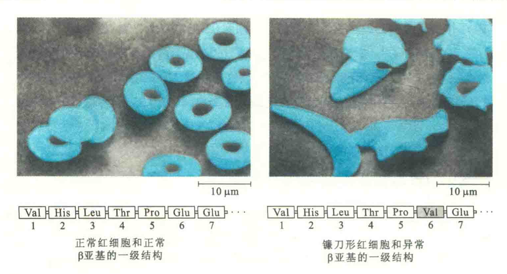
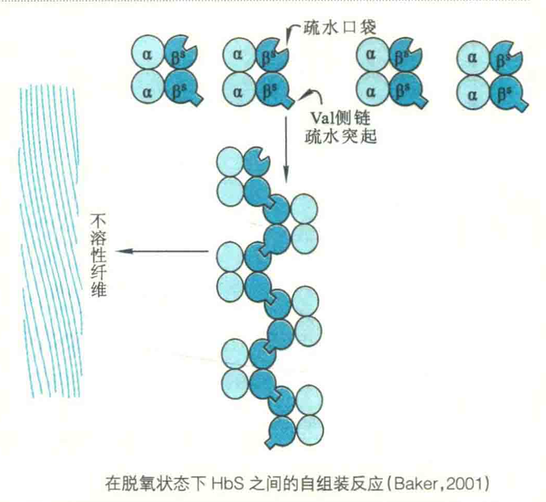

# 血红蛋白的突变体

迄今为止，已发现了Hb的多种突变体。根据表型，突变体可分为4类：

①Hb聚合成纤维状，致使红细胞成镰刀形；

②改变与O2的结合性质；

③血红素辅基丢失；

④四聚体解聚。

第一种突变体最为常见，它直接导致镰状细胞贫血症。这种贫血患者的Hb简称为HbS。HbS与Hb在结合O2的能力方面并没有什么差别，它们的区别在于HbS能造成红细胞溶血，致使患者体内的红细胞数量减少，通常只有正常人的1/2。

溶血后的Hb不能像红细胞中的Hb一样正常运输患者表现为乏力，剧烈运动可导致死亡。

HbS导致溶血的原因在于，其β亚基的6号位残基从正常的Glu突变成Val。这种异常的HbS在脱氧状态下，相互间很容易通过一个β亚基在表面由Val6侧链形成的疏水突起，与另一个β亚基在表面的疏水口袋之间的疏水作用而聚集成纤维，导致细胞膜变形直至破裂。

Ngb和Cygb是近几年来才发现的属于珠蛋白家族的两个新成员，与Hb和Mb一样也能结合Ο2。

其中，Ngb主要在脊椎动物的大脑和视网膜细胞中表达，而Cygb几乎在脊椎动物所有的细胞中都能表达。

