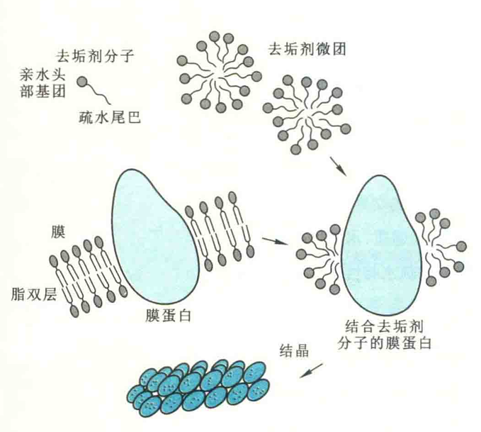
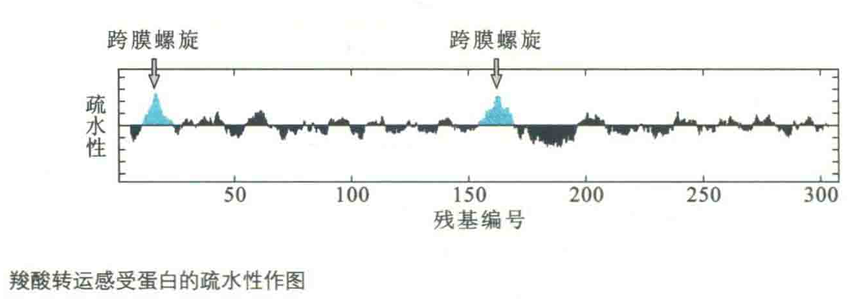
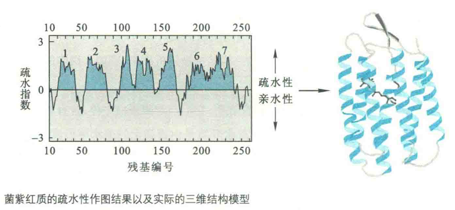

# 膜蛋白的结构与功能

细胞内有1/3~1/2的蛋白质与膜结合或镶嵌在膜内，这些蛋白质统称为膜蛋白。生物膜的各项功能主要是由各种结构不同的膜蛋白完成的。

根据与脂双层膜联系的方式，膜蛋白可分为外在蛋白、内在蛋白和脂锚定蛋白。

外在蛋白也称为外周蛋白，它们仅与膜的表面保持接触，是可溶性的，与球状蛋白质非常相似，如细胞色素c；

内在蛋白则镶嵌在膜上，与膜融为一体，其结构比较复杂；

脂锚定蛋白通过与其共价连接的疏水基团锚定在膜上。

膜内在蛋白镶嵌于膜脂的特性，使这一类蛋白质经常位于细胞与外部环境的交界处，介导细胞与外界之间的信号转导，并执行很多重要的细胞功能。

例如，它们作为各种神经递质、水溶性激素和其他配体的受体，构成各种跨膜的离子通道及转运蛋白等。但是，膜内在蛋白的疏水特性使其需要与生物膜共同形成稳定的天然构象，这大大增加了研究的难度。与研究球状蛋白一样，要真正地理解膜蛋白的功能，首先需要确定它们的三维结构。

## 研究膜内蛋白的困难

研究膜内在蛋白的三维结构并非易事，其困难集中反映在以下3个方面：

1. 含量低　例如一些跨膜受体蛋白的含量为微克级，而应用基因工程方法大量表达膜内在蛋白也存在着很大的困难。因此，迄今为止其精细结构已被解析的主要是天然含量本来就高的膜内在蛋白，如牛心线粒体细胞色素ｃ氧化酶、细胞色素bc1复合体、植物光合作用的聚光复合体、紫色细菌光合反应中心、嗜盐古菌菌紫红质和细菌膜孔蛋白等。
2. 分离、纯化比较困难　只有用较剧烈的条件（如去垢剂、有机溶剂和超声波）才能将它们溶解下来，而分离后一旦除去去垢剂或有机溶剂，它们很容易聚合为不溶物。
3. 结晶困难　这就限制了使用X射线晶体衍射对其结构的解析。

对于膜内在蛋白难以结晶的难题，德国生化学家Hartmut Michel在研究中巧妙应用可透析的两性小分子去垢剂给予解决了。其原理是：当小分子的去垢剂达到一定浓度时形成微团，可将膜蛋白的疏水区屏蔽起来，这使膜内在蛋白在水中呈溶解状态。在去垢剂微团的极性表面之间的相互作用下，膜内在蛋白有可能形成结晶。

1977年，Michel正是利用这种方法得到菌紫红质的晶体。次年，Michel偶然发现，当把这种物质放在冰箱中时，可形成固态的玻璃状聚集体，由此他相信有可能获得三维晶体。幸运的是，很快他便获得了成功。1981年，Michel利用分子筛层析技术首次得到了光合反应中心的晶体。1982年，Michel在Robert Huber领导的当时世界上最先进的X射线衍射实验室做报告时，引起了Huber的兴趣，二人选定Johann Deisenhofer完成紫色细菌光合反应中心的X射线晶体衍射分析。1985年，Deisenhofer完成了整个光合反应中心结构的测定。1988年，这三位德国生化学家共享了诺贝尔化学奖。

另外，随着冷冻电镜技术的发展，现在对于膜内在蛋白的研究可以说多了一种十分重要的工具，使用这项技术，一大批以前难以研究的膜蛋白的三维结构被解析出来，例如人细胞的葡萄糖转运蛋白和钾离子通道等。

## 膜蛋白的结构

对已获得三维结构的各种膜内在蛋白的研究表明，它们与非膜蛋白一样，含有相同的二级结构元件，但它们几乎完全存在于疏水环境之中，这种疏水环境是由膜脂上的疏水尾形成的。因此，对于膜内在蛋白来说，需要解决肽键的亲水性质造成的将一条多肽链插入或贯穿在一个脂双层膜上能量不利的问题。

要解决多肽链通过脂双层膜能量不利的问题，最简单的方法是形成疏水α螺旋，因为α螺旋满足了主链原子形成氢键的倾向，并使疏水R基团面向脂环境。

既然α螺旋的每一个残基延伸0.15 nm，那么一个跨膜α螺旋约含20个氨基酸残基，这相当于脂双层疏水部分的平均厚度，即2.5~3 nm。

因此，一段由20个疏水氨基酸残基组成的α螺旋就足以横跨生物膜，此数据实际上已成为鉴别一种蛋白质是不是膜内在蛋白的一个重要标志。

## 疏水作图

疏水作图对于发现一个膜内在蛋白的跨膜螺旋十分有用，因为跨膜螺旋的疏水性一般要比通常的螺旋高得多。

例如，在对羧酸转运感应蛋白进行疏水作图以后，预测其有2个跨膜螺旋，而结果果真如此。

菌紫红质是一种典型的膜内在蛋白。疏水作图表明，其含有7个跨膜螺旋，螺旋之间是相当短的小环。其功能是作为一种受光子驱动的质子通道。受光子的激活，结合在菌紫红质核心的视黄醛从全反式异构成13-顺式。如此构型的变化会影响到一个氨基酸残基侧链的pKa，从而导致1个质子从膜的一侧转运到另外一侧。

## 孔蛋白

还有一种方法，可以解决多肽链通过脂双层膜遇到的能量不利的问题，那就是形成β折叠。

然而，膜蛋白上的β折叠单凭序列是难以确定其存在的，原因是一个跨膜的β股只需要8~9个氨基酸残基就够了，但折叠一般由亲水氨基酸和疏水氨基酸残基交替组成。

到目前为止，发现的全β折叠膜蛋白具有反平行的β折叠桶结构，例如孔蛋白。联系相邻β股的是短的亲水性转角。

孔蛋白主要存在于革兰阴性菌、线粒体和叶绿体的外膜上，其中央是一个由β折叠桶构成的孔洞，允许小分子和水被动扩散进入周质。孔洞的两侧分布着带正电荷和带负电荷的残基，以创造跨膜的电场，使不同的孔蛋白对离子具有不同的选择性。细菌的孔蛋白都是三聚体。它有很大的表面区域被包埋在亚基之间，这与球状蛋白亚基之间被包埋的表面并无两样。面向脂双层的表面高度疏水，比蛋白质的内部和亚基之间界面上的疏水性要高得多。

于是，多肽链总是通过形成特殊的二级结构或三级结构来避免肽键与疏水的脂环境接触，以便插人到脂双层结构之中。实际上，疏水环境更有利于二级结构的形成，这是因为在疏水环境中没有水分子的竞争干扰，肽链内的氢键更容易形成。

就氨基酸分布而言，膜内在蛋白暴露在水相中的表面性质实际上与一般的球状蛋白相同，它们的差别主要在于与脂双层作用的氨基酸的性质和分布。

如果不考虑与脂双层相互作用的表面，膜内在蛋白的内部与绝大多数球状蛋白差不多，但那些参与信号转导的离子通道或参与物质跨膜转运的孔蛋白除外。

