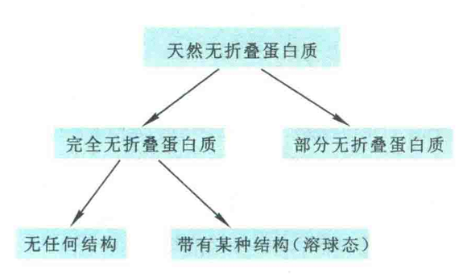

# 天然无折叠蛋白质的结构与功能

前面所述的各种蛋白质，无论是纤维状蛋白，还是球状蛋白或膜蛋白，由于具有特定的三维结构，才具有特定的生物学功能。一旦失去了特定的结构，成为松散无折叠状态，就立刻丧失功能。

然而，自20世纪90年代初以来，人们开始发现越来越多的蛋白质，在生理条件下，尽管缺乏特定的二级结构和三级结构，处于完全无折叠或部分无折叠状态，但仍然具有功能。这类蛋白质现在统称为天然无折叠蛋白质（NUP），或固有无结构蛋白质（IUP），或固有无序化蛋白质。迄今为止，已发现的NUP约占蛋白质总数的30%。

## NUP的分类

NUP一般可分为两类：一类是完全无折叠蛋白质，约占10%；另外一类是部分无折叠蛋白质，一般含有一段由50个氨基酸残基组成的无折叠区域。

完全无折叠蛋白质还可以进一步分为两个亚类：第一亚类无任何二级结构，第二亚类无三级结构，与天然折叠蛋白质在折叠过程中形成的“溶球态”中间体相似。显然，天然无折叠蛋白质的发现是对传统的蛋白质结构与功能关系基本法则的挑战。

## NUP的机理

在天然无折叠蛋白质中，有些必须处在无折叠状态才具有一定的功能，有些需要跟特定的配体（经常是DNA）结合，进而发生折叠，再行使功能。

例如，淋巴类增强子结合因子1（LEFT-1）就属于后一类，它在B细胞前体和T细胞中表达，定位在细胞核，与DNA分子上的T细胞受体-α增强子结合以后发生折叠，然后刺激相关基因的表达。

再如，真核细胞中有两种转录因子，一是CREB结合蛋白，它有一个结构域称为细胞核辅助激活蛋白结合结构域（NCBD），该结构域最初为熔球态；另一个是甲状腺素和视黄酸受体的辅助激活蛋白（ACTR），它带有一个完全无序的激活结构域。研究表明，一旦这两个转录因子的这两个结构域结合，则立刻折叠。

## NUP的主要功能

NUP的主要功能是参与信号转导、细胞周期调控和基因表达调控，此外，它与翻译后加工也有关系，还经常充当RNA和蛋白质的分子伴侣。

在信号转导过程中经常涉及可逆的蛋白质磷酸化，这种磷酸化和脱磷酸化修饰是真核细胞调节蛋白质或酶活性的主要手段之一。

人们还发现，磷酸化位点周围的氨基酸组成、序列复杂性、疏水性、电荷和其他序列特征与NUP十分相似。因此，有人认为蛋白质磷酸化位点主要发生在无折叠区域。

NUP一级结构的特征是含有较多的Gln、Ser、Pro、Glu和Lys；而侧链较大的疏水氨基酸很少，如Val、Leu、Iie、Met、Phe、Trp、Tyr。因此可以利用上述性质来鉴别或预测一种蛋白质是不是无折叠蛋白。

NUP为什么不能折叠或者只能部分折叠？主要原因是疏水氨基酸含量少，而疏水作用力是驱动蛋白质折叠的主要动力。

NUP虽然处于完全无折叠或部分无折叠状态，但并不比处于折叠状态的蛋白质更容易水解，这主要是因为NUP主要分布在细胞核和无蛋白酶的细胞器，远离有蛋白酶的区域，而且多数NUP在遇到合适的配体以后也会发生折叠。

## NUP生物学意义

从生物进化学的角度看，NUP似乎具有很多好处，可能包括：

①不需要经过折叠就能起作用；

②可以结合几种不同的配体，而表现多种功能；

③拥有较大的分子之间相互作用的界面，有利于分子识别；

④有利于细胞信号转导过程中开与关的切换。

这些好处对于复杂的生物来说更有用，因此NUP的分布与生物复杂性正相关，即生物越复杂，NUP越多。

NUP在真核生物中比较普遍，在原核生物中则少见。

