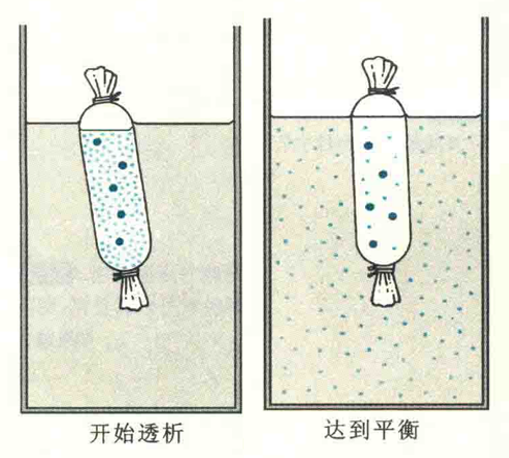
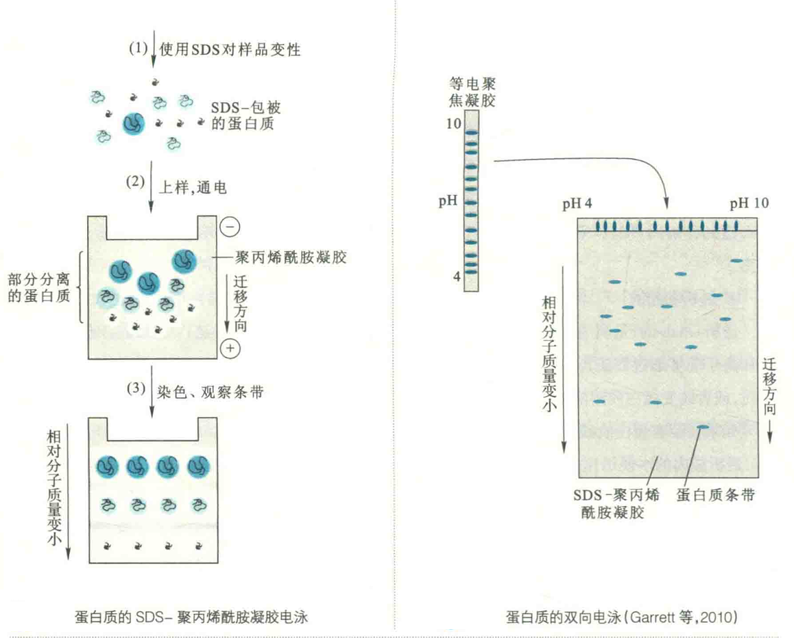
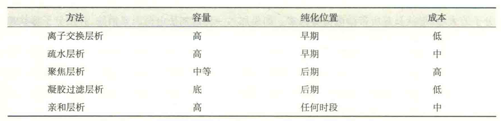
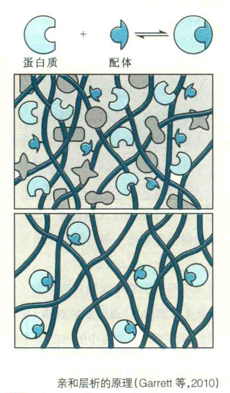
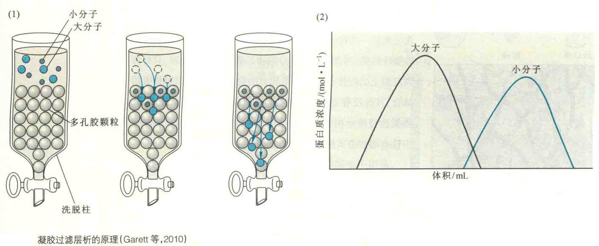

# 蛋白质纯化的常见方法

分离纯化蛋白质的各种方法都是利用不同蛋白质在理化性质上的差别，如溶解性、质量和形状、表面电荷、表面疏水性、与特定配体结合的性质等。

常用的方法有沉淀、离子交换、聚焦层析、凝胶过滤、疏水作用层析、亲和层析。

在纯化过程中，有时候样品体积较大，需要先进行浓缩以缩小体积。常见的浓缩方法有沉淀、冻干、反透析、超滤。

## 沉淀与离心

沉淀是根据不同蛋白质在特定条件下溶解性不同，而对它们进行选择性沉降从而达到分离目的的一种粗纯化方法。它通常用于将目的蛋白从大体积的粗抽取物中游离出来。

这种方法既能除去许多杂质，又有浓缩之效。实现选择性沉淀的方法包括改变pH或改变离子强度。无论是哪一种沉淀方法，产生的沉淀物都需要借助离心的方法才能与上清有效的分开。

### 沉降系数

离心方法是根据分子的特征密度来分离大分子的。如果一种颗粒的密度大于其介质溶液的密度，那么这种颗粒有可能通过溶液发生沉降。颗粒沉降的速率与颗粒和介质溶液之间的密度之差成正比。

任何一种颗粒在离心力作用下通过溶液发生沉降的趋势可用沉降系数，即S表示：S=(p-m)V/f。

这里p为颗粒或大分子的密度即为介质或溶液的密度，V为颗粒体积，f为摩擦系数。非球形分子具有更大的摩擦系数，因此其沉降系数较小。颗粒越小或形状与球形相差越远，在离心机内就沉降得越慢。

沉降系数对于生物大分子来说，多数为(1~500)×10^-13 s。为应用方便起见，人为规定1×10^-13 s为一个S单位。

一般单纯的蛋白质在1~20 S，较大核酸分子在4~100 S，更大的亚细胞结构在30~500 S。

### 离心机

离心既可以作为分离和纯化大分子或亚细胞组分的制备技术，也可用来分析大分子的流体动力学性质。

分析用超速离心机仅能对少量样品进行分析：制备用离心机是专为提取、纯化大分子组分设计的，可对大量的样品进行分离。

制备用离心机的应用最广，根据其性能可分为低速离心机和超速离心机。

1. 沉降离心是指在离心管内溶液密度均一的情况下进行的离心。最常见的方法是差速离心，这是对含两种以上大小不同的待分离物质的混合液，以不同离心速率分段离心沉淀，使之相互分离的离心方法。

2. 梯度离心是将待分离的物质在具有密度梯度的介质中进行的离心。

梯度离心又可分为密度梯度离心和平衡密度梯度离心。

#### ①密度梯度

离心是在密度梯度介质中进行的一种沉降离心，被离心的物质根据其沉降系数不同而进行分离。常用蔗糖或甘油来制备梯度。

梯度的作用是稳定离心液以减少扩散，而得到较为锋利的区带。

密度梯度离心和差速离心一样是依赖时间的，如果离心时间过长，已经分离的物质都可沉降到离心管的底部或某一密度区域。

#### ②平衡密度梯度离心

虽然也是在密度梯度介质中进行的，但被分离的物质是依靠它们的密度不同而进行分离的，此种离心常用CsCl等无机盐类制备密度梯度。

在梯度介质中，当被分离的物质分别达到与其密度相同的介质部位时，就不再移动，从而达到分离的目的。

平衡密度梯度离心是不依赖于时间的，只要梯度不破坏，时间延长也不影响分离。

## 透析和超滤

透析是利用蛋白质等生物大分子不能透过半透膜，但小分子物质和离子能够通过而进行纯化的一种方法。这种方法经常用于去除大分子溶液中的小分子物质，或者改变蛋白质溶液的组成。

如果在装有蛋白质或其他大分子溶液的透析袋外，放入高浓度吸水性强的多聚物，透析袋内的水便迅速被袋外多聚物所吸收，从而达到了浓缩袋内液体的目的。这种方法称为反透析；

超滤对透析原理进行了改进，它利用具有一定大小孔径的微孔滤膜，在常压、加压或减压条件下对生物大分子溶液进行过滤，使大分子保留在超滤膜上面的溶液中，小分子物质及水过滤出去，从而达到脱盐、浓缩或更换缓冲溶液的目的，有时还可以用它来进行滤过灭菌。

## 电泳

电泳的原理已在氨基酸的分离技术作过介绍，这里仅介绍3种与蛋白质分离纯化有关的电泳技术，即等电聚焦电泳（IFE）、十二烷基硫酸钠聚丙烯酰胺凝胶电泳（SDS-PAGE）和双向电泳。

### IFE

IFE需要在凝胶中加入两性电解质，以便在两极之间建立pH梯度，处在其中的蛋白质分子在电场的作用下发生迁移，最后各自移动并聚焦于凝胶上某一特定的位置，各个位置的pH与聚焦在此的蛋白质的pI相同。

通过IFE，不仅可以实现pI不同的蛋白质之间的分离，还可以直接测定出各种蛋白质的pH。

### SDS-PAGE

蛋白质在非变性聚丙烯酰胺凝胶中电泳时，其迁移率取决于分子的大小、形状及其所带净电荷等因素。如果加入一种试剂使电荷因素消除，并使分子形状趋于一致，那电泳迁移率将只取决于分子的大小。在此基础上，还可以测定出蛋白质的相对分子质量。阴离子去污剂SDS具有这种作用。

在向蛋白质溶液中加入足够量的SDS以后，SDS即与蛋白质形成复合物。SDS带负电，能使各种蛋白质-SDS复合物都带上相同密度的负电荷，其总量大大超过了蛋白质分子原来的电荷量，因而掩盖了不同种蛋白质间原有的电荷差别。

SDS还能打破维持蛋白质三级结构的次级键，使各种蛋白质变性而呈线状展开。

这样的蛋白质-SDS复合物，在凝胶电泳中的迁移率，不再受蛋白质原来的电荷和形状的影响，仅取决于它们的大小，因而SDS-PACE还可以用于测定蛋白质的相对分子质量。

不过SDS还能够破坏蛋白质的四级结构，因而可导致寡聚体蛋白解聚。

SDS-PAGE不仅可以用来测定蛋白质的大小，还可以用来鉴定蛋白质的纯度、定量蛋白质和二硫键的确定等。

### 双向电泳

也称二维电泳或2D电泳，它由第一向等电聚焦电泳和第二向SDS-聚丙烯酰胺凝胶电泳组成。第一向利用等电聚焦的方法使pI不同的蛋白得到分离。

将第一向电泳的凝胶转移到SDS-PAGE平板的顶部，即进行第二向电泳，这一次是按照分子大小来分离，两向结合便得到高分辨率的蛋白图谱。在对凝胶进行染色以后，可以观察到各个蛋白质的位置。

使用双向电泳，研究者有可能观测并建立一种特定细胞所表达的全部蛋白质的目录。

ExPASy已建立了双向电泳数据库，数据库内含有多种类型的细胞和组织的蛋白质双向电泳图谱。

## 层析

在蛋白质分离纯化中是不可替代的一种方法。常见的层析方法有离子交换层析、疏水层析、聚焦层析、凝胶过滤层析和亲和层析等。

### 疏水作用层析

疏水作用层析（HIC）是利用不同蛋白质在疏水性质上的差别，而对特定蛋白质进行纯化的一项层析技术。

其固定相是连接到惰性基质上的疏水基团，如辛烷基或苯环，以此除去蛋白质的水化层，由于表面上亲水基因最少的蛋白质最容易失去水，也就最容易暴露出它们的疏水基团，并与树脂上的疏水基团结合：

反之，表面上亲水基团最多的蛋白质最难失去水化层，也就最难与固定相结合。

HIC的洗脱方法有降低洗脱液的盐浓度、增加洗脱液的去污剂浓度或者改变pH。

### 亲和层析

亲和层析是利用待分离物质和它的特异性配体间具有特异性的亲和力，而实现分离的一类特殊层析技术。

其固定相是带有共价偶联配体的惰性树脂，当含有混合组分的样品通过此固定相时，只有和固定相上的配体具有特异亲和力的物质，才能被固定相吸附结合，其他没有亲和力的无关组分就随流动相流出。

如果改变流动相成分，可将结合的亲和物洗脱下来。洗脱的方法有增加游离配体的浓度或改变pH。

可用于亲和层析的具有特异性亲和力的生物分子对主要有酶与底物/抑制剂、受体与激素、抗体与抗原、抗体与蛋白质A、带有组氨酸纯化标签的融合蛋白与金属镍、带有单链DNA结合蛋白纯化标签的融合蛋白与单链DNA、带有谷胱甘肽S-转移酶（GST）纯化标签的融合蛋白与谷胱甘肽、蛋白质与染料、糖蛋白与植物凝集素、特异性结合蛋白与被结合的物质。

亲和层析纯化过程简单、迅速、高效，有时能够“一柱到位”，对分离含量极少又不稳定的活性物质特别有效。

### 聚焦层析

聚焦层析（CF）是根据各种蛋白质的pI不同进行分离的层析技术。

其流动相为多元缓冲剂，固定相为多缓冲交换剂。CF的原理与等电聚焦和离子交换相似，不过是在含有pH梯度的离子柱内进行。

当将特定的多元缓冲溶液自上而下流过填充在层析柱内的多元缓冲交换剂时，由于交换剂带有具缓冲能力的电荷基团，会在多元缓冲交换剂的表面从上到下自动地形成连续的pH梯度。

因为蛋白质所带电荷取决于它的pI和层析柱中的pH，所以如果使用的是阴离子交换剂，则当柱中的pH低于蛋白质的pI时，蛋白质带正电荷，而不与阴离子交换剂结合。

但随着洗脱液向前移动，固定相中的pH随着洗脱时间延长而变化。当蛋白质移动到环境pH高于其pI时，蛋白质由带正电荷变为带负电荷，并与阴离子交换剂结合。

当洗脱液流过的时候，蛋白质周围环境的pH再次低于PI，于是它又带上正电荷，并从交换剂解离下来。

随着洗脱液向柱底部的迁移，上述过程将反复进行，各种蛋白质就在各自的pI被洗下来，从而实现了分离的目的。

### 凝胶过滤层析

凝胶过滤层析又称分子筛过滤层析或大小排阻层析等。它是一种主要按大小来分离物质的层析方法，因此也可以用来测定蛋白质的相对分子质量。

其固定相是装在层析柱内细而多孔的凝胶颗粒。例如，葡聚糖、琼脂糖或聚丙烯酰胺。在将样品加到充满着凝胶颗粒的层析柱以后，使用缓冲溶液洗脱。

大分子无法进入凝胶颗粒的内部，只能随着流动相穿行于凝胶颗粒之间的缝隙中，因而以较短的路径和较快的速率首先流出层析柱，而小分子则能自由出入凝胶颗粒内部，并很快在两相之间形成动态平衡，于是要走更长的路径和花费更长的时间流过柱床。不同大小的分子因此得以分离。

### HPLC

HPLC的层析原理与经典的液相层析及气相层析一致，只不过对固定相颗粒的大小、流动相的流速进行了很大的改进，使颗粒更细、流速更快，并实现了自动化。

以反相HPLC为例，其固定相由共价结合到硅上的碳氢链构成。它的纯化原理与疏水层析一样，蛋白质通过疏水作用结合到柱上，可用降低离子强度或增加洗脱液的疏水性的方法进行洗脱。