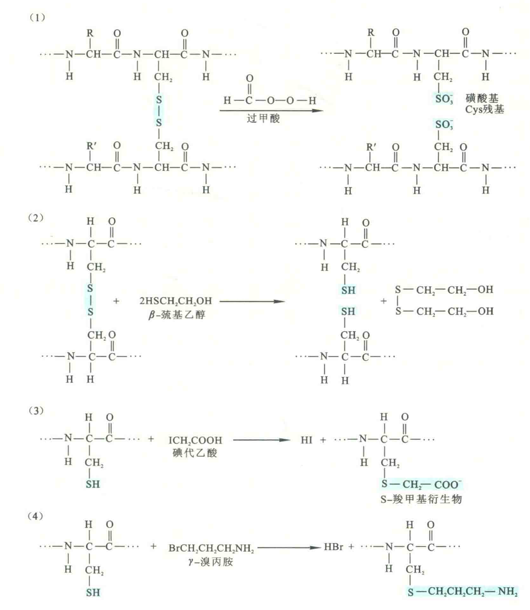
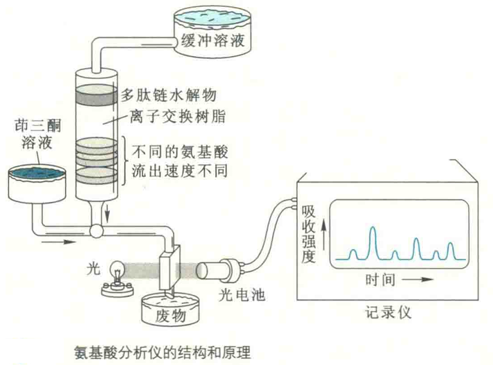
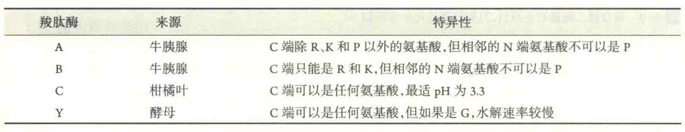
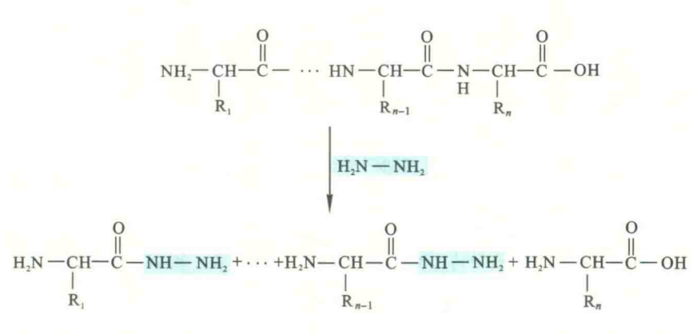
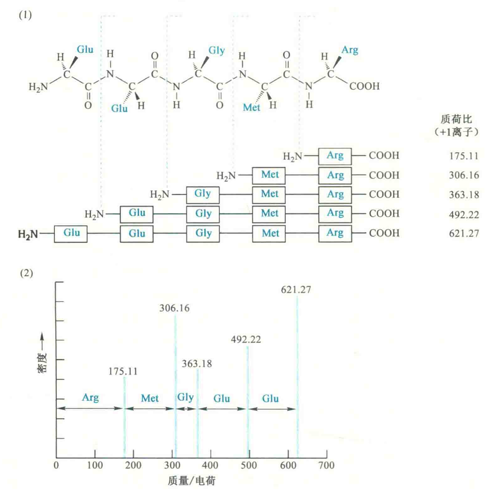
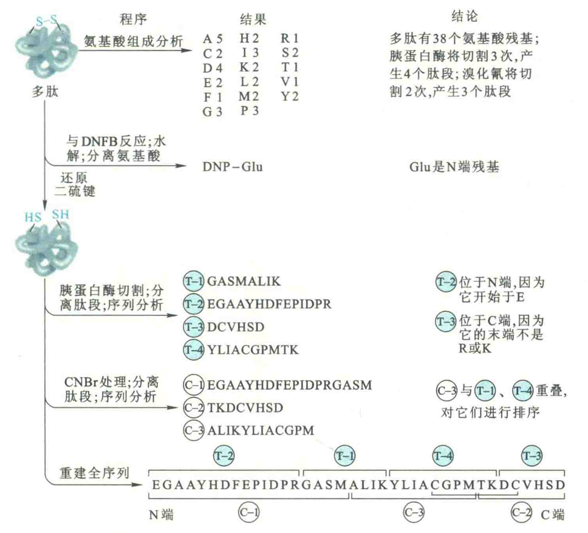

# 蛋白质一级结构的测定

蛋白质一级结构测定是研究蛋白质其他层次的结构和蛋白质功能的基础。蛋白质一级结构的测定在策略上可以直接测定，也可以间接测定。

## 间接测定

间接测定的策略基于“中心法则”，是先得到某一种蛋白质基因的核甘酸序列，然后根据通用的遗传密码表，间接推导出由其决定的氨基酸序列。

如果是原核生物，可先直接从它的基因组DNA中得到目标蛋白的基因，然后测定基因的碱基序列，找出可读框，最后根据遗传密码反推出氨基酸序列：

如果是真核生物，可以先得到目标蛋白的cDNA，然后测定cDNA的碱基序列，找出ORF，最后同样根据遗传密码反推出氨基酸序列。

真核生物一般不能直接从基因组DNA得到基因序列来推断其决定的氨基酸序列，这是因为真核生物的蛋白质基因内部大多数含有不决定任何氨基酸序列的内含子。

### 优缺点

间接测定的优点是快速，不需要纯化蛋白质，与直接测定多肽链的氨基酸序列相比，测定DNA的碱基序列要容易得多。但其缺点是无法确定经后加工的蛋白质的最终序列，无法确定修饰的氨基酸，也得不到任何二硫键的信息。以胰岛素为例，如果是用间接测定的策略测定的话，是绝对预想不到它会是由两条肽链组成的蛋白质的。

间接测定的策略对含量低、不容易纯化的蛋白质很有用，此外对分离纯化来自生存在极端环境下古菌体内的蛋白质来说也十分有用，因为这些古菌在实验室内无法模拟自然的环境进行培养。许多难以纯化的膜内在蛋白都是用这种策略最先得到一级结构的。

另外，对于一些未知的蛋白质，它也很有用。例如，人们本来并不知道有神经珠蛋白的存在，更不知道它只在脑和视网膜中表达。但在分析脑cDNA库序列的时候，发现其中的一种cDNA似乎编码一种与Mb相似的蛋白质。在使用这种cDNA制作的探针对脑细胞进行检测以后，证明了脑细胞的确能表达神经珠蛋白的mRNA。

## 直接测定

直接测定的策略前后需要9大步，依次是：

### 纯化目标蛋白

这是第一步，也是不可省略的一步，纯度应在97%以上。

### 拆分肽链

如果目标蛋白含有2条或2条以上不同的肽链，必须先进行拆分，然后纯化出各条单链，再进入下一步，分别测定各条肽链的序列。

多亚基蛋白在亚基之间通常以次级键相连，因此在受到极端pH、8mol/L，尿素、8mol・LT盐酸胭或者高浓度盐的作用时，一般就能发生解聚，一旦解聚，可根据大小或电荷的差异将它们彼此分离。

有时，亚基之间通过二硫键相连，这时需要利用下面的方法打破二硫键以后，再进行分离。

### 打破二硫键

有许多方法可用来切开二硫键。Anfinsen曾经使用筑基乙醇将胰核糖核酸酶的链内二硫键还原，使其破坏。这种方法也适用于亚基之间的链间二硫键。

另外也可以用还原型的二硫苏糖醇代替疏基乙醇来还原二硫键。在利用这两种还原剂来打破二硫键的同时，还需要使用碘代乙酸或γ-溴代丙胺将还原出来的巯基再氧化，以防止它们重新形成二硫键。

另一种切开二硫键的方法是使用过甲酸直接氧化二硫键，将本来通过二硫键相连的Cys残基氧化成磺酸基Cys。带负电荷的磺酸基之间的静电排斥可阻止二硫键重新形成。

### 分析各单链的氨基酸组成

测定蛋白质完全水解的产物可得到肽链的氨基酸组成。蛋白质的酸水解通常是将样品与6 mol/L HCl起放在密封的玻璃小瓶中，在110 ℃下放置24h、48h或72h。

在酸水解条件下，Trp几乎完全被破坏，因此它的含量需要用其他方法单独确定。

尽管羟基氨基酸在酸水解条件下也会被破坏，但被破坏的速率较慢，因此可以将在3个时间段得到的3种羟基氨基酸各自的含量回推到零时段，从而还原出它们原来的含量。

酸水解下释放出来的氨可用来估计蛋白质样品中Asn和Gln的总含量，但无法得到Asn和Gln各自的含量。

反应结束以后，将反应混合物上柱分离。使用的分离方法可以是离子交换层析，也可以是反相HPLC。

如果使用离子交换层析，则将洗脱出来的氨基酸与茚三酮反应进行定量分析：如果是反相HPLC，需要将氨基酸在上柱之前与Edman试剂反应，使其转变成PTH-氨基酸。

无论是哪一种分离手段，现在都与定量反应一起完全实现了自动化，在专门的氨基酸分析仪中进行。一个相对分子质量为3XIO4的蛋白质通过自动分析仪只需要不到1h的时间，需要的蛋白质样品量仅6 μg就足以。

氨基酸的组成分析并不能直接给出一个多肽的每一种氨基酸残基的数目，但能给出各种氨基酸残基之间的相对比例。如果蛋白质的大小和样品中蛋白质的精确含量也能够确定，那么，蛋白质分子中不同氨基酸的摩尔比就可以计算出来，在此基础上，就可以预测出特定蛋白酶的切点或CNBr切点的数目。

### 末端氨基酸残基的鉴定

先测定蛋白质末端的氨基酸，可以搞清楚目标蛋白有几个末端，进而有可能推断出它有几条肽链。

如果一个蛋白质由两条或两条以上的肽链组成，那么测定出的N端或C端氨基酸很可能不止一种。但若用常规的方法测定不出，那很可能是N端氨基或C端羧基被一些特殊的基团封闭住了，这时就需要用特殊的试剂来解除封闭。

关于N端氨基酸测定的方法在氨基酸化学反应中已有介绍，这里只描述C端氨基酸残基的测定。

C端氨基酸的测定有两种方法，一种是酶法，另一种是化学法。

#### 酶法

酶法测定使用羧肽酶。有4种羧肽酶可供选择，即段肽酶A、B、C和Y。

羧肽酶可以连续地从C端释放出氨基酸，直至遇到不能水解的氨基酸。显然，越靠近C端的氨基酸残基释放的速率越快，利用这一点就可将C端氨基酸残基与其他氨基酸残基区分开来。

目前已有人将羧肽酶Y进行改造，使之能够像Edman降解一样，从C端向N端连续测定肽段的氨基酸序列。

#### 化学法

化学法又分为还原法和肼解法。

还原法使用硼氢化纳将C端氨基酸残基还原成氨基醇，从而将它与其他氨基酸区别开来：肼解法则使用无水肼在90℃下处理蛋白质20~100 h，这样的处理可切开蛋白质分子上所有肽键，产生氨脂酰肼，唯独C端氨基酸以游离的形式出现。

通过比较肼解产物与标准氨基酸的层析行为，可以确定出C端氨基酸，因为它的层析行为不变。

由于高比例的肼能诱导副反应，这种方法一般只用于末端能抵抗羧肽酶水解的肽。

### 将肽链切成小的片段，再测定各小片段的氨基酸序列

Edman降解能重复多次，且产率很高，测出20~30个氨基酸残基构成的肽段序列一般没有问题，但要获得50个氨基酸残基以上的序列就很困难了。

这是因为在每一轮循环中，pITC不可能与所有N端残基都起反应，因而在多轮循环以后，错误会越来越多，那时就难以得到准确而有意义的序列信息了。

许多多肽链的长度在50个氨基酸以上，因而在进行Edman降解之前，需要将长的肽链进行特异性地切割，以产生长度低于20~30个氨基酸的肽段。

特异性切割多肽链的方法有酶法和化学法。

1. 酶法使用的是具有一定特异性的蛋白酶，这些蛋白酶对形成肽键的氨基酸残基的R基团有不同的要求。例如，胰蛋白酶只水解由Arg或Lys提供羧基的肽键：
2. 化学法则使用特异的化学试剂切开肽键，但有的试剂对肽键无选择性，如酸水解或碱水解，这样的试剂对肽链进行随机切割，用途不大。能派上用场的一般是对肽键具有一定选择性的化学试剂。

例如，BrF专门切割Met残基提供羧基的肽键。再如，羟胺在pH 9时选择性切割Asn-Gly之间的肽键，而在温和的酸性条件下，只切割Asp-Pro之间的肽键。

无论是酶法还是化学法，切割后的产物都需要进行分离、纯化。分离后得到的每一种肽段还要单独进行氨基酸组成分析、末端氨基酸测定和全序列测定，以积累重建一个蛋白质全序列所必要的信息。

测定肽段序列的方法有Edman降解和质谱。质谱除了可测定蛋白质的相对分子质量以外，还可以用来测定肽链的一级结构。若要测定肽链一级结构，可用串联质谱法（CID）和梯形肽片段测序法。

串联质谱法是利用待测分子在电离飞行中产生的亚稳定离子，通过分析相邻同组类型峰的质量差，识别相应的氨基酸残基。串联质谱的肽序列图需要读取部分氨基酸序列与前后的离子质量和肽段母质量相结合，称为肽序列标签（PST）。

串联质谱的基本过程是从一级质谱产生的肽段中选择母离子，进入二级质谱，经惰性气体（He、Ar）碰撞后，肽段沿肽链在肽键断裂，可以分解分为更小的肽链。由于形成的产物离子碎片在化学上是可以预测的，因此蛋白酶特异性的比较由所得到的各肽段峰之间的质量差异，可推出前体离子的氨基酸序列。

待测序列片段在二级质谱仪内，受惰性气体原子的轰击，可以分解分为更小的肽链碎片，因此可检测到一系列碎片产物离子，其中每个离子表示的是从原始的多肽片段的一端有一个或更多氨基酸断裂的产物，图中显示的肽键的羧基片段都被电离。

梯形肽片段测序法与Edman降解法有相似之处，是用化学探针或酶解使蛋白或肽从N端或C端逐一降解下氨基酸残基，产生包含仅差于1个氨基酸残基质量的系列肽，名为梯状肽，经质谱检测，由相邻肽峰的质量差而得知相应氨基酸残基。

质谱法有不少优点，如能测定翻译后修饰，其发展迅速，从20世纪90年代中期起，基本已经完全取代传统的Edman降解测序。

除了Edman降解和质谱以外，还有一种从肽段C端进行降解而获得序列的方法。这种方法是对Edman降解测序很有用的补充，特别是在遇到N端氨基被封闭而无法直接进行Edman降解的时候。

此外，C端测序得出的信息还有助于对蛋白质翻译后C端剪切位点的鉴定、基因序列的验证和重组DNA技术中寡聚核甘酸探针的设计。

### 选择不同的切点，重复步骤6

### 根据片段重叠法，推断出肽链的全序列

在得到使用不同切割方法产生的所有肽段的氨基酸序列以后，下一步要做的工作就是将各片段的序列放在一起进行比较，找出部分重叠的序列，在此基础上就可以重建出一种蛋白质完整的一级结构。

### 二硫键的定位

如果一种蛋白质分子含有二硫键，还需要对二硫键进行准确定位。对二硫键定位的基本步骤是：

1. 保留目标蛋白上的二硫键，直接用一种蛋白酶水解。
2. 找出含有二硫键的肽段以后，再用前面叙述的方法将二硫键拆开，分别测定两个肽段的顺序。
3. 在将它们的顺序与已测出的蛋白质一级结构进行比较以后，就能确定相应的二硫键位置。

因此，“挑出”含有二硫键的肽段成为确定二硫键位置 的关键。

寻找含有二硫键的肽段的最佳方法是对角线电泳，其步骤包括：

1. 先将蛋白质部分水解物样品弥散地点在滤纸的一端，并开始进行第一向电泳。
2. 电泳结束以后，将样品条剪下，置于装有过甲酸的器皿中，用过甲酸蒸气处理2h，使二硫键断裂，此时含有二硫键肽段的净电荷发生了改变。
3. 然后，将滤纸条附着于另一张新的滤纸上，进行第二向电泳，电泳条件与第一向完全相同，只是与第一次的方向成直角。
4. 在第二向电泳中，那些不含有二硫键的肽段电泳情况与第一向相同，电泳后均位于滤纸的对角线上，而那些含有二硫键的肽段由于电荷发生变化，其电泳速率就与第一向不同，从而导致这些肽斑偏离对角线。

肽斑可用茚三酮显示

