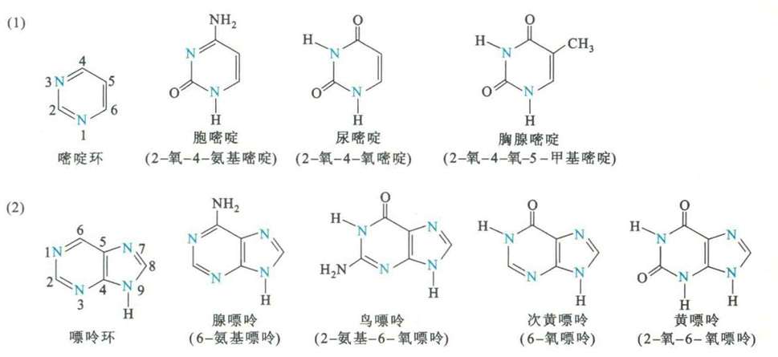
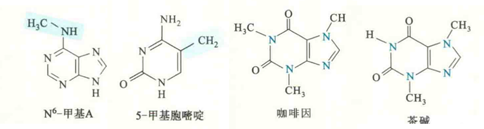
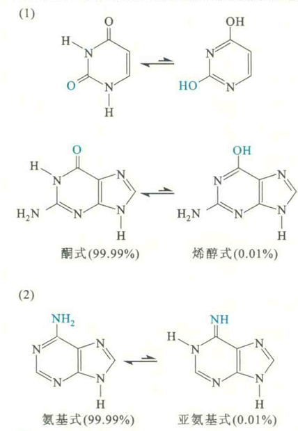

# 碱基

碱基是核苷酸的重要部分，遗传信息由特定的碱基序列编码。碱基是含有N原子的嘧啶或嘌呤衍生物，称为嘧啶碱基和嘌呤碱基。

## 碱基的种类

生物体内最常见的嘧啶碱基是胞嘧啶C、尿嘧啶U、胸腺嘧啶T，嘌呤碱基是鸟嘌呤G、腺嘌呤A。

RNA和DNA共有的碱基是C、A、T，而U通常只存在于RNA，T通常只存在于DNA。但有时DNA分子中也会有少量的U，某些RNA分子还会有少量的T（tRNA）。

## 修饰碱基

除了以上5种常见的碱基以外，机体内还存在着上百种修饰碱基，这些修饰碱基有的很少见，但多为5种常见碱基的修饰产物或代谢产物，例如5-甲基胞嘧啶、5-羟甲基胞嘧啶、N6-甲基A、次黄嘌呤、黄嘌呤、尿酸和二氢尿嘧啶。

这些修饰碱基中，5-甲基胞嘧啶特别重要，如果它出现在真核生物的基因组DNA上，通常可抑制与它有关联的基因的表达，从而在一个基因序列不变的情况下改变生物的表型。因此，5-甲基胞嘧啶有时被称为DNA分子上的第5个碱基。

此外，某些真核生物（如秀丽隐杆线虫和果蝇）基因组DNA上缺乏5-甲基胞嘧啶，但却含有N6-甲基A，这种甲基化的A也可以影响到周围基因的表达，因此有时被称为DNA分子中的第6个碱基。

茶叶中的有效成分茶碱和咖啡中的有效成分咖啡因都属于嘌呤碱基，这两种天然的嘌呤碱基在胞外可作为腺苷的拮抗剂，在与腺苷在肌细胞和脑细胞膜上的受体结合以后，具有提高心率和产生兴奋的作用，还可以在胞内充当催化cAMP水解的磷酸二酯酶的抑制剂，从而延长或加强以cAMP为第二信使的激素（如肾上腺素和胰高血糖素）的作用功效。

## 碱基的性质

### 紫外吸收

碱基杂环共轭结果使其对紫外光有强吸收，最大吸收值在260nm，可用于定性定量分析碱基、核苷、核苷酸、核酸等。

### 水溶性差

芳香族疏水杂环造成其水溶性差，同时碱基的疏水性质对DNA形成稳定的双螺旋结构十分重要。

### 解离

碱基上含有可解离的基团，这些基团的pKa不一样。在中性pH下，碱基主要以内酰胺形式存在。

尿嘧啶的Nl和N3的pKa均超过8；与此相比，胞嘧啶的N3的pKa为4.5。各个基团的pKa决定了在生理pH下质子是否与环上的各个N原子结合，而结合与否又决定了这些N原子能作为氢键的供体还是受体。究竟是作为氢键受体还是供体将直接决定核酸分子中碱基配对的性质，这是双螺旋结构形成的基础，对于核酸的生物学功能至关重要。

### 含多个氢键供体或受体

虽然碱基的水溶性差，但是其环上却带有许多氢键供体或受体。这些氢键供体和受体一方面可以使碱基之间发生相互作用，如在双螺旋结构中互补配对；另一方面还可以与蛋白质分子中亲水氨基酸侧链上的氢键受体或供体形成特定的氢键，从而使得一些蛋白质能识别并结合在DNA分子特定的碱基序列上。

### 互变异构

嘧啶环和嘌呤环的芳香族性质以及环上取代基团（羟基和氨基）的富电子性质致使它们在溶液中，能够发生酮式-烯醇式或氨基式-亚氨基式的互变异构，若是碱性的溶液，可使互补异构的平衡向烯醇式或亚氨基式一侧移动。

两种结构的主要差别在于两者的氢键供体和受体都发生了显著的变化，这会对双螺旋结构中碱基的配对性质产生重要影响。

必须指出，DNA双螺旋中的碱基互补配对规则都是建立在所有碱基都是以酮式或氨基式存在的基础上的，一旦有一方以烯醇式或亚氨基式存在，原来的配对规则将被打破。

好在碱基在体内的主要形式为更稳定的酮式或氨基式，约占99.99%。这就充分保证了DNA在复制和转录时能形成正确的碱基配对。

