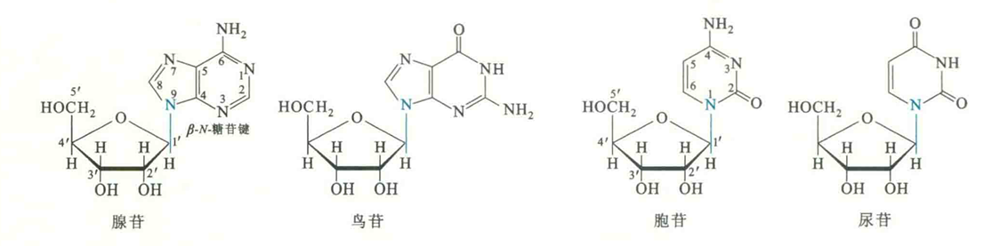
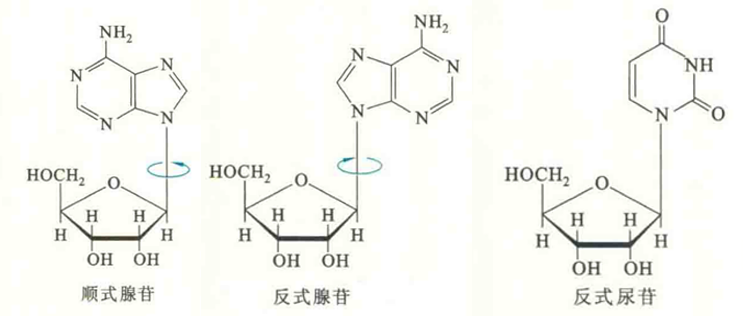
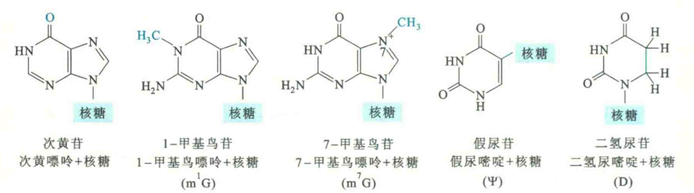

# 核苷

## 核苷的结构

核苷是由戊糖和碱基通过β-N-糖苷键形成的糖苷，糖苷键由戊糖的异头体C原子与吡啶碱基的N1或嘌呤碱基N9形成。

其中的N-糖苷键称为β型，这是因为碱基环在核糖环的上方。如果碱基环是在核糖环的下方，就是α型，但生物体内的核苷并没有α-Ν-糖苷键。

核苷中的戊糖有D-核糖和2-脱氧-D-核糖两种，它们都以呋喃型环状结构存在。其中由核糖形成的核苷称为核糖核苷，由脱氧核糖形成的核苷称为脱氧核苷。

为了避免呋喃糖环与碱基环在原子的编号上出现混淆，需要在呋喃环上各原子的阿拉伯数字后加" ' '"。

核糖上的2-羟基是否存在对于核酸的二级结构、核酸对碱水解和酶促水解的敏感性以及RNA可作为酶催化反应产生了巨大的影响。

## 核苷的构象

在核苷中，碱基在糖苷键上的旋转受到空间位阻（特别是C2’上的H）的限制。结果核苷和核苷酸能以两种构象存在，即顺式和反式。

顺式核苷的碱基与戊糖环在同一个方向，反式核苷的碱基与戊糖环在相反的方向。

由于嘧啶环O2和戊糖环C5'之间的空间位阻，嘧啶核苷的构象通常为反式。

嘌呤核苷可采取两种构象，但无论是哪一种，大致呈平面的呋喃糖环和碱基环不是共平面的，而是相互间近似垂直。

自由的嘌呤核苷（特别是鸟苷）更容易形成顺式构象，但在DNA或RNA双螺旋中，除了Z-DNA以外，嘌呤核苷都是以反式构象存在。

## 常见的核苷

常见的核苷由常见的碱基与核糖或脱氧核糖组成。核糖核苷有腺苷、鸟苷、胞苷和尿苷；

脱氧核苷有脱氧腺苷、脱氧鸟苷、脱氧胞苷和脱氧胸苷。

## 修饰核苷

修饰核苷主要是指由修饰碱基与戊糖组成的核苷，也包括核糖环被修饰的核苷以及少数不是以N-糖苷键相连的核苷。例如，在假尿苷中，尿嘧啶碱基和核糖以C-C键相连。修饰核苷通常存在于RNA分子上，尤其是tRNA和rRNA。

## 核苷的性质

核苷的水溶性要比自由的碱基高得多，这与核糖基的高度亲水性有关。与糖苷一样，核苷在碱性条件下较稳定。嘧啶核苷还能抵抗酸水解，但嘌吟核苷很容易发生酸水解