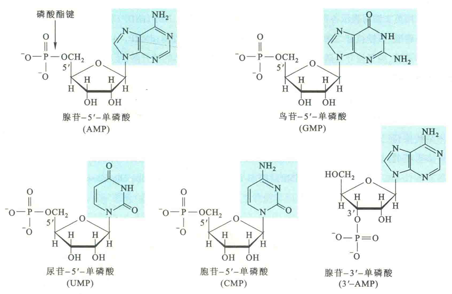
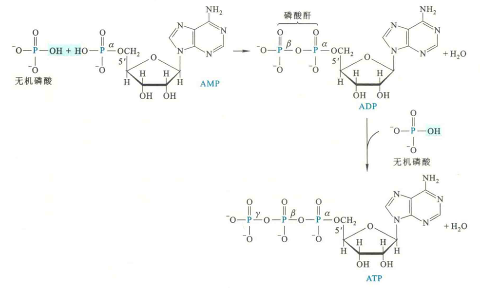
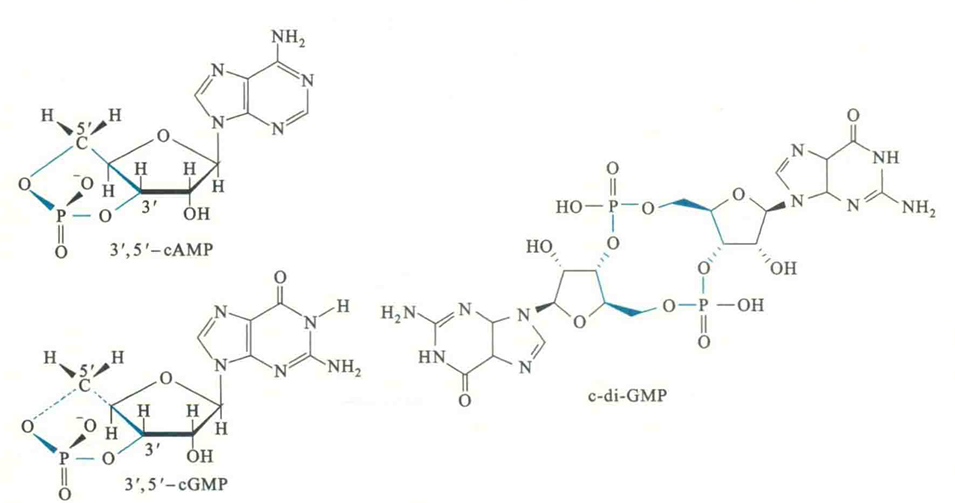
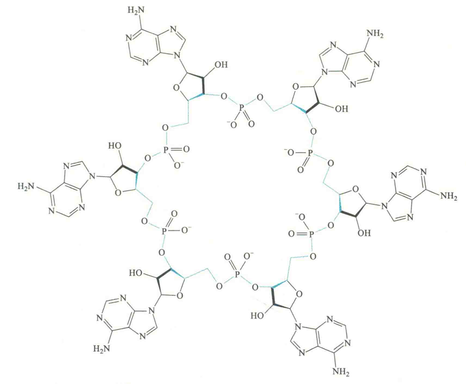
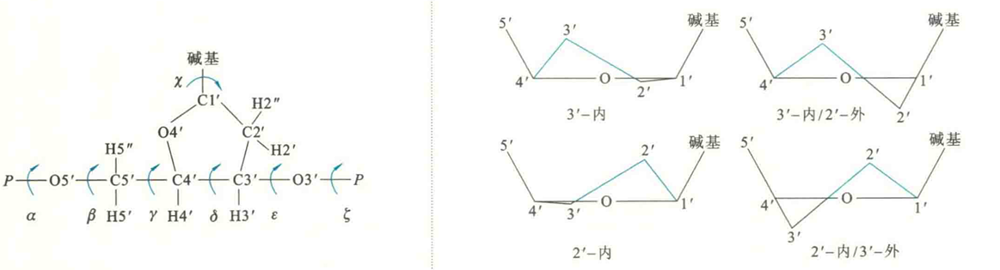

# 核苷酸

## 核苷酸的结构

核苷酸是核苷的戊糖羟基发生磷酸化反应而形成的磷酸酯。其中核糖核苷的磷酸酯为核糖核苷酸，脱氧核苷的磷酸酯为脱氧核苷酸。

理论上，核苷的5'-OH、3'-OH和2’-OH均可以发生磷酸化，而分别形成核苷-5-磷酸、核苷-3'-磷酸和核苷-2'磷酸。但自然界的核苷酸多为核苷-5'磷酸。

由于自然界游离的核苷酸多为核苷-5'一磷酸，因此如果没有特别说明，某某核苷酸即指核苷-5-磷酸。

## 核苷-磷酸

核苷单磷酸(NMP)是指核苷的单磷酸酯。核苷单磷酸还可以通过两次成酐反应，分别形成核苷二磷酸(NDP)和核苷三磷酸（NTP）为了将核苷二磷酸和核苷三磷酸上不同的磷酸基团区分开来，将直接与戊糖5—羟基相连的磷酸基团定为α磷酸，其余两个磷酸基团从里到外依次称为β磷酸、γ磷酸。

## 核苷酸英文缩写

以NMP(rNMP)、NDP(rNDP)和NTP(NTP)分别表示核糖核苷单磷酸、核糖核苷二磷酸和核糖核苷三磷酸，r可以被省掉。

dNMP、dNDP和dNTP分别表示脱氧核苷单磷酸、脱氧核苷二磷酸和脱氧核苷三磷酸。

遇到具体的核苷酸，使用碱基首字母代替N，例如ATP和dATP分别表示腺苷三磷酸和脱氧腺苷三磷酸，CDP和dCMP分别表示胞苷二磷酸和脱氧胞苷单磷酸，IMP表示次黄苷单磷酸。

## 环核苷酸

某些核苷三磷酸在特定的条件下，受环化酶的催化，形成环核苷酸，在细胞中作为第二信使，参与许多重要的过程。

如3‘-5’-环腺苷酸cAMP、3‘-5’-环鸟苷酸cGMP、环二鸟苷酸c-di-GMP、环寡腺苷酸

①cAMP既可以在细菌体内作为一种第二信使，激活多种与糖类分解代谢有关的基因表达，也可以在高等生物体内与cGMP一样，作为多种激素的第二信使；

②c-di-GMP则在多种细菌中作为第二信使，参与调节生物薄膜的形成和一些致病因子的产生等；

③环寡腺苷酸则是最新发现的一种，存在于许多原核生物的第Ⅲ类CRISPR-CaS系统受到外来入侵病毒激活以后被合成，可在细菌胞内迅速扩散，激活另一种称为Csm6的RNA酶，这种RNA酶可协助破坏入侵病毒转录产生的RNA。

## 核苷酸的构象

核苷酸的构象不是固定不变的，它也具有一定的柔性。

①核苷酸分子上C-O-P内的单键可以旋转

②一个核苷酸具有7个扭角，即α、β、γ、δ、ε、ζ、χ，χ在碱基和核糖之间，其值受到很大的限制

③脱氧核糖环不是平坦的，而是形成一定的折皱，共有四种形式，不同的折皱影响到5-OH、3-OH上磷酸基团的位置

④N-糖苷键有顺式和反式

## 核苷酸的理化性质

核苷酸的某些性质由碱基决定，例如紫外吸收、互变异构；

某些性质由核糖或脱氧核糖决定，例如易溶于水和具有旋光性；

某些性质由磷酸基团和碱基共同决定的，例如核苷酸的两性解离和具有等电点；

某些性质与N-糖苷键有关，如核苷酸特别是嘌呤核苷酸在酸性溶液中不稳定，易发生脱碱基反应。