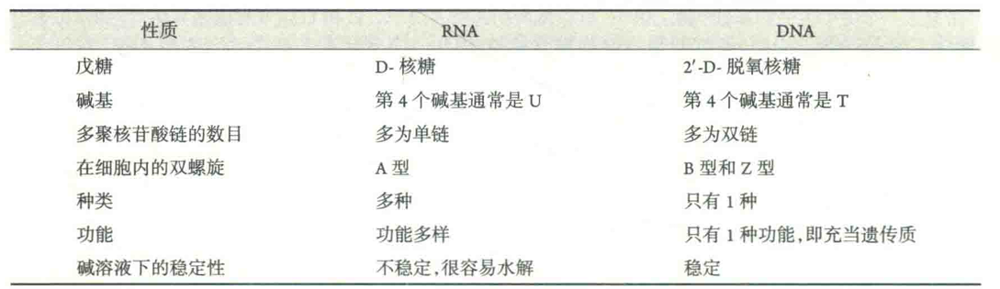
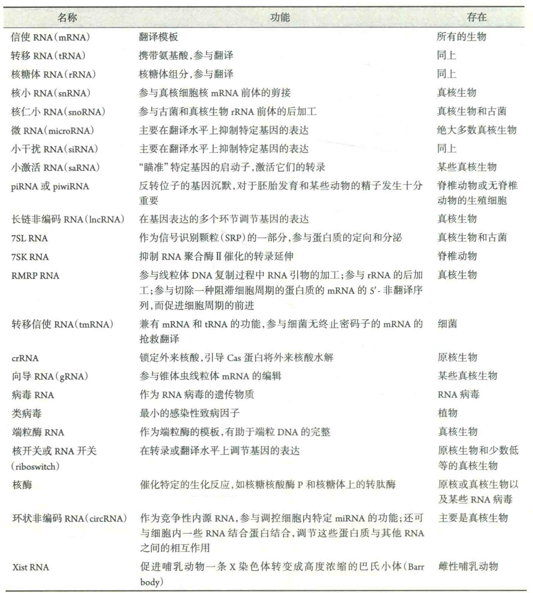

# 核酸的分类

核酸即多聚核苷酸，是由多个核苷酸通过3',5'-磷酸二酯键相连的多聚物，可分为核糖核酸(RNA)和脱氧核糖核酸(DNA)两类。

DNA是生物体主要的遗传物质，只有少数病毒以RNA为遗传物质。DNA能作为遗传物质是与其结构分不开的，其一级结构贮存遗传信息，二级结构有助于遗传物质的复制、转录、重组和修复。

与DNA单一的功能相比，RNA则是一个多面手，其功能是多方面的，除了作为某些病毒的遗传物质，它还可以在基因表达中起主导作用，甚至还可以作为酶起催化作用。RNA功能的多样性与其复杂多变的结构有关。

## 核酸的基本组成单位

核酸的基本组成单位是单核苷酸。构成DNA和RNA的单核苷酸分别是脱氧核苷酸和核糖核苷酸。

核糖核苷酸含有2'-OH，因此在理论上，多聚核糖核苷酸除了通过3',5'-磷酸二酯键连接外，还有另外一种连接方式，即2',5'-磷酸二酯键连接。然而，在自然界很难找到以这种方式连接的多聚核苷酸，不过，高等动物体内的干扰素在作用的时候，可诱导靶细胞合成一种以2',5'-磷酸二酯键连接的多聚腺苷酸。

## RNA与DNA的差别

### RNA分子中的戊糖是核糖，DNA分子中的戊糖是脱氧核糖。

这项差别对于两类核酸各自的结构与功能具有重大的影响，也是我们判断一种核酸是RNA还是DNA的唯一标准。

DNA因为是脱氧核糖，而缺乏反应性的亲核基团2'-OH，降低了磷酸二酯键自发水解的速率，提高了DNA的稳定性，这对于遗传物质的稳定性至关重要。

RNA中的核糖带有2'-OH，亲核性使其很不稳定，容易发生水解，特别是在碱性溶液里。这使得RNA并不适合充当遗传物质，但却适合在细胞里充当蛋白质合成的模板mRNA，在需要的时候被转录出来，在不需要的时候可迅速降解。

当然，在细胞内有多种不同类型的RNA，它们的稳定性是不一样的，像tRNA和rRNA就特别稳定。tRNA和rRNA之所以特别稳定，原因一方面是它们在细胞里不断地被循环使用，细胞需要它们稳定，另一方面是它们有很多2'-OH发生了甲基化修饰，而大大降低了2'-OH原子的反应性。RNA带有2'-OH还有一个用处，就是使其能够利用羟基的亲核进攻性，去作为酶催化一些重要的生化反应。

### RNA的第4个碱基通常是U，而DNA通常是T

这项差别不是绝对的，因为有的RNA分子中也含有少量的T，而DNA分子中经常含有少量的U。

RNA分子中的T是由转录出来的U发生甲基化修饰产生的，而DNA分子上的U则有两种机制可以产生：

一是因为细胞中有少量的dUTP，它在DNA复制的时候，可代替T而直接参入到新合成的DNA链上；二是DNA分子上的C可自发地脱氨基变成U。

**为什么DNA中要有T？**

无论是哪一种途径产生的U，只要出现在DNA分子上，就会被细胞内的DNA修复系统视为损伤而很快将其修复。在复制中参入的U会被修复成T，由C变来的U则被修复成C。显然，要让修复系统能正确地行使功能，这些“坏U”必须能够被及时发现。如果DNA分子中的第4个碱基也是U，那这些U就属于“好U”。在一个DNA分子上同时出现“坏U”和“好U”的情况下，修复系统是区分不了的，更谈不上修复了。因此，DNA分子中的第4个碱基用T代替U，等于是打上一种标记，可让修复系统能够及时发现那些错误的U并将它们修复，从而有效防止了C→U的突变。

### RNA通常是单链，DNA通常是双链

这项差别也不是绝对的，有的RNA是双链的，比如某些RNA病毒和真核细胞内的微RNA(miRNA)，也有的DNA是单链的，例如微病毒科(MiCroViridae)的DNA病毒。

RNA处于单链状态，使其能够自我折叠成可以和蛋白质相媲美的各种类型的二级和三级结构，这是形成RNA结构多样性的基础。否则，所有的RNA与DNA一样，只能形成千篇一律的双螺旋。RNA在三维结构的多样性使其在细胞内能行使多项生物学功能。DNA通常是双链的，使其能够充分地行使作为遗传物质这项唯一的功能。

## RNA的类型

已在生物体内发现多种天然的RNA，例如转移RNA(tRNA)、信使RNA(mRNA)、核糖体RNA(rRNA)、核小RNA，核仁小RNA(snoRNA)、微RNA(miRNA)、，卜干扰RNA(smallinterfereingRNA，SiRNA)、7SLRNA、向导RNA(gRNA)、环状非编码RNA(CirCRNA)、转移信使RNA(tmRNA)和Xist RNA等。

这些RNA具有特殊的结构和功能，其中某些RNA存在于所有的生物，某些RNA是真核生物或原核生物特有的。有时，根据RNA是否具有编码蛋白质的功能，可将RNA分为编码RNA和非编码RNA，按照这样的划分，显然mRNA和UnRNA以外的所有RNA，如tRNA、rRNA、snRNA和miRNA等都属于ncRNA。

而ncRNA还可以进一步分为管家ncRNA和调控ncRNA，前者呈组成型表达，是细胞的正常功能和生存所必需的；后者只在特定的细胞，或者在生物发育的某个阶段，或者在受到特定的外界刺激以后才表达，它们的表达能够在转录或翻译水平上影响到其他基因的表达。另外，一般将长于200nt的非编码RNA称为长链非编码RNA。

不管是何种核酸，其功能都由结构决定的。与蛋白质一样，核酸的结构可以人为地划分为几个不同的层次，即一级结构、二级结构和三级结构，但核酸没有四级结构。

