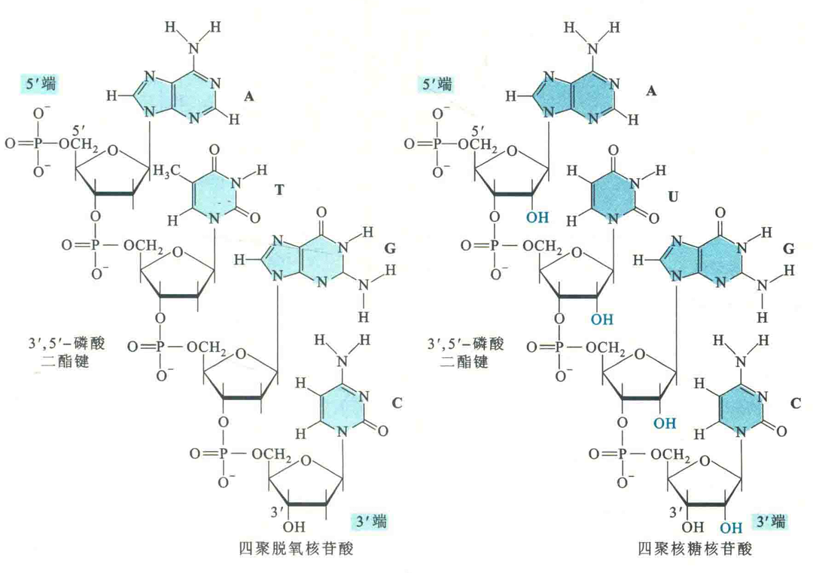

# 核酸的一级结构

核酸的一级结构是指构成核酸的多聚核苷酸链上所有核苷酸或碱基的排列顺序。 

多聚核苷酸链至少有3个重要特征：

①有两个不对称的末端，其中有一端的核苷酸5'-OH不参与形成磷酸二酯键，此末端称为5' 端，另一端的核苷酸3'-OH不参与形成3',5'-磷酸二酯键，此末端称为3'端，多聚核苷酸链的这种性质称为极性；

②在生理PH下，多聚核苷酸链上的磷酸基团由于大多数处于解离的状态，带有大量负电荷，因此核酸是一种多聚阴离子复合物；

③每一条链上的核苷酸残基都有一定的排列顺序，这种排列顺序也就是核酸的一级结构。

## 环形DNA

除了线形核酸以外，自然界还有环形核酸。例如，细菌的染色体DNA、大多数质粒DNA、叶绿体DNA和大多数线粒体DNA都属于环形DNA，而类病毒为环形的RNA。

与线形核酸不 同的是，环形核酸没有游离的3'端和5'端，或者说两个末端之间也形成了磷酸二酯键。 

## 核酸序列的书写

对于一个已知序列的核酸，现在一般都直接用碱基的单字母缩写来表示，如果两端有磷酸基团， 可用“P”表示；如果不确定是否有磷酸基团，可用“—”表示。

按照惯例，应从5'→3'，书写核酸的一级结构。如果你一定要从3'→5'书写，必须明确注明。

有时为了强调是DNA还是RNA，可以在单字 母缩写前加写“d”和"r"。

核酸一级结构的意义在于，生物体的遗传信息是贮存在由4种核苷酸编码的特定的序列之中，而与高级结构无关。