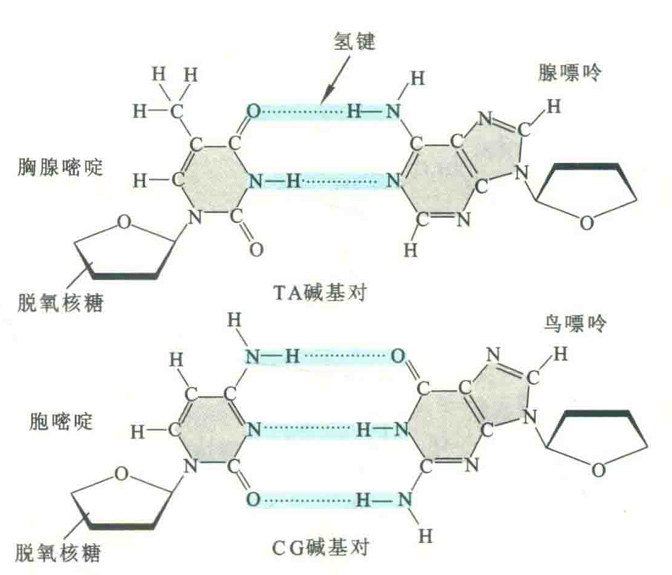
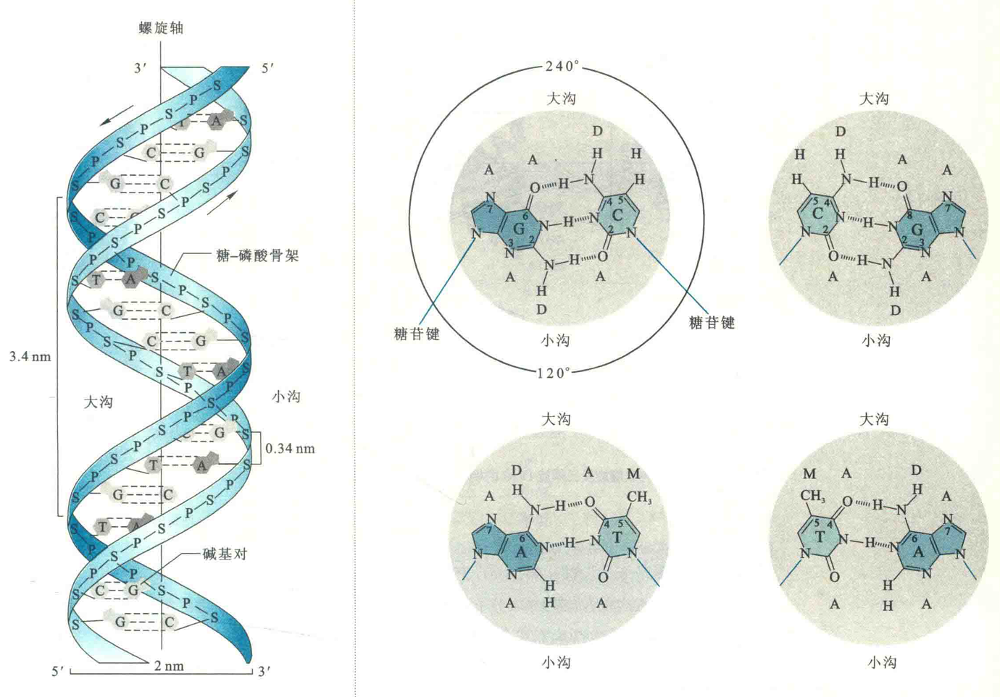
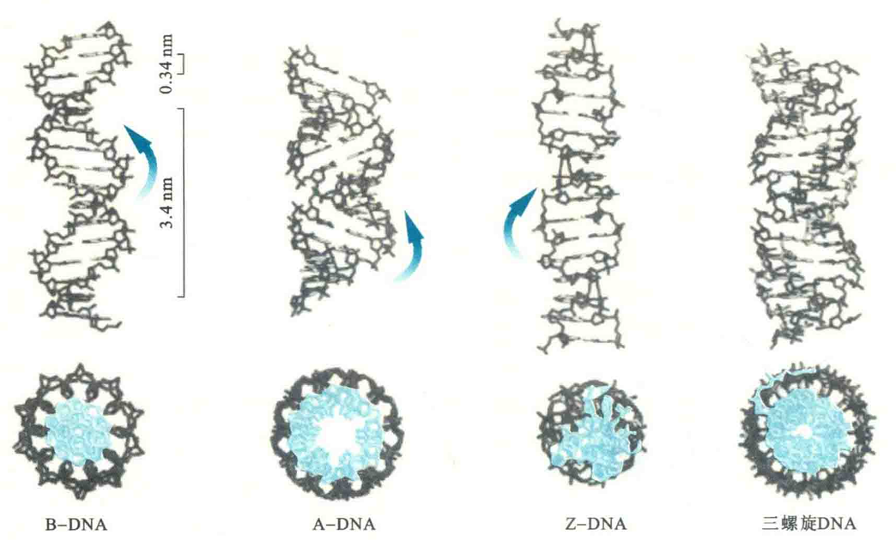
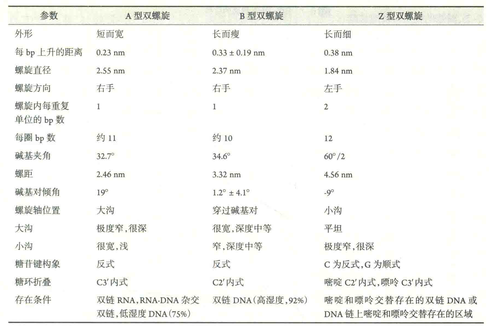
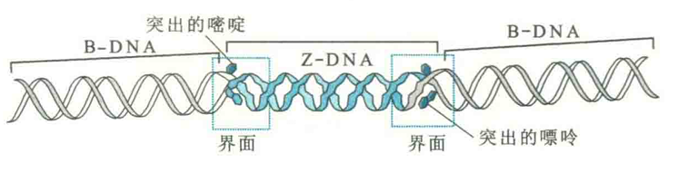

# DNA的双螺旋结构

核酸的二级结构是其主链建立在碱基配对的基础上形成的各种折叠。就DNA而言，由于一般是由两条互补的双链组成，因此可形成完全互补配对的双螺旋。然而，对RNA来说，一般只由一条链组成，因此只能通过链内的碱基互补配对形成局部的双螺旋结构。

DNA的二级结构DNA的二级结构主要是各种形式的螺旋，特别是B型双螺旋，此外还有A型双螺旋、Z型双螺旋、三螺旋和四链结构等。

## B型双螺旋

①DNA由两条反平行的多聚脱氧核甘酸链组成，两条链相互缠绕，形成右手双螺旋。

②组成右手双螺旋的两条链在碱基序列上是互补的，它们通过特殊的碱基对结合在一起。一条链上的A总是与另一条链的T以氢键配对，一条链上的G总是与另一条链上的C以氢键配对。其中AT碱基对有2个氢键，GC碱基对有3个氢键。这种配对方式被称为Watson-Crick碱基对。

有两个因素决定Watson-Crick碱基对的特异性，一是A和T、G和C之间在几何形状上的完美互补；二是它们之间能形成“绝配”的氢键。

::: tip

前一种因素可能更为重要，因为有人用几何形状与T极为相似但缺乏氢键受体和供体的化合物（2，4-二氟甲苯）来代替双链DNA在少数位置上的T，结果双螺旋结构照样能够存在。

:::

③碱基对位于双螺旋的内部，并垂直于螺旋轴，而磷酸脱氧核糖骨架则位于螺旋表面。碱基对之间通过疏水键和范德华力相互垛叠在一起，对双螺旋的稳定起重要作用。

④双螺旋的表面是不规则的，含有明显的大沟和小沟，宽度分别为2.2nm和1.2nm。

双螺旋上出现大、小沟的原因是，与每一个碱基对有关的两个糖苷键没有完全处于相对的位置。如果把螺旋看成一个圆筒的话，在将螺旋横切以后，看到的两个糖苷键之间的夹角不是180°，而是120°的小角或240°的大角。当越来越多的碱基对垛叠在一起的时候，在碱基对一侧的小角形成小沟，在另外一侧的大角则形成大沟。

显然，如果一个碱基对上的两个糖苷键夹角为180°的话，两个沟的大小和形状就是一样的了。

⑤双螺旋的其他参数包括:相邻碱基对距离为0.33nm，相差约36°，螺旋的直径为2.00nm，螺距为3.32nm，每一圈完整的螺旋含有10个碱基对。然而，细胞内的DNA双螺旋每一圈实际上含有10.4-10.6Bp。

## A型双螺旋

B型双螺旋仅是DNA双螺旋多种构象中的一种，在一定的条件下，双链DNA可以从B型转变成其他构象，例如A、C、D、E、T和Z等形式，但在正常的细胞环境中，能够存在的双螺旋只有B型、A型和Z型。

### 影响因素

其中B型是细胞内最主要的形式，A型一般与RNA有关系。引起DNA双链构象改变的主要因素包括

①相对湿度；②盐的种类和浓度；③碱基组成和序列；④超螺旋的数量和方向。

促进A型DNA双螺旋(A-DNA)形成的主要因素是相对湿度的降低和盐浓度的上升。DNA钠盐在相对脱水的条件下（即低于75%相对湿度）可形成A型双螺旋。

### 差异

与细而长的B-DNA相比，A-DNA更宽、更平、更短；

每一圈螺旋为11bp，而不是10bp；

螺距为2.46nm，而不是3.32nm；螺旋的直径为2.6nm，而不是2.0nm；

碱基对不再近乎垂直于螺旋轴，而是相对于螺旋轴倾斜了19°；

相邻的碱基对距离0.23nm，而不是0.33nm；大沟窄而深，小沟宽而浅。

因为活细胞内充满着水，所以A-DNA很难存在。然而，某些革兰阳性细菌胞子内的DNA是A型，这显然与孢子内部水分缺乏有关。

除此之外，在DNA复制的时候，与DNA聚合酶活性中心结合的大概在3bp内的双螺旋为A型。在基因转录的时候，DNA与RNA形成的杂交双螺旋为A型。RNA双螺旋也为A型。

双链RNA或者DNA-RNA杂交双链之所以以A型双螺旋存在，是因为RNA的2'-OH造成的空间位阻阻止了B型双螺旋的形成。

## Z型双螺旋

Z型双螺旋(Z-DNA)最早是在体外得到的一种双螺旋。1972年，Fritz M.Pohl等发现，人工合成的由GC相间排列的多聚核苷酸(GCGCGC)在高盐的条件下，旋光性会发生改变。随后，MIT的Alexander Rich对这种六聚脱氧核甘酸的单晶进行了X射线衍射分析，提出了Z-DNA模型。

### 结构特点

①螺旋上的脱氧核糖磷酸骨架呈锯齿状或“Z"字形伸展

这是由于碱基对向螺旋的外表面前移，中轴不再像B-DNA位于碱基对之间，而是移向了小沟，其中的脱氧核糖与C相连的糖键是反式的，与G相连的糖苷键是顺式的；

②螺旋的方向是左手，与G相连的糖苷键呈顺式，不仅使螺旋旋转方向发生了改变，还使G残基位于分子表面；

③脱氧胞苷酸的糖环C2'为内式，碱基为反式，使糖环转离小沟；而脱氧鸟苷酸的糖环C3'为内式，碱基为顺式，使糖环弯向小沟；胞嘧啶的C5和鸟嘌呤的N7、C8原子填满了大沟，并指向表面，使大沟变得不明显，而小沟变得非常深但较窄；

④螺旋的各种参数发生了变化

### 体外形成条件

Z-DNA在体外的存在需要满足两个条件：

①高的盐浓度或者在有乙醇的时候。如果是NaCl，其浓度需超过2 mol/L；如果是MgCl2，其浓度要超过0.7mol/L。

Z-DNA的形成导致带负电荷的磷酸基团距离更近了(Z-DNA为0.8nm，B-DNA为1.2nm)，而高的盐浓度能够减少两条链之间靠得最近的磷酸基团间的排斥力。

②嘌呤-嘧啶相间排列，例如Poly(dG-dC)。目前认为在适当的盐浓度下，任何不少于6bp的嘌呤-嘧啶交替排列顺序都能形成Z-DNA。

有时，并不严格的嘧啶-嘌呤相间序列，例如含有2个5-甲基胞嘧啶(m5C)的六聚核苷酸m5CGATm5CG，在生理盐水的浓度下也能形成Z-DNA。

### 体内形成条件

事实上，体内m5C上的甲基被认为有助于B型向Z型的转变，这是因为在B-DNA上，疏水的甲基伸入到大沟内水溶性环境之中，从而不利于B-DNA的稳定。而在Z-DNA中，同样的甲基却能形成一种稳定性的疏水“补丁”。

生命科学的研究总是这样，科学家在体外得到某种结构的时候，首先想到的是体内是否存在类似的或同样的结构，如果在体内发现存在这种结构，又想知道它在体内的功能。那么体内到底有没有天然的Z-DNA存在呢？如果有，其功能又是什么呢？

Rich使用荧光标记的Z-DNA特异性抗体，并将其引入到细胞内，结果发现了在某些生物体内的确存在Z-DNA。

例如，果蝇的X染色体上就存在Z-DNA，而人类基因组上类似的可暂时形成Z-DNA的片段约有10^5bp，但细胞内Z-DNA形成的条件与体外有所不同。

例如，体内的盐浓度很难达到非常高的水平，而体内带正电荷的多胺化合物，如精胺和亚精胺的存在，一样可与磷酸基团结合，减少负电荷的排斥作用，使B-DNA转变成Z-DNA。

此外，某些蛋白质(如Z-DNA结合蛋白)带有正电荷，与DNA结合可在DNA周围创造局部的高盐浓度的微环境，这也是在活细胞中形成Z-DNA的原因之一。

有时，体内负超螺旋的存在也能促进Z-DNA的形成，这是因为负超螺旋引起的扭曲张力可稳定Z-DNA的存在。

抗体结合实验表明，将PoIy(dG-dC)插入到质粒中，质粒在松弛状态下不能结合Z-DNA抗体，但如果处于负超螺旋状态，则能结合。

如果细胞内的DNA在某段序列形成Z-DNA，那这段Z-DNA在两端与周围B-DNA的交界处就会各有一对碱基从内部被挤出来，碱基的突出与磷酸核糖骨架在两种双螺旋过渡的时候发生弯曲和回转有关。

### 生物学意义

关于体内Z-DNA形成的生物学意义，现在一般认为与基因的表达调控有关。已发现有利于Z-DNA形成的碱基序列经常位于控制基因转录起始的启动子区域，而该区域的DNA在基因转录或染色质重塑过程中易形成负超螺旋。

也许DNA的局部区域发生Z-DNA和B-DNA的可逆性转变可充当控制基因表达的开关。当一个DNA分子的某个区域从B-DNA转变成Z-DNA以后，细胞内有某些调节蛋白质专门与Z-DNA结合，从而改变基因表达。

例如，猿猴肾病毒（SV40）DNA上能够增强基因表达的增强子序列中就有此结构。已发现真核细胞内DNA上有许多m5C，既然m5C有利于Z型双螺旋的形成，而甲基化能够改变基因的表达，这就说明Z-DNA与基因表达之间肯定存在某种关系。

Z-DNA除了参与基因表达调控以外，还可能通过释放来自螺旋本身的拓扑学张力而促进同源重组。