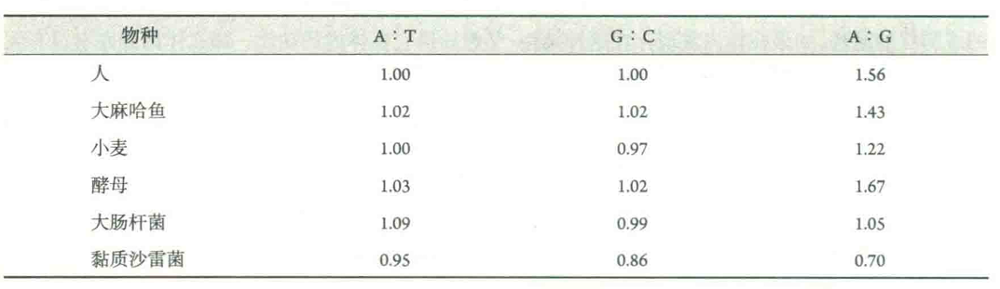
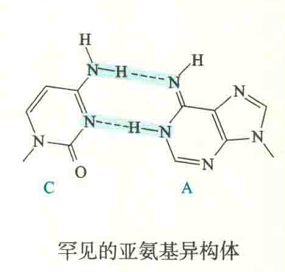

# DNA双螺旋结构的依据和控制因素

## 支持依据

支持DNA双螺旋结构的证据Watson和Crick提出的DNA双螺旋结构模型主要建立在X射线衍射数据和Chargaff规则的基础之上。

### X射线衍射数

据从1950年到1953年，Rosalind Franklin和Maurice Wilkins使用DNA湿纤维（类似于晶体）进行了X射线衍射分析，所取得的一些数据表明，DNA具有简单、有规律的重复结构单元，特别是Franklin获得的编号为51的X射线衍射照片，其标志性的X形状显示了其螺旋的特征。

### Chargaff规则

1949年，Erwin Chargaff应用纸层析及紫外分光光度计，对不同生物来源的DNA的碱基组成进行了定量测定，结果发现在所测定的每一种生物的DNA分子上，A和G的含量都分别等于T和C，且A+GH+T。

此外，DNA的碱基组成具有物种特异性，但无组织和器官的特异性，并且年龄、营养状况和环境等因素不影响DNA的碱基组成。

上述DNA分子中4种碱基组成表现出来的规律称为Chargaff规则。尽管Chargaff对这一发现谨慎地猜测为“这是DNA结构的某些重要特征的反映”，然而他本人并没有揭示出其中的生物学意义。而Watson和Crick正好利用此规则来说明DNA双螺旋结构中A与T、G与C配对的特征。

### 碱基的互变异构

碱基配对的特异性在很大程度上是由碱基之间的氢键决定的，但碱基具有酮式和烯醇式或氨基式和亚氨基式，两种形式的碱基在氢键的供体和受体上有所变化。GC和AT配对是碱基在酮式结构下的配对，这也是DNA分子正确的配对方式，因为体内的碱基主要形式正是酮式。但如果碱基变成烯醇式，就会发生其他形式的配对，如CA配对。

事实证明，在DNA复制过程中，作为模板的某些碱基“不巧”处于烯醇式或亚氨基式，结果导致复制出现错配。这说明在DNA分子中，碱基的确是以配对的形式存在的，这与Chargaff规则也是一致的。

## 稳定双螺旋结构的因素

DNA的双螺旋结构通常是很稳定的，起稳定作用的因素包括：

### 氢键

螺旋内部的氢键是碱基对之间的氢键，螺旋外部的氢键在戊糖-磷酸骨架上的亲水基团与周围的水分子之间形成。

在双螺旋中，嘧啶和嘌呤之间的距离正好与一般氢键的键长（0.27nm）差不多，且氢键供体原子和氢键受体原子处于一条直线上，利于形成氢键。若嘌呤与嘌呤或嘧啶与嘧啶配对，其空间的大小都不适合形成氢键。

氢键固然重要，但它们主要决定碱基配对的特异性，而对双螺旋稳定的贡献不是最重要的。对双螺旋稳定起决定性作用的是碱基堆积力。

### 碱基堆积力

碱基堆积力是碱基对之间在垂直方向上的相互作用所产生的力。它包括疏水作用和范德华力。

虽然多聚核甘酸链的磷酸核糖骨架是高度亲水的，但碱基杂环π-电子云导致嘧啶和嘌呤本身具有一定程度的疏水性。在水溶液中，这些疏水基团会自发聚集在一起。当疏水基团因聚集而相互靠近到一定的距离时，自然就会产生范德华力，这正如球状蛋白质形成疏水核心的机制一样。

从热力学的角度来看，DNA形成双螺旋能使高度亲水的磷酸基团与水的接触增加到最大限度，同时也使碱基与水的接触减少到最小限度。在双螺旋中，相邻碱基对的间隔是0.34nm，而范德华力的平均半径（指引力和斥力正好相平衡的距离）为0.17nm，因此相邻碱基对会产生范德华引力。

碱基间相互作用的强度与相邻碱基之间环重叠的面积成正比，其总的趋势是嘌呤与嘌呤之间>嘌呤与嘧啶之间>嘧啶与嘧啶之间。

另外，碱基的甲基化也能提高碱基堆积力。

### 磷酸核糖骨架上负电荷的中和

在生理pH下，DNA主链上的磷酸基团带有大量的负电荷，因此两条链之间存在着静电的排斥作用。溶液中的阳离子（如Mg2+或多胺类化合物）可以中和磷酸所带的负电荷，消除静电斥力。当离子浓度降低，中和作用减弱时，排斥力会加大，DNA双螺旋稳定性就降低了。

在上述几种因素的作用下，一段由20bp组成的双螺旋在室温下已相当稳定。正因为如此，在设计聚合酶链式反应（PCR）的引物的时候，要让引物与DNA模板形成稳定的双螺旋结构，引物长度至少是16个碱基，但为了增加特异性，最好达到20~24个碱基。

## DNA双螺旋结构的意义

DNA双螺旋结构发现的意义在于为生物学家揭示遗传物质的遗传、复制、修复、多样性以及为物种的进化提供了重要的线索。从更广泛的意义来看，该发现将遗传学与生物化学、细胞生物学和生理学等学科结合到一起，并直接导致分子生物学的诞生和后来的迅速发展。

简言之，在DNA双螺旋结构模型中，最重要的内容应该是其中互补的概念。互补结构对于理解DNA的复制、重组、修复、转录、转录后加工和翻译等机制都很重要。

可以说，在发现DNA双螺旋结构之前，想推测出DNA作为遗传物质如何能够行使它的生物学功能几乎是不可能的。但在发现DNA由两条链组成，并且两条链的序列是互补的以后，一切就变得很容易了。一个DNA分子上的两条链都可以分别作为模板，即新链的序列按照碱基互补配对原则由模板链决定。结果就是，DNA链上的任何一部分序列都可以用来作为复制新序列的模板，或者去识别另外一个DNA分子上的互补序列后再配对结合。这两点对于DNA复制和重组至关重要。

此外，DNA双螺旋结构对于DNA损伤的修复机制也同样重要。当DNA受到损伤以后，机体内修复系统通常会把受到损伤的序列切除，然后以它正常的互补序列为模板，重新合成出正确的序列。