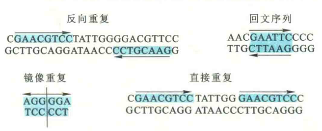
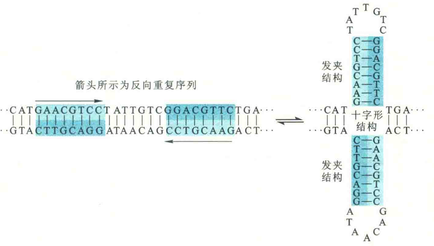
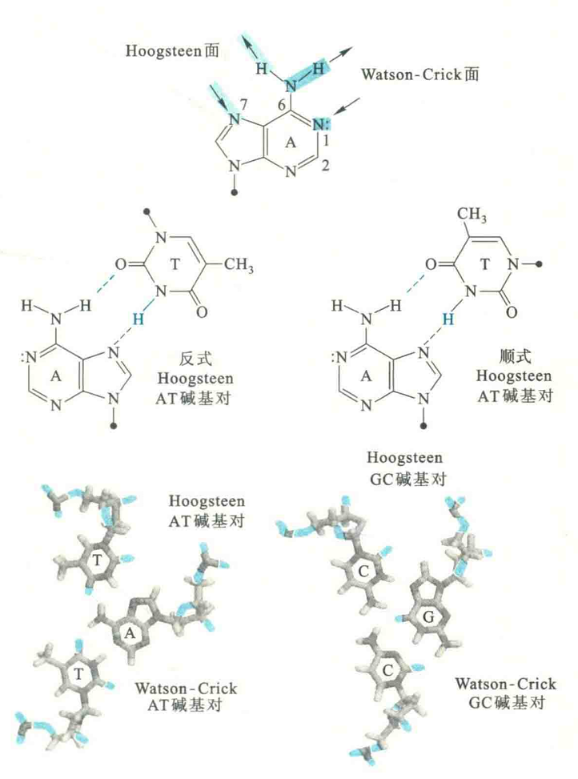
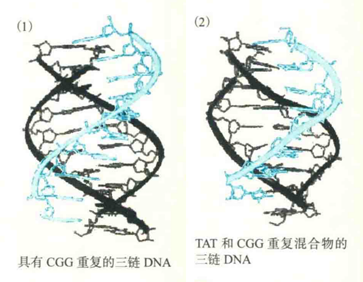
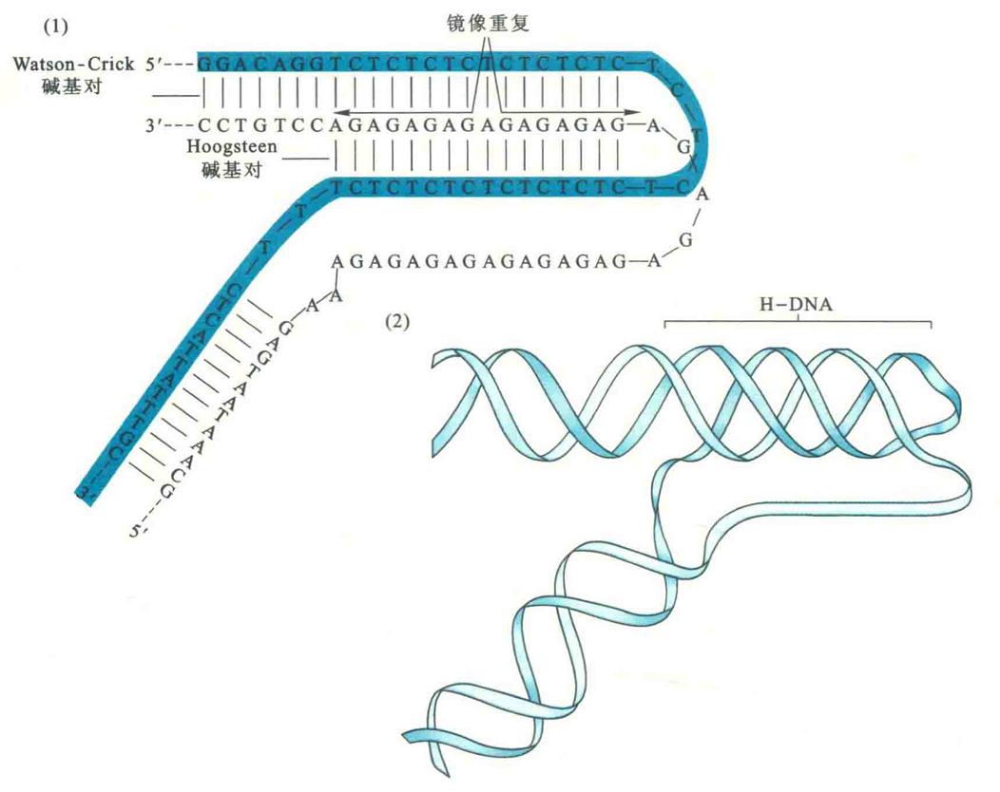
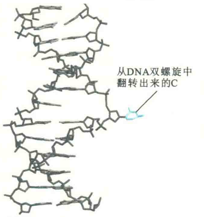
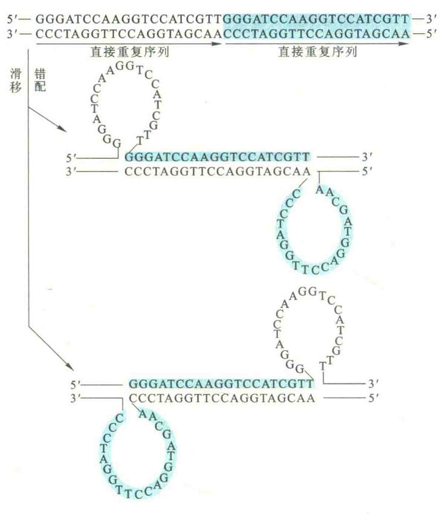

# DNA非标准结构

构除了上述3种最常见的标准二级结构以外，细胞内的DNA在特殊的条件下还可能形成其他几种非标准的二级结构，如弯曲、十字型、三螺旋、滑移错配DNA和碱基翻转等。

这些特殊的条件包括：DNA受到某些蛋白质的作用（如组蛋白）；DNA本身所具有的特殊序列模体，例如反向重复、回文序列、镜像重复、反向重复、直接重复、高嘌呤序列、高嘧啶序列、富含A序列和富含G序列。

## 弯曲

当DNA的一条链在某区段含有成串的A序列（4~6个A），且相邻的串间隔10个碱基的时候，该区段DNA很容易形成弯曲。有时，DNA受到某些蛋白质的作用也会形成弯曲。

例如，真核生物的TATA盒结合蛋白可导致DNA在启动子区域发生弯曲，大肠杆菌cAMP受体结合蛋白可导致DNA在乳糖操纵子处发生弯曲。已有证据表明，在DNA复制、转录和定向重组过程中，DNA在局部形成弯曲似乎是蛋白质与DNA序列之间相互作用的要素之一。

此外，DNA发生碱基错配或DNA受到紫外线的照射发生损伤时也可以形成弯曲，此时形成的弯曲实际上是作为体内DNA修复系统识别损伤的一种信号。

DNA弯曲还有利于压缩比较大的基因组DNA。已发现类似CTGnCAGn的序列比其他序列更容易组装成核小体的结构，这是因为这样的序列构成的双螺旋具有较好的柔性，容易发生弯曲。这说明DNA弯曲可影响到染色质的结构组装。

## 十字形DNA

内部一些含有反向重复序列的区域在解链以后，可通过链内碱基互补配对形成一种十字形的二级结构。由于十字形结构在两端含有6~7个没有配对的碱基，因此在热力学上并不是一种稳定的结构。

在人类基因组DNA的复制起始区和转录调控区，有许多反向重复序列，因此，在这些区域有可能形成十字形结构，其功能也许是充当某种控制DNA复制和基因转录的开关。

## 三螺旋

双螺旋DNA在一定条件下可容纳第三条链，这个“第三者”沿着双螺旋的大沟，通过与双螺旋中的一条链形成Hoogsteen碱基对而形成稳定的三螺旋结构。

嘌呤碱基具有再形成两个氢键的潜在位点，被称为Hoogsteen面。若是G，两个位点为N7和O6；若是A，两个位点是N7和6号位的NH2。这些氢键供体和受体可以导致Hoogsteen碱基对的形成，其中T与A配对，质子化的C与G配对。

### Hoogsteen碱基的类型

Hoogsteen碱基对有顺式和反式两种：反式是指第3条链与嘌呤链呈反平行排列，顺式是指第3条链与嘌呤链呈平行排列。这种结构的形成涉及3段碱基序列，每一段序列要么全是嘌呤，要么全是嘧啶，而且具有互补的关系。

它们可以是两段相同的全嘌呤序列和一段互补的全嘧啶序列，也可以是两段相同的全嘧啶序列和一段互补的全嘌呤序列。

三螺旋结构的形成可以影响到DNA的复制、重组和转录，还可能阻止特定的蛋白质与DNA的结合，从而对基因表达起调控作用。

### 形成条件

三螺旋结构可以在两个DNA分子之间形成，也可能在同一个DNA分子内形成。

前者容易在两个DNA分子上全是嘌呤和全是嘧啶的互补区段之间形成，但第3条链在配对结合的时候有两种不同的方向，而具体的方向取决于链的性质。

第3条链通过Hoogsteen氢键配对的时候，需要C的质子化（低pH）。这样的三螺旋结构可能在DNA同源重组的时候形成:一个DNA分子上的同源片段出现裂口，然后发生解链，其中的一条链与另一个DNA分子上的同源双链配对结合。

分子内的三螺旋结构形成，除了需要互补的全嘌呤和全嘧啶序列以外，还需要序列呈镜像重复。第3条链上的C需要质子化才能与G配对。已发现，超螺旋的形成有利于这类三螺旋结构的形成。

在三螺旋结构中，碱基堆积力对其稳定性有一定的贡献，但由于3条链之间存在更强的电荷排斥，稳定性没有双螺旋好。

然而，当DNA处于高盐浓度时，其链上的负电荷多数被多价阳离子中和，形成三螺旋将会变得容易。此外，负超螺旋或低PH也有利于H-DNA的形成。

### 生理意义

据估计，由嘌呤组成的镜像重复序列在人DNA上大概每140-150kb出现一次，也就意味着H-DNA可能广泛地存在于基因组DNA中。

在细胞内，H-DNA经常出现在DNA复制、转录和重组的起始位点或调节位点，因此有人推测，第三股链的存在可能使一些转录因子或RNA聚合酶难以与该区段结合，从而阻遏有关基因的表达。

原则上，人工合成的单链DNA如果能与体内的某段DNA序列形成三螺旋，就能阻断特定的基因表达，也就能治疗一些因特定基因过度表达引起的疾病。

## 碱基翻转

有时候，DNA双螺旋上的某个碱基离开它的“配偶”，突出在双螺旋之外，这种现象称为碱基翻转。

一个碱基发生翻转的时候，会造成相邻碱基对的扭曲。碱基翻转对于细胞的某些功能是很重要的。例如，参与同源重组的酶需要通过碱基翻转寻找同源的序列，催化碱基修饰的酶需要碱基通过翻转落入它的活性中心被化学修饰，参与碱基切除修复的DNA糖苷酶需要受损伤的碱基通过翻转进入它的活性中心被切除。

最后一种情况的实例就是DNA分子上出现的U是通过这种方式被尿嘧啶-DNA糖苷酶切除掉的。

## 滑移错配DNA

3',5'含有直接重复序列的DNA可以形成一种称为“滑移错配”的二级结构。

形成这种结构的原因是该区段DNA先发生解链，在重新缔合的时候，一段重复单元内的核甘酸序列因滑移与另一段重复单元内的互补序列发生错配，从而形成两个环。因滑移的方式不同，可形成两种SMP-DNA。

若体内的DNA形成上述结构，会导致某些基因发生移框突变。

## 四链DNA

很长一段时间内，没有人敢想过DNA能形成四链结构。但在三螺旋被发现以后，有人根据Watson-Crick碱基对和Hoogseen碱基对，首先从理论上预测出四链结构是可能存在的。很快有人在体外发现，由CGG重复序列组成的单链DNA在K+、Na+或Li+存在下很容易形成四链结构，这种结构可使用凝胶电泳的方法检测出来，因为它泳动的速率比其他形式的DNA要快。

化学修饰实验清楚地显示，G参与以Hoogsteen氢键形成四链。在两个两侧含有2段G四联体GGGG重复序列的GCGC序列组成的DNA片段之间，可以形成四链结构。

真核生物染色体DNA的端粒是最可能形成四链结构的地方。端粒DNA是由短的GnTn重复序列组成。重复的次数成百上千。四膜虫大核端粒DNA重复序列为GGGGTT，拟南芥为GGGATT，人类为GGGATT。

多数真核细胞的端粒DNA的3'端具有由富含G的短重复序列组成的悬垂，长度通常为12~16个碱基。人端粒DNA的3'端的悬垂较长，有125~275个碱基，其重复序列为GGGATT。

人工合成的人端粒悬垂序列在体外特定的条件下，可以通过螺旋桨状的G-四联体结构形成四链结构。在G-四联体结构之中，每一个G通过Watson-Crick面与相邻G的Hoogsteen面形成氢键。四个G的O6位于四联体的中心，每两个四联体片层可以结合一个金属离子。

四联体可能是平行的，也可能是反平行的，如果是反平行的，相邻的G就必须采取不同的取向。

有人根据体外的一些实验数据推测，人细胞端粒DNA悬垂折叠成为的G-四联体可与特定的端粒DNA结合蛋白结合，从而可为端粒提供额外的保护，有助于它的完整性和稳定性。

还有人使用改造过的由荧光标记的G-四联体特异性抗体，在人细胞中直接观察到了G-四联体的存在。此外，体内的四联体可能参与调节c-Myc原癌基因的转录：有证据表明，一种椅状的四联体结构能够阻止c-Myc的转录激活。如果四联体被破坏，c-Myc的转录就会显著增加。