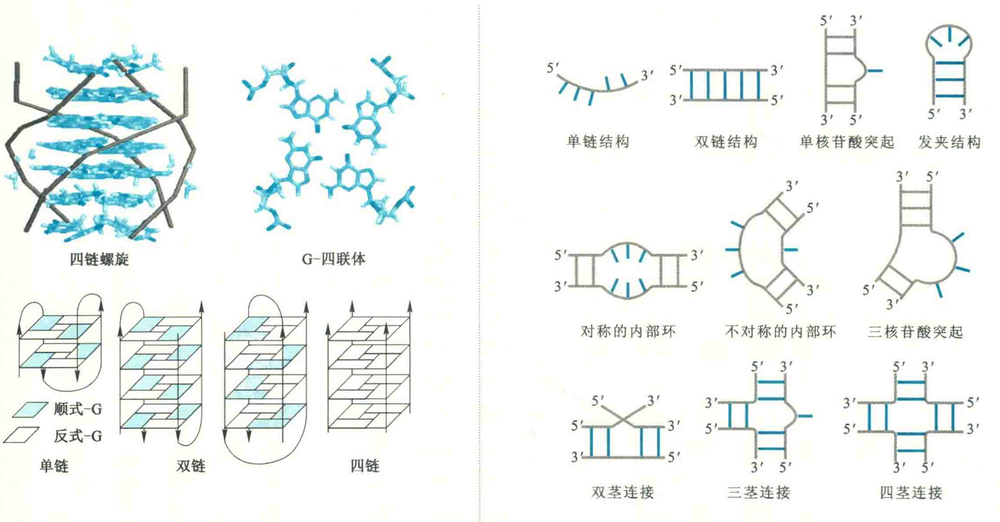
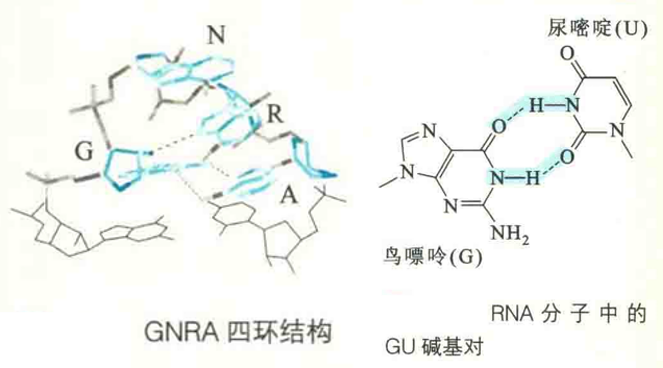

# RNA二级结构的多样性

RNA的二级结构主要取决于它的碱基组成，即其一级结构。

RNA二级结构的多样性可以和蛋白质相提并论。少数病毒的基因组RNA由两条互补的链组成A型双螺旋。

然而，自然界的RNA通常只由一条链组成，但它们仍然表现出相当程度的双螺旋性质。这是因为RNA链经常自我折叠，使在不同区段的互补序列之间形成局部的A型双螺旋，而不能配对的序列以突起、简单环、内部环或发夹环的形式游离在双螺旋之外，形成多种形式的二级结构。

在这些二级结构中，发夹结构最为常见。发夹结构包括两个部分，一个部分是由一段标准互补碱基对形成的双螺旋，另一部分是双螺旋两股互补序列之间的一段由3~5个没有配对的碱基组成的环。最常见、最稳定的环是由4个碱基UNCG、GNRA或CUYG(N表示任何碱基，R代表嘌呤碱基，Y代表嘧啶碱基)构成的四环。

以GNRA(如GAGA、GCAA和GAAA)为例，环上的第一个碱基(G)和第4个碱基(A)形成不同寻常的GA碱基对，此外，在G和磷酸基团之间的一个氢键、R与核糖羟基的氢键以及碱基间的堆积对四环结构均有稳定作用。

在RNA双螺旋中，常常可以发现GU碱基对，这为单链RNA形成链内双螺旋创造了更多的机会。与GC碱基对不同的是，GU碱基对只有2个氢键。不同种类的RNA的全部二级结构实际就是上述各种二级结构不同形式的组合。

