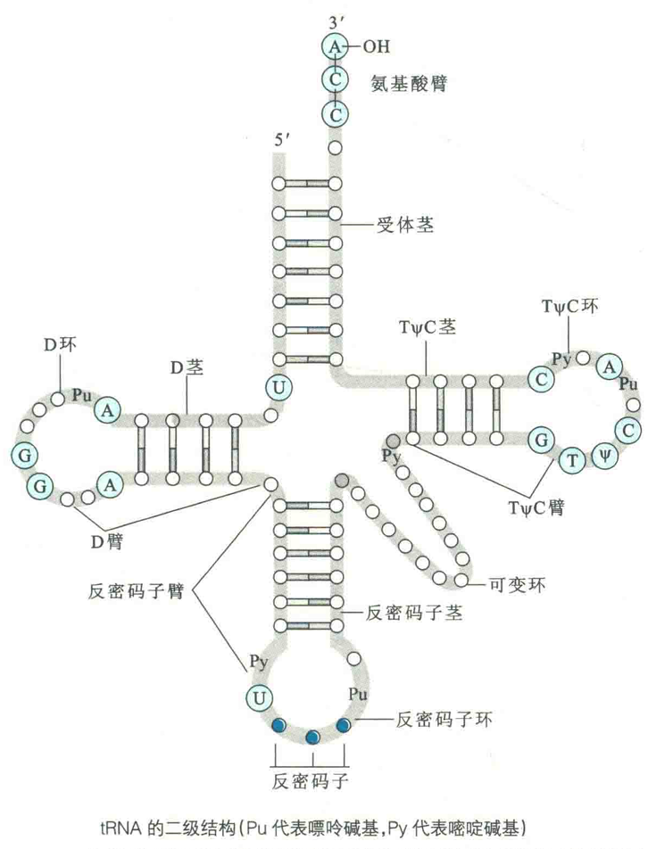

# RNA的二级结构

## tRNA的二级结构

tRNA分子只由一条链组成，含有73~94个核苷酸，其中有不少是修饰的核苷酸或修饰的碱基(如次黄嘌吟、硫尿嗑咤和假尿苷等)，链内的大多数碱基通过氢键相连，但几乎所有的tRNA分子上不变的核苷酸都位于三叶草结构上的非氢键区域。

构成tRNA二级结构的要素有：环、茎和臂。一个典型tRNA的二级结构像三叶草，含有4个环和4个茎。

环是由链内没有配对的碱基突出而成，茎则是链内互补的碱基之间配对形成的局部A型双螺旋，臂则是紧靠着茎又不属于环的非配对核苷酸。

按照从5'→3'的顺序，4个环依次是D环、反密码子环、可变环和TΨC环。4个茎依次是受体茎、D茎、反密码子茎和TΨC茎。臂有D臂、反密码子臂、TΨC臂和氨基酸臂。

### 受体茎

受体茎是紧靠氨基酸与tRNA连接形成氨酰tRNA的地方，它由RNA靠近两端的互补序列配对而成。虽然不同的tRNA在一级结构上差别很大，但它们的二级结构却惊人地相似，并且3'端的最后3个核苷酸总是CCA，与3'端的第4个核苷酸一起，并不参与形成受体茎，而是构成接受氨基酸的臂。细胞在合成氨酰tRNA的时候，氨基酸最后被添加到CCA末端腺苷酸的3'-OH上，将来在蛋白质生物合成中作为氨基酸残基的供体。

### D环

D环得名于它常常含有一个修饰的碱基，即二氢尿嘧啶(D)。

### 反密码子环

反密码子环因含有反密码子而得名。反密码子是由三个核苷酸组成的单位，它能够按照碱基互补配对的原则去阅读mRNA上同样由三个核苷酸组成的特定的密码子，从而将核苷酸序列翻译成氨基酸序列。

紧靠反密码子5'端的核苷酸总是U，紧靠3'端的核苷酸总是嘌呤核苷酸(通常烷基化)。

### 附加环

在反密码子茎和TWC茎之间通常还有一个可变环或附加环，其长度在不同的tRNA分子上会有变化，因此有时可以用它来区分不同的tRNA。

TWC环含有7个没有配对的碱基，包括TΨC序列，其中Ψ即假尿苷。核糖体与tRNA的结合依赖于其对TΨC环的识别。

## rRNA的二级结构

核糖体是蛋白质生物合成的场所，其中的RNA被称为核糖体RNA(rRNA)。根据沉降系数的大小，rRNA可分为几种不同的类型。

原核生物有5S rRNA、6S rRNA和23S rRNA；真核生物有5S rRNA、5.8S rRN、8S rRNA和28S rRNA。

在所有的rRNA分子上都发现有大量链内互补的序列，这些序列通过互补配对，使rRNA高度折叠。在不同物种的同一类型的rRNA上存在十分保守的折叠样式。

以16S rRNA为例，其内部存在大量的短螺旋，螺旋之间夹杂着多种形式的环和突起，这是根据形成氢键的序列比对出来的。比较不同物种来源的16S rRNA的一级结构和二级结构发现，尽管它们在一级结构上相似性并不高，但它们的二级结构也惊人地相似。

显然，16S rRNA的分子进化是二级结构在起作用，而不是表现在核苷酸的序列上。换句话说，16S rRNA在进化中，只要保证它的二级结构基本不变就行，而不用在乎其一级结构的变化。

再以5s rRNA为例，它的二级结构由5段螺旋（I~V）、1个突环（环A）、2个发夹环（环C和环E）、2个内部环（环B和环E）和一个铰链区组成。

图中的内部环E并没有画成环，是因为该环的5'端序列和3'端序列在三级结构上通过非Watson-Crick碱基对结合在一起。

## mRNA的二级结构

mRNA的种类繁多，对各种mRNA的二级结构的研究却很少。

实际上，人们关心更多的是它们的一级结构，这是因为编码多肽或蛋白质氨基酸序列的是其一级结构。

然而，研究发现，mRNA分子的二级结构，尤其是两端的二级结构，对翻译有一定的影响，某些mRNA正是借助于末端特殊的二级结构对基因的表达进行调控。

出现在mRNA分子上最多的二级结构部件也是茎环结构。

## DNA-RNA杂交双链的二级结构

由DNA和RNA形成的杂交双链形成的是A型双螺旋。这样的结构会在体内DNA复制、转录和反转录（也称逆转录）的时候出现。

在DNA复制的时候，先要合成一段短的RNA引物，这段RNA序列与DNA一条链上的部分序列是互补的，它们之间形成局部的A型双螺旋；在基因转录的时候，DNA一条链上的一段核苷酸序列作为模板，合成各种RNA分子，被转录的RNA分子总是有7~8个核苷酸与DNA的模板链以A型双螺旋结合；而在反转录的时候，RNA是模板，合成的cDNA与其也是形成杂交双螺旋结构。