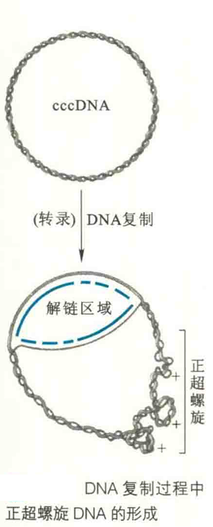

# DNA的三级结构

核酸的三级结构是在其二级结构的基础上形成的包括所有原子在内的三维立体结构。对DNA来说，其三级结构一般就是在双螺旋结构的基础上形成的超螺旋。

DNA可以以两种形式存在，松弛型和超螺旋。在松弛型状态下，DNA以正常的B型双螺旋存在，每一圈10bp，这时候双螺旋的能量状态最低。当通过某种手段使得DNA双螺旋每一圈少于或多于10bp，将导致DNA双螺旋过度缠绕或缠绕不足。如果这时DNA两端被固定住，或者本来就是共价闭环的DNA，那DNA将会因内部的张力无法释放而自发地形成超螺旋结构。

DNA超螺旋分为正超螺旋和负超螺旋，前者通常为左手超螺旋，由DNA双螺旋过度缠绕引起；后者通常为右手超螺旋，由DNA双螺旋缠绕不足引起。

超螺旋DNA可以通过以下几种参数定量地表示：

①连环数(L)：L是拓扑学中的一·个重要术语，用在超螺旋DNA上是指在螺旋轴被限制在平面上，双螺旋DNA的一条链以右手的方向环绕螺旋轴的次数。

对于一个cccDNA来说，其L值是不变的。例如，一个5400bp大小的松弛型B型cccDNA，其L值应该是5400/10=540。

②扭转数(T)：T是指DNA的双螺旋的总转数。对于一个倾向形成B型双螺旋的DNA来说，其最佳T值为碱基对数/10；

③缠绕数(W)：即超螺旋数，是指双螺旋的轴环绕超螺旋轴的次数。负超螺旋的卯值为负数，正超螺旋的即值则为正数。

根据拓扑学理论，L、T和W之间的关系可用L=T+W表示，T和W可以为小数值，但L必须为整数值。

④比连环差(λ)：该数据用来表示DNA的超螺旋密度。

λ=(L-L0)/L0，其中L是指某一超螺旋DNA的L值，L0是指松弛环形DNA的L值。一般天然DNA分子中λ=0.05=5%负超螺旋；例如SV40，其基因组大小为5,226bp，T=522，W=-26(L=496)，λ=-0.05。

负超螺旋DNA是由两条链的缠绕不足引起，很容易解链，因此有利于DNA的复制、重组和转录。正因为如此，绝大多数生物体内的DNA在没有复制之前，均以负超螺旋的形式存在，以方便DNA在复制、重组或转录的启动阶段进行解链。

当DNA开始复制、重组或转录的时候，随着解链的深入，原来的负超螺旋会逐渐被消耗，并最终被正超螺旋取代。正超螺旋的出现将会阻碍DNA的继续复制和转录，幸好细胞内存在DNA拓扑异构酶，可及时清除正超螺旋。

某些与碱基对差不多大小的多环芳香族分子(溴乙锭和吖啶橙)可以插入到DNA双螺旋两个相邻的碱基对之间，促进产生正超螺旋。这些分子都是强烈的致癌试剂，它们在插入到双螺旋内部以后，很容易诱发DNA在复制时发生突变。
