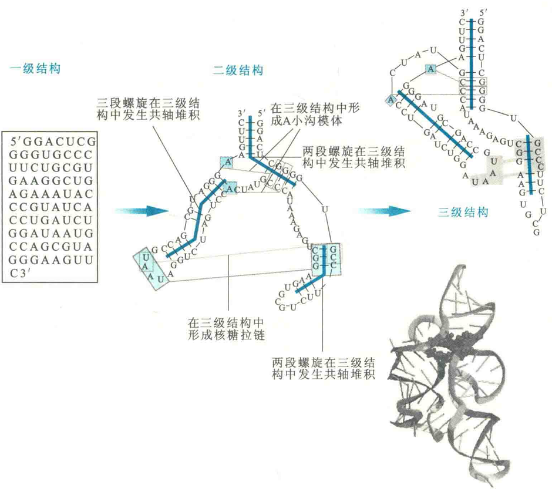
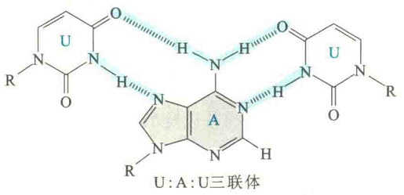
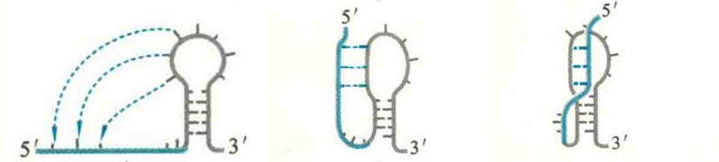
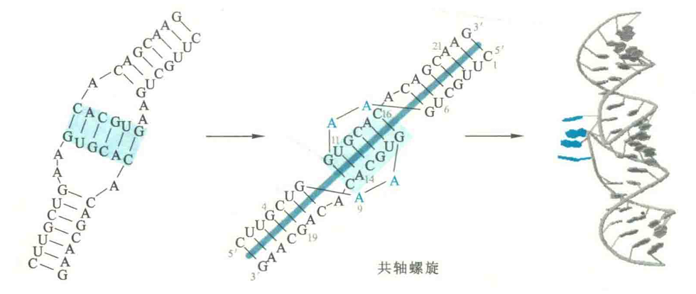
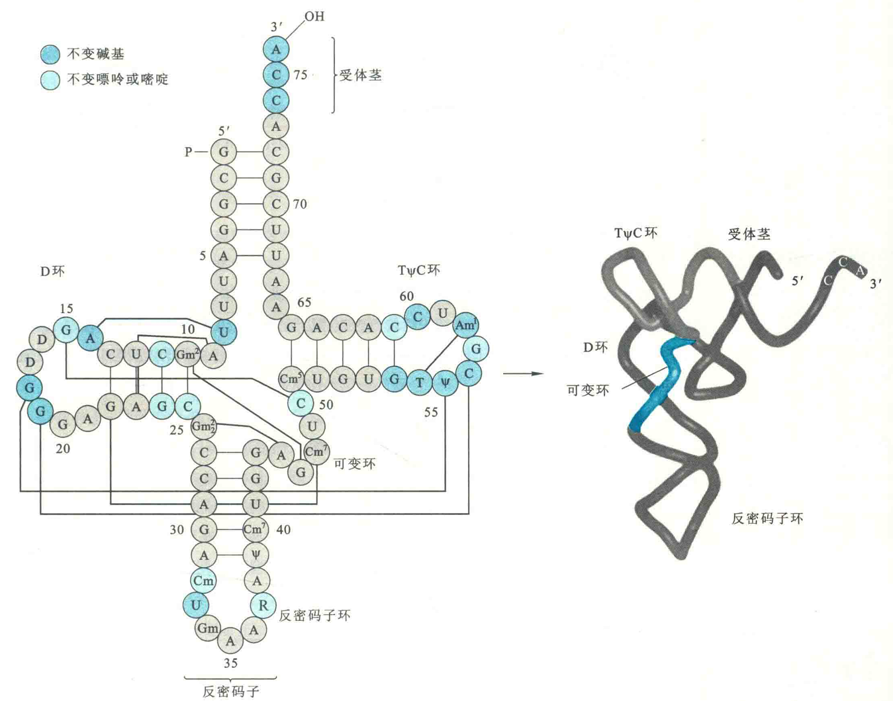
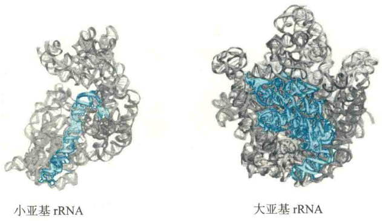

# RNA的三级结构

细胞里的绝大多数RNA，特别是较为稳定的RNA，如rRNA和tRNA等，都有自己独特的三级结构，它们的三级结构也是通过折叠实现的。

RNA的三级结构是在二级结构的基础上进一步折叠、包装而成的，其复杂性不亚于蛋白质。其中的双螺旋区域主要充当刚性的框架结构来组织其他结构或功能部件。

构成突起、内部环、发夹环和末端环的单链区域对于RNA最终三级结构的形成至关重要，其作用相当于氨基酸残基的侧链基团对于蛋白质三级结构形成的贡献。正是因为这些单链区之间以及单链区与双链区之间核苷酸的相互作用，才使得一种RNA最终能够折叠成它所特有的三级结构。

## RNA伴侣

事实上，RNA折叠，特别是较大的RNA，就像大多数蛋白质的折叠一样，也需要分子伴侣的帮助，以便让大多数RNA能快速折叠成正确的构象，而不至于陷在许多可能错误的构象中“不能自拔”。

细胞内有许多非特异性的核酸结合蛋白(NABP)充当RNA折叠的分子伴侣，它们通过防止或解除错误的折叠来指导一种RNA正确的折叠。为了与参与蛋白质折叠的分子伴侣区分开来，通常将帮助RNA折叠的分子伴侣称为RNA伴侣。

RNA伴侣与正在折叠的RNA分子结合以后，一旦出现错误的折叠，它就会破坏错误折叠的RNA分子内部的次级键，形成RNA蛋白体复合物，在这种复合物里，RNA能迅速重新折叠成最终正确的构象。

以枯草杆菌体内的TPP核开关为例，它在折叠的时候，先形成各种局部的二级结构，这些局部的二级结构的形成是相对独立的，主要利用氢键和碱基堆积来驱动和稳定折叠。然后，在不同的二级结构之间发生远距离的相互作用，在此基础上形成构建三级结构的模块，即模体。

参与远程作用的主要是游离在双螺旋结构之外的环和突起中的核苷酸，这些核苷酸之间发生相互作用，形成非标准的碱基对或发生碱基堆积，在多数情况下，核糖2'-OH参与形成氢键。

有时，相邻的螺旋之间可通过共轴的碱基堆积形成一段连续的或准连续的共轴螺旋。

## 稳定因素

驱动和稳定RNA三级结构形成的因素经常涉及金属离子(如Mg2+)和碱性蛋白质，这是因为RNA链在生理pH下本身是带高度负电荷的，需要通过与金属离子或者碱性蛋白质的结合，来中和或屏蔽主链上磷酸基团带有的负电荷，以使不同区域的磷酸核糖骨架能相互靠近，发生近距离的接触和包装，并可能作为最终构象的一部分。

::: tip

例如，第一类内含子核酶就围绕一个Mg2+进行折叠

:::

此外，还有其他几个因素也能影响到RNA的折叠：

①在一级结构上相距较远的两段区域形成标准的Watson-Crick碱基对和非Watson-Crick碱基对；

②在一段双螺旋和一段单链之间通过非Watson-Crick碱基对形成三螺旋；

③以及碱基和碱基之间的堆积力、碱基和主链之间(特别是核糖部分)的相互作用等。

## RNA结构模体类型

构成RNA三级结构的主要结构模体有多种类型，如假节结构、“吻式”发夹结构。这些不同的模体之间还可以相互作用，形成更复杂的结构。

### 假节结构

这是RNA分子上最常见的一种模体，最初是在萝卜黄色镶嵌病毒的基因组RNA上被发现的。

一个假节结构至少是由两段螺旋和将两段螺旋联系起来的单链区域或环组成。目前在几种拓扑学结构不同的假节结构中，性质最为确定的是H型假节。

在H型假节结构之中，一个发夹环上的碱基与茎以外的碱基形成分子内的配对，从而形成第二个茎环结构，产生具有两茎、两环的假节结构。

上述两茎能够相互垛叠在一起，形成一个具有一个连续股和一个不连续股的准共轴螺旋。单链环区域经常与相邻的茎发生作用，形成氢键，参与整个分子结构的形成。因此，这种相对简单的折叠能产生既复杂又稳定的结构。

由于环和茎长度以及它们之间相互作用的变化，假节结构实际上有多种形式，每一种形式可能具有不同的生物学功能。这些功能包括：

①参与形成多种核酶和自我剪接的内含子的活性中心；

②诱导多种病毒在翻译过程中发生核糖体移框；

③对于端聚酶发挥活性有十分重要的作用。

虽然端聚酶不属于核酶，但其RNA部分充当端粒DNA合成的模板。有证据表明，端聚酶RNA中有一个高度保守的假节结构是端聚酶活性必需的。人体内的这个假节结构若发生突变，可导致一种叫先天性角化症的遗传疾病。

### “吻式”发夹

这种模体结构是由两个独立的发夹结构通过环之间的碱基配对形成的，当两个环配对以后，就在两个发夹结构之间形成第3段双螺旋，这段螺旋与原来的两端双螺旋形成共轴堆积或共轴螺旋，艾滋病病毒的基因组RNA分子上就有这种模体。

### 其他结构类型

除了假节结构和“吻式”发夹结构以外，现在还发现了A-小沟模体、核糖拉链和弯曲-转角等。这些模体出现在不同类型的RNA分子上，赋予了RNA特殊的结构和功能。

就tRNA分子而言，其三级结构的形成依赖于D环上的碱基和不变碱基以及ΤψC环上的碱基之间建立氢键。参与三级结构形成的许多氢键并不是通常的AU和GC碱基对。所有的氢键将D臂和ΤψC臂折叠到一起，并将三叶草二级结构弯曲成稳定的倒L型。

在三级结构中tRNA的两个功能端被有效地隔离开，携带氨基酸的受体茎位于L的一端，与另一端的反密码子相距7 nm左右，而D环和ΤψC环构成L的角。在倒L型构象中，碱基的排列方向都尽可能增加碱基平面之间的疏水作用力，这也是稳定倒L型构象的一种重要因素。

对rRNA的三级结构而言，只是在近十多年来才有了许多突破。X射线衍射获得的数据表明，核糖体的整体构象是由rRNA决定，核糖体蛋白质一般正好位于RNA螺旋之间，起点缀作用。

