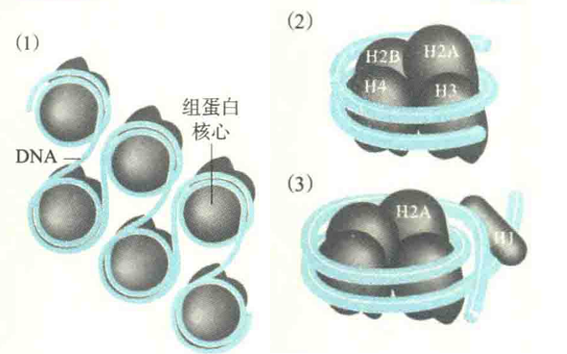
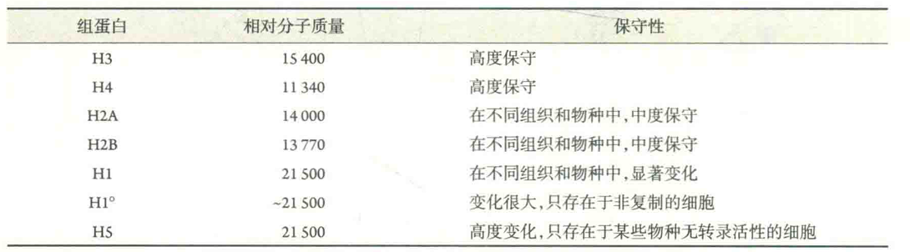
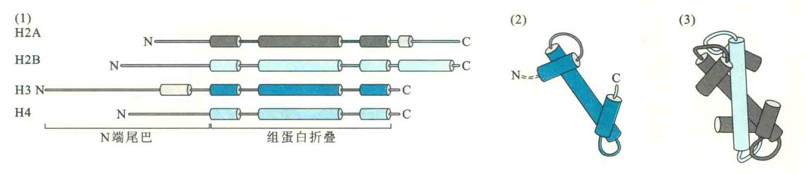
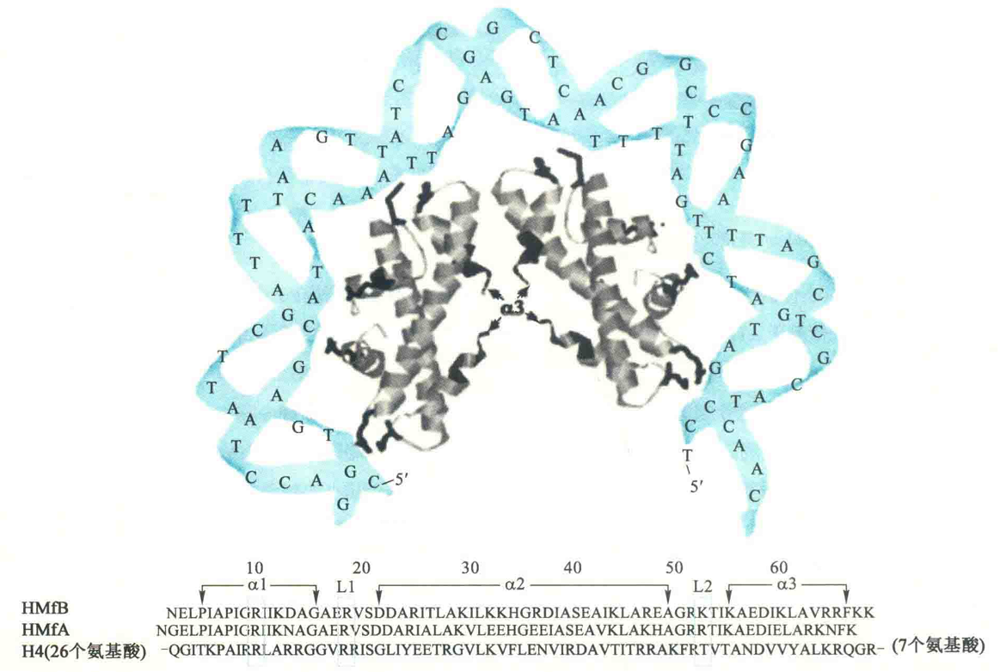
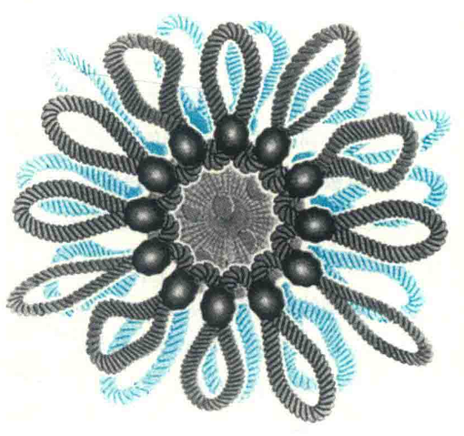
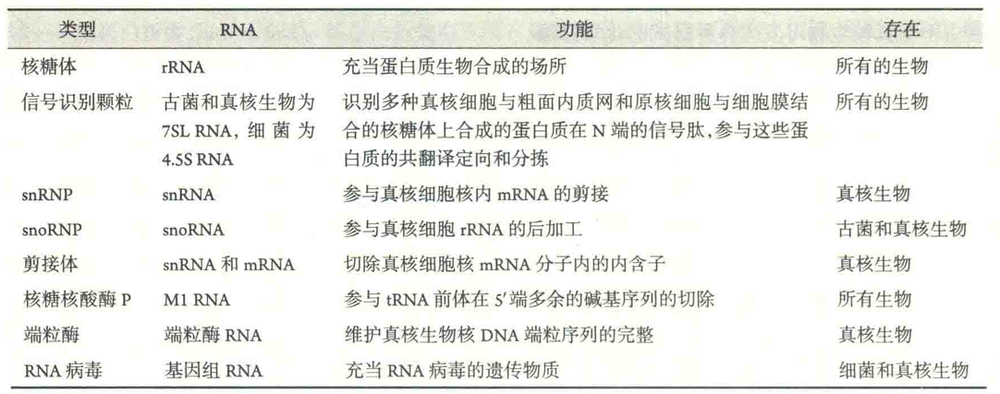

# 核酸与蛋白质形成的复合物

细胞内的核酸并不是游离的，它们总是与蛋白质或酶发生各种各样的作用，这些作用不但能够影响到核酸的结构，而且直接参与基因的复制、重组、修复、转录、转录后加工和翻译等过程。

在很多情况下，核酸与蛋白质能够形成紧密的复合物，即核酸蛋白体颗粒。

## DNA与蛋白质形成的复合物

### 真核生物的核小体

真核细胞的核基因组DNA在细胞核内与组蛋白结合形成核小体的结构。核小体可视为真核生物细胞核染色质的一级结构单位，它在电镜下呈串珠状：

每一个“珠子”由组蛋白核心和环绕其上的DNA组成（约146bp）；

相邻“珠子”之间的连线为DNA，称为连线DNA，长度8~114bp不等，它最容易受到DNA酶的水解。

H1与连线DNA结合，但去除H1并不会破坏核小体结构。

组蛋白属于一类较小的碱性蛋白。富含碱性氨基酸（Lys、Arg），它们在生理pH下，带有正电荷，这样就可以与带负电荷的DNA通过静电引力结合在一起。

#### 组蛋白的类型

组蛋白主要有5种类型，即H1、H2A、H2B、H3和H4。某些生物或组织还有H1°或H5。此外，细胞内还存在与这5种标准形式相对应的不同变体。这些变体在取代相应的标准组蛋白并与DNA结合以后，会改变局部的核小体和染色质的结构，进而有可能影响到基因的表达。

各种组蛋白在进化的保守性上是不一样的，保守性最高的是H4，其次是H3，再其次是H2A和H2B，变化最大的是H1。某些组织中没有H1，而含有其他类型的组蛋白。例如，在鸟类的红细胞中由H5取代了H1。

#### 组蛋白的结构

在三维结构上，H2A、H2B、H3和H4的结构相似，N端形成尾，C端形成组蛋白特有的结构模体——组蛋白折叠。组蛋白折叠由3段α螺旋组成，中间的α螺旋比较长，两侧的较短，组合起来形如一个浅的“U”字。

组蛋白核心是一个八聚体，由4组二聚体通过组蛋白折叠结合在一起。Η3与Η4通过一个组蛋白折叠形成异源二聚体，H2A与H2B通过另一个组蛋白折叠形成另一个异源二聚体。两个H3-H4二聚体通过H3之间的四螺旋束形成H3-H4四聚体，最后一对H2A-H2B通过H2B与H4之间的相互作用形成八聚体。

组蛋白核心主要通过静电引力与DNA结合，其表面大约环绕146 bp的DNA双螺旋，DNA长度因此被压缩了6-7倍。H1并不参与形成组蛋白八聚体核心，而是游离在外，与连线DNA结合，锁定核小体，有利于将核小体包装成更高层次的结构。

最新研究发现，细胞内核小体的组装经历前核小体中间物。这种介于DNA与核小体之间的前核小体结构，在依赖于ATP的马达蛋白ACF的催化下，可快速地形成标准的核小体结构。

核小体的宽度约为10 nm，因此这个阶段的染色质称为10 nm纤维或核蛋白纤维。通过X射线晶体衍射分析发现，构成核小体核心的组蛋白单体N端和C端尾不在核心结构之中，而是伸出来通过超螺旋上的沟与相邻的核小体接触；DNA双螺旋每隔10 bp，其小沟就面对蛋白质的表面，并与Arg侧链接触；DNA的大沟朝外，能够被序列特异性结合蛋白识别并结合;核小体表面的DNA卷曲并略显缠绕不足，以负超螺旋的形式存在，其中的双螺旋的螺距为每圈10.2bp而不是每圈10.5bp。

已发现，DNA序列在核小体选位中起重要作用。核小体选位对序列的偏爱性可反映一群细胞在一给定的DNA区域核小体的占据率。例如，在不同的生物体内，二聚核苷酸AA或TT序列在核小体形成的区域缺乏，而GC含量与核小体的占据率高度相关。此外，在人类和拟南芥细胞内，包裹在核小体外序列中的C甲基化程度高于连线DNA。

#### 核小体的作用

核小体结构可以用来调节特定基因的表达：一方面它可以通过启动远距离DNA序列之间的相互作用而激活基因的表达，另一方面它还可以通过阻碍特定转录因子或调节蛋白与DNA的结合而抑制基因的表达。

盘绕在核小体上的DNA与转录因子或调节蛋白的接触受到组蛋白的限制，DNA只有在从核小体上分离或部分解盘绕的情况下才可与转录因子或调节蛋白充分接触，但组蛋白尾上的氨基酸残基可以被化学修饰。

组蛋白可发生的化学修饰包括乙酰化、甲基化、磷酸化和泛酰化等。这些修饰可改变组蛋白分子所带的电荷，从而影响到它们与DNA的相互作用，进而对核小体的稳定和DNA的解螺旋起着调控作用。

### 古菌的核小体

与细菌相似，古菌的基因组也是共价闭环的DNA，但许多古菌具有组蛋白，因此也会形成核小体。

例如，在炽热甲烷嗜热菌体内，发现了两种组蛋白HMfA和HMfB。

然而，古菌的组蛋白要短于真核生物，如HMfA和HMfB比H4在N端和C端各少了36和7个氨基酸残基，而且在与DNA形成核小体的时候，只形成四聚体核心，也没有伸出来的N端或C端的尾。如此小的组蛋白核心让古菌的一个核小体只能包被约80 bp的DNA，而缺乏尾的特征，使得古菌的组蛋白不像真核生物可发生各种形式的化学修饰。

### 细菌的拟核

与古菌和真核生物不同的是，细菌并没有组蛋白，所以不会形成核小体的结构。

但细菌也具有一些小的碱性蛋白质，如HU和FIS。这些碱性蛋白质也可以和它们的基因组DNA结合，形成高度浓缩的拟核或类核的结构。拟核包括DNA、不同于组蛋白的拟核蛋白NAP、DNA拓扑异构酶、转录因子和mRNA。

拟核中的DNA以超螺旋的形式存在，形成一个大小在50~10 kb的小环。这些小环被固定在由特定的蛋白质分子形成的基座上。

## RNA与蛋白质形成的复合物

在细胞里，很多重要的RNA需要与特殊的蛋白质形成复合物以后才能起作用。这些RNA与蛋白质复合物主要包括：核糖体、信号识别颗粒(SRP)、核小RNA蛋白质复合物(SnRNP)、核仁小RNA蛋白质复合物(SnoRNP)、剪接体、核糖核酸酶P和端粒酶。

除此以外，RNA病毒本质就是基因组RNA与衣被蛋白质等形成的复合物，例如艾滋病病毒(HIV)，流感病毒、丙型肝炎病毒(HCV)和埃博拉病毒等。

