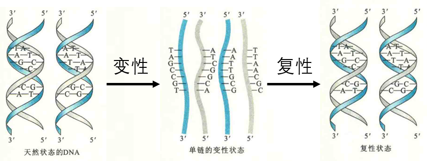

# 核酸的变性

核酸的变性是指在特定因素作用下，其双螺旋区因氢键和碱基堆积力的破坏而发生解链的过程。核酸的变性可以是局部的，也可能发生在整个核酸分子上，但与蛋白质变性一样，不涉及任何共价键的断裂。

## 导致核酸变性的因素

凡能破坏稳定双螺旋构象的因素（如氢键和碱基堆积力），以及增强不利于双螺旋稳定的因素（如磷酸基的静电斥力和碱基分子的内能）都可以成为变性的原因，如加热、碱性pH、低离子强度、有机试剂（甲醛、甲醇、乙醇、尿素及甲酰胺）等，均可破坏双螺旋结构引起核酸分子变性。

如要维持DNA单链状态，可保持pH大于11.3，以破坏氢键：或者盐浓度低于0.01 mol/L，此时由于磷酸基团间的静电斥力，使配对的碱基无法相互靠近，碱基堆积作用也处在最低水平。

常用的DNA变性方法主要是热变性和碱变性，热变性使用得十分广泛，热能使核酸分子热运动加快，增加了碱基的分子内能，破坏了氢键和碱基堆积力，最终破坏核酸分子的双螺旋结构，引起核酸分子变性。

热变性常用于变性动力学的研究，然而高温可能引起磷酸二酯键的断裂，得到长短不一的单链DNA。而碱变性方法则无此缺点，在pHI 1.3时，几乎全部氢键都被破坏，DNA完全变成单链的变性DNA。

碱性条件之所以能够导致DNA变性，是因为碱基在此条件下更容易发生互变异构，致使原来碱基对之间的氢键被破坏。

## 变性引起的核酸理化性质的改变

核酸在变性时，其一系列理化性质会发生改变，例如紫外吸收、浮力密度、旋光性、黏度和沉降速率等。至于生物活性是否变化，则取决于是什么核酸。

### 增色效应

核酸变性时，紫外吸收增加。此现象称为增色效应。增色效应产生的原因是：双螺旋结构之中的碱基堆积作用降低了紫外吸收，在变性以后，碱基堆积作用被削弱，这时每一个碱基的紫外吸收都能充分表现出来，紫外吸收随之升高。上述性质的变化可作为检测核酸变性的一个重要指标。

### 浮力

变性还可以增加DNA的浮力密度，这是因为变性后的DNA会像单链的RNA一样，通过链内的互补碱基配对形成更加致密的结构。

### 黏度

变性还能降低DNA溶液的黏度。DNA双螺旋是紧密的“刚性”结构，变性后代之以“柔软”而松散的无规则单股线性结构，DNA黏度因此而明显下降。

### 沉降速度

当变性改变了DNA的浮力密度和黏度以后，其离心时的沉降速度必然改变，变化的趋势应该是增加。另外，变性后整个DNA分子的对称性及分子局部的构象改变，使DNA溶液的旋光性发生变化。

### 生理功能

有关变性能否影响到核酸的生物学功能，在这里有必要将它与蛋白质变性作一比较。两者都仅仅涉及一级结构以上结构层次的破坏和次级键发生断裂，且共价键不受影响。

然而，蛋白质变性强调的是蛋白质三维结构的破坏。如果蛋白质发生变性，其三维结构肯定遭到了破坏，它的生物学功能也必然丧失。

而核酸的变性强调的是二级结构即双螺旋结构的破坏，它与核酸的生物学功能是否丧失没有必然的联系。

1. 如果核酸是DNA，则变性并不会使其生物学功能丧失，反而有利于它的生物学功能的发挥，这是因为DNA的生物学功能是贮存、复制及转录遗传信息，而遗传信息是贮存在一级结构之中的，DNA在变性的时候，一级结构并没有发生任何破坏。

2. 此外，无论是DNA复制，还是转录，第一步都需要DNA发生解链，这实际上就是DNA的变性。例如，体外复制DNA（即PCR）的第一步反应就是热变性。

3. 如果核酸是RNA，变性是否破坏其生物学功能，需要区别对待。那些生物学功能直接由高级结构决定的RNA，如tRNA、rRNA、SnRNA、snoRNA和核酶，一旦发生变性，就会像蛋白质一样，生物学功能立刻丧失。

4. 而对于那些生物学功能直接与一级结构有关的RNA，如mRNA和RNA病毒的基因组RNA，变性则不会破坏它们的生物学功能。
