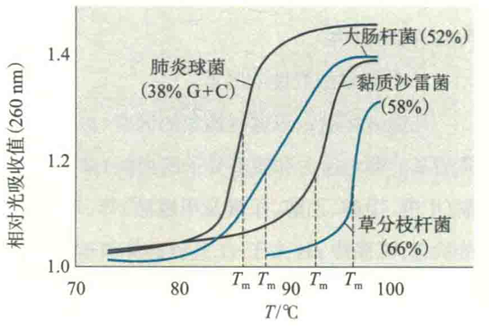
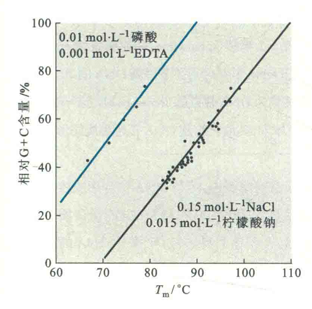

# 核酸的Tm及其影响因素

若是单独研究双螺旋DNA的热变性，则可发现它是在很窄的温度内发生的，与晶体在熔点时突然熔化的情形相似，因此DNA也具有“熔点”，用Tm表示。

Tm是指DNA双螺旋有一半发生热变性或有一半氢键因受热破坏时相应的温度，DNA的Tm值通常在82~95℃。

若以温度（T）对DNA溶液的紫外吸光度作图，得到的DNA变性曲线通常为S形。S形曲线下方平坦段，表示DNA的氢键尚未破坏；当加热到某一温度，氢键突然断裂，DNA迅速解链，同时伴随着吸光率的陡然上升，这对应于曲线中段陡直的部分：此后因“无链可解”而出现增色效应丧失的上方平坦段。

如果需要强调热变性与增色效应之间的关系，那么可以从另外一个角度来定义，即让增色效应达到一半时的温度作为Tm，它在S形曲线上相当于吸光率增加的中点处所对应的横坐标。

## 影响因素

DNA的Tm值并不是固定不变的，至少受到4种因素的影响：

### DNA的均一性

DNA的均一性有两种不同的含义：第一种是指DNA序列的均一性，如人工合成的poly[d(A-T)]或poly[d(C-G)]具有高度的均一性，这是因为它们只含有一种碱基对。与天然DNA相比，这些人工合成的高度均一性DNA的值范围就很窄，这是因为它们在变性时的氢键断裂几乎同时进行，所要求的变性温度更趋于一致；

第二种是指待测样品DNA的组成是否均一，即是否含有其他杂DNA的污染。例如，所测样品中只含有一种病毒DNA，其Tm值的范围就窄，若混有其他来源的DNA，Tm值范围就变宽。

总的说来，某种DNA均一性越高，变性时DNA双螺旋之间的氢键断裂所需能量就接近，其Tm值范围就越窄。反之亦然。

### GC含量

在溶剂条件固定的前提下，Tm值的高低取决于DNA分子中的GC含量。

GC含量越高，Tm值越高。这是因为GC碱基对具有3个氢键，比AT碱基对多1个，而且产生的碱基堆积力更高。

显然破坏GC碱基对比破坏AT碱基对需要付出更多的能量，故GC含量高的DNA，其Tm也高。实验证明，DNA的Tm值与其GC含量成正相关。

DNA溶解在0.2mol/L NaCl溶液中，Tm值与GC含量（ω）百分比的这种关系可用以下经验公式来表示：ω %（G+C）=2.44(Tm - 69.3 ℃)

### 离子强度

溶液中的阳离子能够中和或屏蔽DNA主链上磷酸基团的负电荷，减弱两条链之间的排斥而增强DNA双螺旋结构的稳定性。因此，溶液中的离子强度越高，Tm值越大。

### 双螺旋的长度

如果其他因素一样，显然双螺旋越长，即碱基对数目越多，维持双螺旋稳定的氢键数目就越多，碱基堆积力就越强，Tm值也就越大。

除了上述4种因素以外，许多容易形成氢键的试剂（如尿素和甲酰胺）能够破坏碱基对之间的氢键，因此可以降低DNA的Tm值。

那些能够提高碱基溶解性的试剂（如甲醇），或者能够破坏DNA分子外被水化层的试剂（如三氯乙酸），因能减弱碱基之间的疏水作用，也会导致Tm的下降。

某些蛋白质（如单链DNA结合蛋白）因为能够稳定DNA单链状态，也能降低Tm值。相反，许多蛋白质在与DNA结合以后，能够稳定双螺旋结构而阻止DNA变性，因此反而提高了Tm值。

## RNA的热变性

RNA的Tm值较为复杂，对于双链RNA来说，其Trn值的性质与DNA相近。但绝大多数RNA为单链，其分子内的双螺旋区域有限。因此，一方面在变性时，性质变化程度不及DNA，另一方面则是它的Tm值较低、变性曲线较宽。
