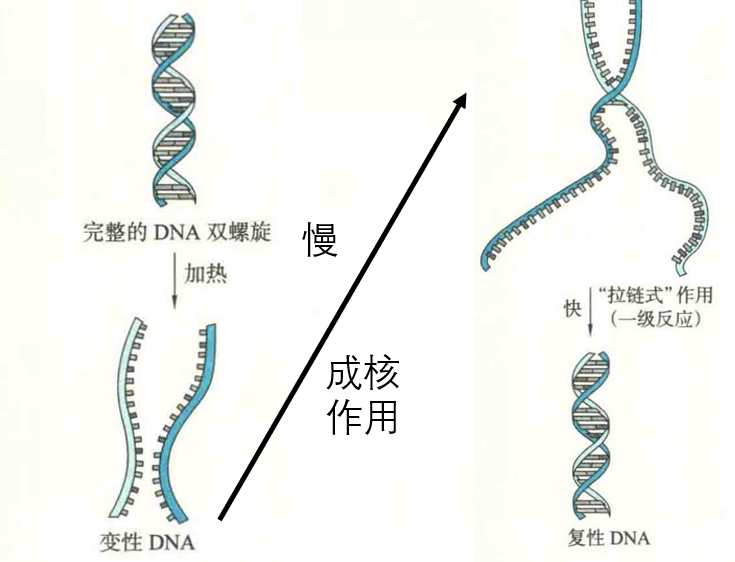
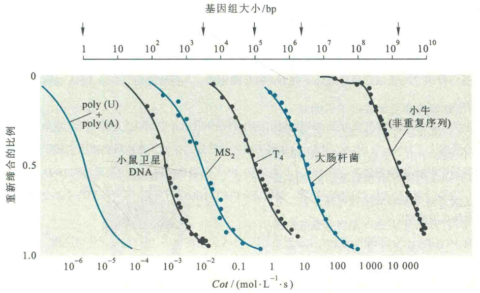

# 核酸的复性

当各种变性因素不复存在的时候，变性时解开的互补单链全部或部分恢复到天然双螺旋结构的现象称为复性。热变性DNA一般经缓慢冷却后即可复性，此过程称为退火。

这一术语也用以描述杂交核酸分子的形成。与核酸变性不同的是，蛋白质一经变性很难复性，这是因为在体外重建与天然蛋白质一模一样的次级键几乎是不可能的。而核酸变性一般是可逆的，因为核酸变性以后，两条链之间的碱基互补关系仍然存在，所以只要条件允许，重建两条链上互补碱基对之间的次级键是比较容易的。

## 理化性质改变

伴随着DNA复性的是其浮力密度、沉降速率和紫外吸收的减少以及黏度的增加，其中紫外吸收减少的现象称为**减色效应**。

DNA复性的第一步是两个互补的单链分子间的接触以启动部分互补碱基的配对，称为“成核”作用。随后，成核的碱基对经历小范围重排以后，单链的其他区域像“拉链”一样迅速复性。

## 影响因素

影响DNA复性的因素有温度、DNA浓度、离子强度和DNA序列的复杂度等。

### 温度

一般认为低于Tm 25℃左右的温度是复性的最佳温度，离此温度越远，复性速率就越慢。在很低的温度（如低于4℃）下，分子的热运动显著减弱，互补链配对的机会自然大大减少。

从分子热运动的角度考虑，维持在Tm以下较高的温度，实际上更有利于复性。

此外，复性时温度的下降须缓慢进行，若在超过Tm的温度下迅速冷却至低温，复性几乎是不可能的。实验室中经常以此方式保持DNA的变性状态。

### DNA浓度

DNA浓度越高，则溶液中DNA分子越多，相互碰撞结合“成核”的机会越大，就越有利于复性。

### 离子强度

DNA溶液中的离子强度直接影响到DNA链的带电状况，离子强度越高，DNA链上磷酸基团被屏蔽的效果就越好，DNA互补单链之间的排斥作用就越弱，因而越有利于复性。

### DNA序列的复杂度或均一性

具有简单序列的DNA分子复杂度低，但均一性高，如poly（dA）和poly（dT）这两种单链序列复性时，互补碱基的配对很容易实现。

而序列复杂的DNA复杂度高，但均一性低，如小牛胸腺DNA的非重复部分，一般以单拷贝存在于基因组中，这样的序列要完成互补配对，显然要比上述复杂度低的DNA分子困难得多。

## 复性动力学

在核酸复性动力学研究中，需要引入一个Cot的术语，用以表示复性速率与DNA序列复杂度的关系。其中Co为单链DNA的起始浓度"，t是以s为单位的时间。

在研究DNA序列对复性速率的影响时，将温度、离子强度、核酸片段大小等其他因素均给以固定，以不同时段的复性率取对数后对Cot图，可以得到曲线，用非重复碱基对数目表示核酸分子的复杂度。

如poly（dA）的复杂度为1，重复的（GATC）”组成的DNA复杂度为4，分子长度是105bp的非重复DNA的复杂度为105。

原核生物基因组均为非重复序列，故以非重复碱基对表示的复杂度直接与基因组大小成正比，对于真核生物基因组中的非重复片段也是如此。在标准条件下（一般定为0.18mol/L阳离子浓度，400核苷酸长的片段）测得的复性率达0.5时的Cot值称为Cot/2，它与DNA序列复杂度成正比。

对于原核生物来说，此值可代表它们的基因组大小及基因组中碱基序列的复杂度。真核生物基因组中因含有许多不同程度的重复序列，所得到的Cot曲线由若干个S形曲线叠加而成。

总之，复性动力学可用来测定某种生物基因组的大小和特征以及重复序列的拷贝数。