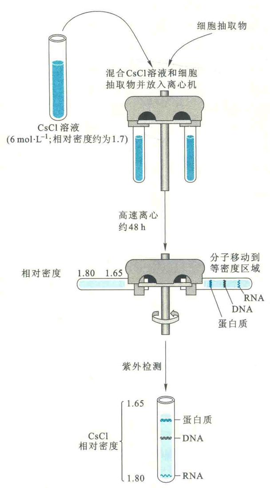

# 核酸的分离、纯化和定量

## 核酸的抽取

### 两种核蛋白的分离

核酸在细胞内通常以核蛋白的形式存在。其中，RNA以核糖核蛋白的形式，DNA以脱氧核蛋白的形式存在。借助两种核蛋白在不同盐浓度下溶解度的差别，可将两者分开。

脱氧核蛋白在0.14 mol/L NaCl溶液中的溶解度很低，在1 mol/L NaCl溶液中很高，而核糖核蛋白在0.14 mol/L NaCl溶液中的溶解度较高。因此，常用0.14 mol/L NaCl和1 mol/L NaCl溶液分别抽取核糖核蛋白和脱氧核蛋白。

### 蛋白质的去除

一旦得到核蛋白，就需要将与核酸结合的蛋白质除去；去除蛋白质的方法包括蛋白酶K的消化和酚/氯仿的多次抽取。

如果抽取DNA，可先用RNA酶消化去除残留的RNA；如果是抽取RNA，事先可用DNA酶尽可能除去残留的DNA。

在酚/氯仿抽取中，核酸溶解在上层水相，而蛋白质变性后处于两相的界面。

### 核酸的沉淀

在酚/氯仿抽取以后，水相中的核酸可在一定盐浓度下，使用2.5~3倍体积的冷无水乙醇进行沉淀。如果纯化的是RNA，尤其是mRNA，需要特别小心，务必要采取各种必要的措施来防止RNA的降解。

## 电泳

核酸由于带有大量的磷酸基团而一般带负电荷，因此，也可使用电泳对不同大小的核酸进行分离、鉴定。

用于核酸的电泳方法有琼脂糖凝胶电泳和聚丙烯酰胺凝胶电泳。使用最多的是琼脂糖凝胶电泳，而聚丙烯酰胺凝胶电泳一般用于DNA序列分析和分离较小的核酸，如PCR的引物。

如果使用琼脂糖凝胶电泳，可使用溴乙锭（EB）染色进行检测，因为EB可插入到DNA双螺旋的碱基对之间，在UV照射下发出荧光；如果使用聚丙烯酰胺凝胶电泳，一般用放射自显影或银染等方法进行检测。

## 离心

离心也是核酸研究中的一项常见技术，它除了可以用来收集沉淀的DNA，还可以用来进一步纯化核酸，获得高纯度的DNA。

此外，还可以用它来测定一种DNA分子中的GC含量。由于这3种大分子具有不同的浮力密度，在CsCl梯度溶液中，经过一定时间离心后，它们将处于不同的密度区域。

RNA密度最高，所以位于离心管底，而蛋白质最轻，将位于上方，而DNA则处于它们之间的某一位置。

## 层析

各种层析蛋白质的方法同样可以用来纯化核酸。如利用阴离子交换层析分离制备核酸，羟基磷灰石分离单链DNA和双链DNA，寡聚dT亲和层析分离带有多聚腺苷酸尾的真核生物mRNA。

## 核酸的纯度的检测和定量

核酸纯度检测和定量的最简单方法是紫外分光光度法，通过测定OD260/OD280比值来推算纯度。

对于DNA来说，如果比值大于1.8，则可视为纯度较高，如果小于1.8，则可能有蛋白质污染：

对于RNA来说，如果比值在1.9~2.0，则可视为纯度较高。

对于纯的DNA来说，1个OD260相当于50 μg/ml 双链DNA或35 μg/ml 单链DNA；

对于纯的RNA来说，1个OD260相当于40 μg/ml RNA。