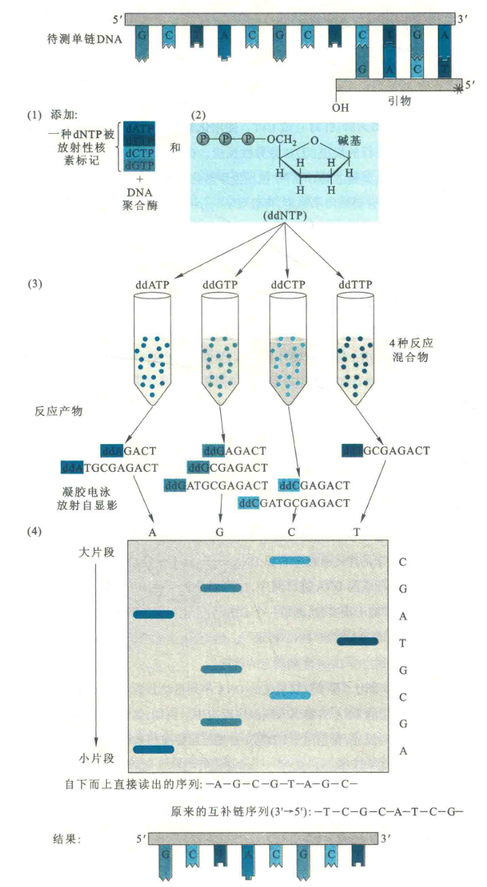
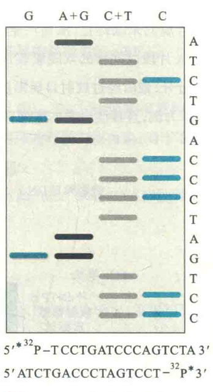
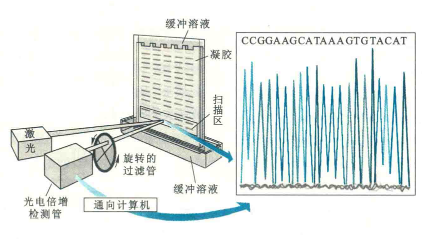

# 第一代DNA测序

第一代测序用得最多的是双脱氧法，而化学断裂法只在一些特殊情况下使用。尽管在当今的基因组测序中，有许多新的测序技术取代了双脱氧法，但双脱氧法引入的几个重要的概念几乎仍然被用在大多数新的测序技术中。

## 双脱氧法双脱氧法

双脱氧法双脱氧法也称末端终止法。

DNA复制是在DNA聚合酶催化下，以亲代DNA的两条母链上的碱基序列为模板，按照碱基互补配对的原则合成新的DNA分子的过程。复制需要引物和4种dNTP，且总是从5'端向3'端进行。

细胞内复制的引物一般是RNA，但体外DNA复制的引物是人工合成的与模板链互补的一段寡聚脱氧核苷酸。复制开始于引物下端自由的羟基，根据DNA模板链的序列合成互补的序列，不断地形成新的3'5'-磷酸二酯键，使DNA链得到延伸，直到一个新的DNA分子完全被合成。

在实际使用双脱氧法测序的时候，通常使用一种经过基因工程改造过的T7噬菌体DNA聚合酶来催化测序反应，引物是人工合成的寡聚脱氧核苷酸，已被放射性同位素标记。

首先需要进行4组平行的测序反应，每组反应均使用相同的模板，相同的引物以及4种dNTP，即dATP、dGTP、dCTP和dTTP，并在每组反应中各加入一种适量的2',3'-双脱氧核苷酸（ddNTP），如ddATP，使其随机地参入到DNA链中。

由于ddNTP缺乏3'-0H，一旦它们进入DNA链，将导致DNA链合成的末端终止，从而产生相应的4组具有特定长度的、不同长短的DNA片段，其中每一组内的DNA片段以同样的双脱氧核苷酸结尾。

然后将4组DNA片段再经过聚丙烯酰胺凝胶电泳按链的长短分开，最后经过放射自显影技术，就可以自下而上直接读出被测DNA的核苷酸序列。

直接读出来的序列应该是5'AGCGTAGC3'，该序列应与原来的待测链的序列互补，因此，原来的作为模板链的序列就是5‘GCTACGCT3’。

## 碱基特异性化学断裂法

碱基特异性化学断裂法可简称为化学断裂法或MaXam-Gilbert法，其基本原理是用特殊的化学试剂处理待测的已在末端被放射性同位素32P标记的单链DNA，或者只有一条链的末端被放射性同位素标记的双链DNA，造成其特定碱基的修饰、脱落和戊糖-磷酸骨架被特异性切割，产生一组长度不同的DNA链裂解产物。再用聚丙烯酰胺凝胶电泳分离和放射自显影观察，最后可直接读出待测DNA片段的核苷酸序列。

使用的碱基修饰试剂有两类，一类为硫酸二甲酯（DMS），针对A或A+G，另一类为肼，针对C或C+T。

## 反应过程

使用化学断裂法测序同样需要进行4组平行的反应：

①G特异性反应。在碱性条件下，DNA受DMS的作用，其链上的G在N7位发生甲基化修饰。甲基化的G与核糖之间的糖苷键变得不稳定，再经哌啶的作用，嘌呤环被打开并且发生脱落，随后与无G的脱氧核糖环相连的磷酸二酯键断裂，结果是每遇到一个G就产生两个DNA片段，但只有一个片段带有同位素标记。

②嘌呤碱基特异性的反应。先对DNA进行酸处理，然后再加DMS。这样的条件会导致DNA链在G的N7和A的N3位都发生甲基化。随后的处理方法同①，结果是每遇到一个嘌呤碱基就会产生两个片段，同样只有一个片段有同位素标记。

③嘧啶碱基特异性的反应。首先在肼作用下，DNA链上嘧啶环发生水解而打开。再受哌啶的作用，嘧啶脱落，裸露的脱氧核糖被修饰，并发生β-消去反应。最后，与无嘧啶的脱氧核糖环相连的两个磷酸二酯键断裂，结果是每逢嘧啶碱基就产生两个片段，也是只有一个片段带有同位素标记。

④C特异性的反应。在高盐浓度下（1 mol/L或2 mol/L 的NaCI），按照③的方法处理DNA，这时T受到保护，不会与肼起反应，只有C才会发生反应。于是，每逢C就产生两个片段，仍然是只有一个片段带有同位素标记。

在以上4组反应结束以后，就可进行聚丙烯酰胺凝胶电泳和放射自显影。比较G、A+G、C+T和C各个泳道，自下而上从自显影X光片上就可读出DNA序列。

化学断裂法较之末端终止法，具有一个明显的优点，那就是测定出来的序列直接来自原DNA分子，而不是经酶促合成产生的新拷贝。

因此，利用化学断裂法可对人工合成的DNA进行测序，也可以分析天然DNA原来可能含有的修饰碱基。还可以结合蛋白质保护及修饰干扰实验，测定一个DNA分子上一段特殊的碱基序列，如DNA酶I-足迹法测定启动子序列。

然而，由于末端终止法既简便又快速，其使用的化学试剂的毒性低，它仍然是当今DNA序列测定的首选。

## DNA序列分析的自动化

基于双脱氧法的DNA序列自动分析早已完全替代了原来的手工测定。这需要将不同荧光标记的DNA引物引入到测序反应中。例如，红色荧光标记引物用于A反应，蓝色用于T反应，绿色用于G反应，黄色用于C反应。

首先按照标准的末端终止法进行测序反应。然后，将四组反应混合物合并，并在同一块凝胶的同一个泳道进行电泳。随着电泳的进行，各个寡核苷酸片段在胶上被分开，并按照从小到大的次序依次通过凝胶的底部。受氨激光器发生的激光束的激发，每一个寡核苷酸片段在5，端的荧光标记发出荧光。

荧光的颜色被自动检测，不同颜色的荧光代表不同的核苷酸。测序的最后结果可直接打印出来。

DNA序列分析的自动化大大加快了DNA序列测定的进程，为科学家测定某一个物种的全基因组序列提供了可能，到2018年8月1日，共有14981种生物的全基因组序列已完成测定，其中大多数为细菌，其次为真核生物，古菌最少。

它们包括：流感嗜血杆菌、大肠杆菌、酿酒酵母（120万bp）、秀丽线虫（17500个基因、拟南芥（2.6万个基因）、果蝇（13601个基因）、小鼠（近3万个基因）、人（2万多个基因）、水稻（5万多个基因）、杨树（4.5万多个基因）、高粱（3万多个基因）、狗、河豚和蚊子等。

