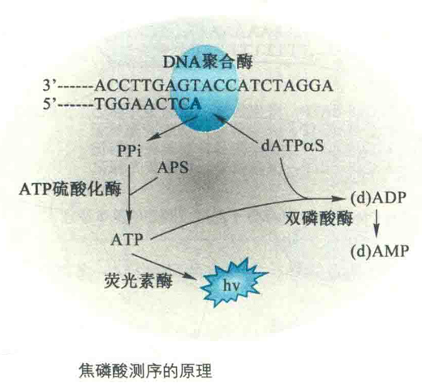

# 二代DNA测序

第二代测序技术的典型标志是使用大规模并行的方法，即大量样品在同一个仪器内同时测定。但要做到这一点需要实现微型化和增强计算能力。

第二代测序方法在速度上比第一代快100倍。有三种被广泛使用的第二代测序方法，它们是454 Life Science焦磷酸测序、Illumina/Solexa测序和SOLiD/AppIied Biosystem测序。

## 454系统

454系统需要将DNA切成几百个碱基长的单链片段。每一个片段被固定在小珠子上，随后使用PCR进行扩增，使得每一个珠子上带有许多相同拷贝的DNA。再使用微型机器人，将珠子放到含有上百万微孔的光纤平板上，每一个微孔刚好可以放入一个小珠。

与Sanger的末端终止法相似，焦磷酸测序也需用DNA聚合酶合成互补链。但焦磷酸测序还需要在同一反应体系中加另外3种酶，它们与DNA聚合酶一起组成级联化学发光反应，在每一轮测序反应中，只加入一种dNTP，若该dNTP与模板配对，聚合酶就可以将其参入到引物链的T端，并释放出等量的焦磷酸基团（PPi）。PPi可转化为可见光信号，并最终转化为一个峰值，每个峰值的高度与反应中参入的核苷酸数目成正比。

第一轮反应结束后，再加入下一种dNTP，继续下一轮DNA链的合成。

### 反应步骤

①将待测的单链DNA作为模板，与其特异性的测序引物结合，然后加入4种酶的混合物，包括DNA聚合酶、ATP硫酸化酶、荧光素酶和双磷酸酶。反应底物有腺苷-5'-磷酸硫酸（APS）和荧光素。

②向反应体系中加入1种dNTP，如果它正好能和DNA模板上的下一个碱基配对，就会在DNA聚合酶的催化下，被添加到测序引物的3'端，同时释放出1分子PPi。

dATP需由脱氧腺苷α-硫-三磷酸（dATPαS）代替，原因是DNA聚合酶对dATPαS比对dATP的催化效率高，且dATPαS不是荧光素酶的底物。

③在ATP硫酸化酶的作用下，生成的PPi可以和APS结合形成ATP。在荧光素酶的催化下，生成的ATP又可以和荧光素结合，形成氧化荧光素，同时产生可见光。通过电荷耦合器（CCD）光学系统即可获得一个特异的检测峰，峰值的高低和相匹配的碱基数成正比。

④反应体系中剩余的dNTP和残留的少量ATP在双磷酸酶的作用下发生降解。

⑤加入另一种dNTP，按第2、3、4步反应重复进行，根据获得的峰值图即可读取准确的DNA序列信息。

## 优势特点

焦磷酸测序的另外一个用处是通过比较亚硫酸盐处理前后的测序结果，快速地检测目标DNA甲基化的频率和样式，对样品中的甲基化位点进行定性及定量检测。

需要对同一种样品进行两次测序：一次是对原始样品直接进行焦磷酸测序，另一次是先使用亚硫酸盐对样品处理，然后进行PCR扩增，再进行测序。

亚硫酸盐能够将没有甲基化的C转变成U，甲基化的C则不会受影响。因此，通过PCR扩增，甲基化的C被拷贝成C，而由没有甲基化转变而来的U则被拷贝成T。于是，第二次测序还保留为C的位置就是原始样品上甲信号。

焦磷酸测序测定甲基化位点的原理基化C的位置，而新出现的T峰则是原来没有甲基化的C所在的位置。

## Illumina/Solexa测序

Illumina/Solexa方法类似于Sanger法，也要进行DNA合成，并使用链末端核苷酸终止剂。但使用的末端终止剂不是双脱氧核苷酸，而是单脱氧核苷酸，而且参人是可逆的。此外，4种作为末端终止剂的单脱氧核苷酸在3'-OH带有不同荧光标记。

## SOLiD/AppIied Biosystem测序

SOLiD/AppIied Biosystem测序是一种基于磁珠的大规模并行克隆连接DNA测序法，在本书中不做详细介绍。

