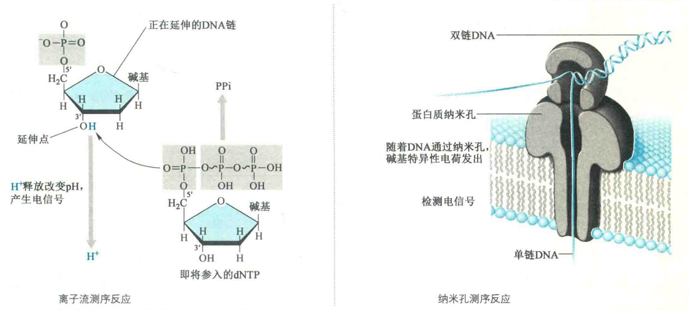

# 四代DNA测序

第四代测序技术的核心特征是不再使用光检测，而是利用离子流测序，所以也称为后光测序。

这一代测序方法并不适用单分子测序。它测定的是伴随一个新脱氧核苷酸的参入释放出来的质子。这种方法测序的速度极快，相关的测序仪器比前几代测序所使用的仪器要便宜很多。例如，这种仪器可以在不到一天的时间测出一个人的全基因组序列。

## 离子流测序的基本原理

在半导体芯片的微孔中固定DNA链，随后依次参入ACGT。

DNA聚合酶以单链DNA为模板，按碱基互补原理，合成互补的DNA链。

DNA链每延伸1个碱基时，就会释放1个H+，在它们穿过每个孔底部时能被离子传感器检测到pH变化后，即刻便从化学信号转变为数字电子信号，从而通过对质子的检测，实时判读碱基。

在离子流半导体测序芯片上每个微孔的微球表面，含有大约100万个拷贝的DNA分子；如果DNA链含有两个相同的碱基，则记录电压信号是双倍的。如果碱基不匹配，则无质子释放，也就没有电压信号的变化。

这种方法属于直接检测DNA的合成，因少了CCD扫描和荧光激发等环节，几秒钟就可检测合成插入的碱基，大大缩短了运行时间。

## 纳米孔技术

纳米孔技术基于能在单分子水平上操作的显微仪器。DNA的纳米孔检测器特别细，一个纳米孔一次只允许一条DNA单链通过。

牛津纳米孔技术系统使用的纳米孔是由蛋白质制备而成的。在毫伏级电压的作用下，DNA的一条单链通过纳米孔向前泳动。随着单链DNA分子通过小孔，检测器记录纳米孔的电流变化。

电流的差别取决于每一个碱基以及不同碱基的组合。纳米孔技术的主要优点在于快速和能测定长的DNA，其他大多数测序方法测定的是短的DNA片段。

此外，可以将许多纳米孔集中装配在一个小小的芯片上，这样可以并行测定许多长的DNA片段。

