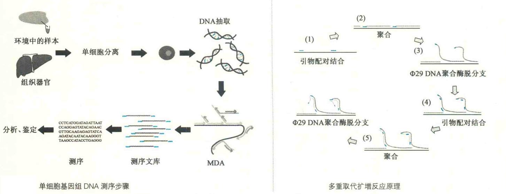

# 单细胞基因组DNA测序

特定基因组DNA的来源并不总是充分的，有时可能只有单个细胞，如在法医调查进行DNA指纹分析的时候，犯罪嫌疑人在案发现场可能只留下一个细胞。

此外，在检测两个细胞之间在基因组DNA水平上的差异时，基因组DNA也是来自单个细胞。

如何能对单个细胞的基因组DNA进行序列分析，在新一代测序方法建立之前，那是难以想象的。

DNA测序技术的突飞猛进才使得单细胞测序变得可能。单细胞基因组DNA测序首先需要分离出单个细胞，并进行全基因组扩增（WGA），然后构建测序文库，最后使用新一代测序技术进行序列分析。

其中全基因组扩增极为关键，目前广泛使用的一种扩增方法是多重取代扩增（MDA）。这种方法的灵敏度非常高，可扩增出10^15 g 的DNA。

MDA所需要的试剂主要包括由6个核苷酸长的随机引物，以及一种来自Φ29噬菌体的高保真、高进行性的DNA聚合酶。在30℃恒温下进行扩增反应，这时DNA聚合酶利用随机的引物，以来自单个细胞的DNA为模板，不断地合成互补的新链进行取代反应，最终可得到多个拷贝12~100 kb长的全基因组DNA

