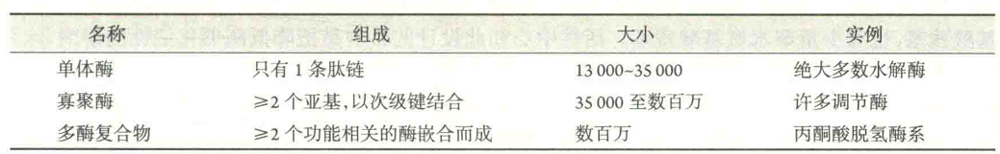

# 酶的化学本质

现在，一般认为，自然界绝大多数酶是蛋白质，仅有少数为RNA。具有催化活性的RNA称为核酶。现在就连核糖体也被证明是一种核酶，蛋白质合成最重要的一步反应，即肽键的形成就是由它催化的。

这些事实表明核酶是普遍存在的，而且，现在人们在实验室还可设计并合成出一系列自然界并非存在的核酶。

根据化学组成，酶可分为单纯酶和缀合酶或结合酶。若是蛋白质，则在缀合酶分子上，除包括由氨基酸残基组成的多肽链以外，还包括某些与肽链结合的非氨基酸成分。这些非氨基酸成分统称为辅因子。丧失辅因子的酶称为脱辅酶，与辅因子结合在一起的酶称为全酶。辅因子包括辅酶、辅基和金属离子三类。

辅酶专指那些与脱辅酶结合松散、使用透析或超滤等温和的方法就能去除的有机小分子，如辅酶I和辅酶Ⅱ；

辅基专指那些与脱辅酶结合紧密(有时甚至以共价键结合)、使用透析或超滤的方法难以去除的有机小分子，比如琥珀酸脱氢酶中的FAD；

可充当辅因子的金属离子有多种，但最常见的有铜、镁、锌和锰等金属的离子。含有紧密结合的金属离子的酶通常称为金属酶。

若是核酶，少数仅由RNA组成以外，绝大多数还含有金属离子或/和蛋白质。由于自然界绝大多数酶为蛋白质，因此下文有关酶学的内容主要是围绕化学本质为蛋白质的酶展开的。

根据酶蛋白本身结构的特征，不含RNA的酶又可分为单体酶、寡聚酶和多酶复合物

单体酶中有一类，虽然只由一条肽链组成，但同时具有多个不同的酶活性，这类单体酶称为多功能酶。

例如，大肠杆菌的DNA聚合酶I就是一个“三合一”的酶，同时具有DNA聚合酶3‘-外切核酸酶和5’—外切核酸酶的活性，而哺乳动物的脂肪酸合酶则是一个“八合一”的酶，一条肽链具有7个不同的酶的活性，还带有1个脂酰基载体蛋白的功能。