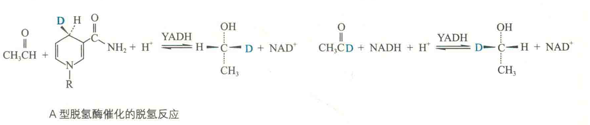

# 酶的专一性

酶的专一性是指酶对参与反应的底物有严格的选择性，即一种酶仅能作用于一种底物或一类分子结构相似的底物，使其发生某种特定类型的化学反应，并产生特定的产物。

不同酶的专一性是不一样的。有的酶专一性特别高，如碳酸酐酶只能催化二氧化碳和水分子形成碳酸，乳酸脱氢酶只能催化乳酸的脱氢反应；有的酶的专一性就比较低，如乙醇脱氢酶不仅能催化乙醇的脱氢反应，还能催化甲醇、甘二醇和视黄醇的脱氢反应，再如胰凝乳蛋白酶不仅能够水解蛋白质，还能水解酯。

## 专一性的类型

### 绝对专一性

一种酶仅催化一个特定的反应，对底物有非常严格的要求。例如，脲酶只能催化尿素的水解反应。甲基脲与尿素的结构非常相似，但脲酶对其无任何作用。

### 相对专一性

在生物体内，大多数酶具有的专一性是相对专一性，包括基团专一性和键专一性。

前者是指一种酶只作用于含有特定官能团(如磷酸基团、氨基和甲基等)的分子，如磷酸酶只水解特定底物分子上的磷酸基团；

后者是指一种酶只作用于含有特定化学键的分子，而不管底物分子其他部分的结构。如二肽酶专门识别二肽中的肽键，而不管构成这个肽键的两个氨基酸残基是哪一种。

### 立体专一性

酶对具有立体异构体的底物只作用于其中的一种，而对另外一种无效的性质，进一步可分为旋光异构专一性和几何异构专一性两类。其中旋光异构专一性是指当底物具有旋光异构体时，酶只能作用于其中的一种。

如D-氨基酸氧化酶只作用于D-氨基酸，而对L-氨基酸不起任何作用。同样，乳酸脱氢酶只作用于L-乳酸。再如氨酰tRNA合成酶只结合L-氨基酸，而不结合D-氨基酸，正因为如此，蛋白质分子中没有D-氨基酸；

几何异构专一性是指酶对几何异构体的专一性。例如，琥珀酸脱氢酶只能催化琥珀酸脱氢而生成反-丁烯二酸，或者催化使反-丁烯二酸得到氢还原成琥珀酸的逆反应，但它并不能催化顺-丁烯二酸的生成或加氢。

酶的立体异构专一性还表现在许多酶能够区分假手性C上的两个等同的基团，并且只催化其中的一个，而不催化另一个。

例如，一端由14C标记的甘油，在甘油激酶的催化下能与ATP反应，但仅产生一种标记产物1-磷酸甘油。甘油分子中的两个一CH2OH基团在我们看是完全相同的，可是酶却能区分它们。

另外，用氘(D)标记的方法发现，在脱氢酶的催化下，底物和NAD+之间发生的氢的转移也有着严格的立体异构专一性，这种专一性表现在对烟酰胺环中C4上的氢有选择性。

如酵母乙醇脱氢酶(YADH)在催化时，辅酶的烟酰胺环C4上只有一侧是可以加氢或脱氢的，另一侧则不被作用。

酵母乙醇脱氢酶的这种专一性被定为A型，凡与酵母乙醇脱氢酶具有相同专一性的酶都称为A型脱氢酶，比如苹果酸脱氢酶、异柠檬酸脱氢酶以及乳酸脱氢酶等，否则就称为B型脱氢酶，如谷氨酸脱氢酶和3-磷酸甘油脱氢酶等。

酶的立体专一性在实践中很有意义。例如，某些药物只有一种构型有生理效用，另一种构型无效甚至有害，而有机合成的药物一般是消旋产物，而用酶来催化可进行不对称合成。

尽管酶表现出高度的专一性，但某些辅因子可以被多种不同的脱辅酶使用，例如NAD+为很多脱氢酶的氢受体。